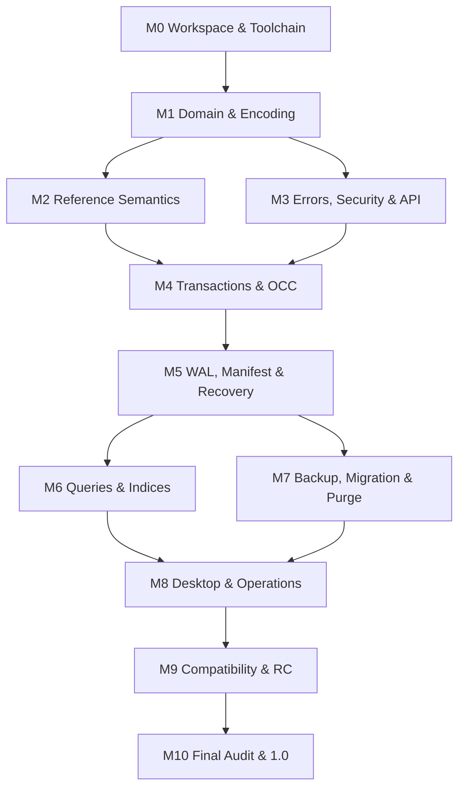

# WorldDB – Finaler vollständiger Architektur- und Implementierungsplan vNext

**Stand:** 20. September 2026  
**Status:** konsolidierte normative Planungsgrundlage für WorldDB 1.0  
**Enthält:** technische Gesamtspezifikation, Umsetzungsreihenfolge, Invariantenregister, ADRs und offene empirische Nachweise.

## Dokumentautorität

Diese Masterdatei vereinigt die zuvor getrennten WorldDB-Artefakte und integriert die ergänzenden Vorgaben aus Mias Rust-/Architekturauswertung. Bei einem Widerspruch innerhalb dieser Datei gilt die jeweils spezifischere HARD-Regel. Festgestellte Widersprüche wurden im Integrationsaudit bereinigt.

Die versehentlich beigefügten Dokumente zu „AI Workspace 2.0“ sind keine WorldDB-Quellen und wurden nicht verwendet.

## Zentraler Architekturgrundsatz

> WorldDB lebt fachlich davon, relevante Unterschiede nicht zu verwischen. Der Rust-Code muss dasselbe tun.

**WDB-PHIL-001 – Erhalt relevanter Unterscheidungen [HARD]:** Eine Abstraktion darf zwei semantisch oder architektonisch relevante Zustände nur zusammenfassen, wenn nachgewiesen ist, dass dadurch keine für Resolution, History, Security, Recovery, Retry, Ownership oder Diagnose erforderliche Information verloren geht.

Der Nachweis ist insbesondere für folgende Paare zu führen:

- Unknown vs. False;
- Conflict vs. Error;
- World Time vs. Transaction Time;
- Mask vs. Negation;
- Perspective vs. Permission;
- interner vs. öffentlicher Error;
- retrybarer Konflikt vs. Integritätsfehler;
- geliehene Daten vs. owned State;
- Shared Handle vs. kopierter Fachwert;
- Telemetrie vs. Audit;
- Error Fact vs. Response Policy.

## Reifegrad

Die Architekturverträge sind konsolidiert. Offene Punkte betreffen ausschließlich repository-, plattform- oder messungsabhängige Nachweise: konkrete MSRV, Desktop-Prozessmodus, Performancebudgets, zusätzliche Dateisysteme, UUIDv7-Implementierung und macOS-Full-Sync. Diese Punkte verändern keine fachliche WorldDB-Semantik.

100 % in einer Vertragsmatrix bedeutet nicht, dass Code und Plattformtests bereits existieren. Implementierungs-, Crash-, Security- und Performance-Gates bleiben verpflichtend.

---


---

# WorldDB – Technische Gesamtspezifikation FINAL

**Stand:** 20. September 2026  
**Status:** normative Architekturgrundlage für WorldDB 1.0  
**Normsprache:** MUSS/MUSS NICHT = HARD; SOLL/SOLL NICHT = GUARDED; KANN = GUIDELINE oder optionale Fähigkeit.

## 0. Dokumentstatus und Quellenlage

Dieses Dokument konsolidiert den im Arbeitsauftrag festgelegten WorldDB-Kern und schließt die Architekturpunkte 14–38. Es ersetzt widersprechende technische Zwischenstände. Die versehentlich beigefügten Unterlagen zu „AI Workspace 2.0“ sind keine WorldDB-Quellen und wurden nicht verwendet. Die im Auftrag erwähnte Gesamtspezifikation v3.1 lag nicht als Datei vor; die im Auftrag vollständig wiedergegebenen Verträge gelten daher als normative Baseline.

Regelklassen:

- **HARD:** keine lokale Ausnahme; Änderung nur per versioniertem Architekturentscheid und, falls öffentlich sichtbar, Kompatibilitätsverfahren.
- **GUARDED:** Ausnahme nur über einen zentral dokumentierten Ausnahmeweg mit Eigentümer, Begründung, Ablaufdatum und Test.
- **GUIDELINE:** Standardentscheidung; Abweichung wird im Review begründet.

Bei Konflikten gilt: explizite WorldDB-Semantik vor Implementierungsbequemlichkeit; Datenintegrität vor Verfügbarkeit; Security vor Diagnosekomfort; deterministische Korrektheit vor Performance; Messung vor Optimierung.

## 1. Systemgrenze und Begriffe

WorldDB ist eine lokale, historisierte, verzweigungsfähige Datenbank für Weltzustände, Perspektiven, Ereignisse, Evidenz und Provenienz. Der Engine-Kern kennt keine Desktop-UI und keinen konkreten Observability-Adapter.

Ein **Commit** ist die atomare Veröffentlichung genau einer neuen `Revision`. Eine Revision ist Transaction Time und keine fachliche Rangfolge. Ein **HistorySpace** ist der einzige verzweigungsfähige Domain-Typ und besitzt optional genau einen Parent sowie eine feste `base_revision`. Eine separate `BranchId` existiert nicht; „Branch“ ist ausschließlich der nutzernahe UI-Begriff für einen nicht-root HistorySpace. Ein **Layer** ist eine projektweit definierte, vom HistorySpace unabhängige Overlay-Schicht. Ein **Snapshot** bindet Datenrevision, Schemaansicht, HistorySpace, Layerauswahl und Security-Auswertung. Eine **OperationId** identifiziert einen logisch einmaligen Commitversuch über Wiederholungen nach Verbindungsabbruch. Eine **TransactionId** identifiziert eine konkrete lokale Transaktionsinstanz.

## 2. Konsolidierter fachlicher Kern

### 2.1 Historie, HistorySpaces und Zeit

- [HARD; WDB-HIS-001] Revisionsnummern steigen pro Datenbank monoton und lückenlos für veröffentlichte Commits. Reservierte, aber nicht veröffentlichte Nummern werden nicht sichtbar.
- [HARD; WDB-HIS-004] Historical Queries gegen dieselbe unveränderte Datenbank, Revision, SchemaMode, Security-Zeitbasis und denselben Query-Vertrag liefern dieselbe geordnete logische Antwort.
- [HARD; WDB-BRA-001/002] Ein Child-HistorySpace sieht den Parent ausschließlich bis einschließlich `base_revision`; spätere Parent-Commits werden nicht importiert.
- [HARD; WDB-BRA-003] Sibling-HistorySpaces sind isoliert; Austausch findet nur durch eine explizite, provenance-erhaltende Migration oder Merge-Transaktion statt.
- [HARD; WDB-BRA-004] HistorySpace-Operationen verändern keine projektweiten Schemaidentitäten.
- [HARD; WDB-TIM-001/002] World Time, Event Time, Assertion Validity und RecordedAsOf bleiben getrennte Typen. Zwischen inkompatiblen Timelines entsteht keine implizite Ordnung.
- [HARD; WDB-TIM-003] Zeitintervalle verwenden durchgehend die halb-offene Semantik `[start,end)`; ein fehlendes Ende bedeutet offen, nicht einen Sentinelwert.

#### 2.1.1 HistorySpace und Branch-Terminologie

WorldDB verwendet **Variante A**: `HistorySpaceId`, `parent_history_space_id: Option<HistorySpaceId>` und `base_revision: Revision` bilden die vollständige Branchidentität. Root besitzt keinen Parent; sein `base_revision` ist die Genesisrevision. Ein Child referenziert genau einen Parent. Multi-Parent-Merge ist in 1.0 keine primitive HistorySpace-Operation; Inhalte werden durch eine explizite, provenance-erhaltende Migration/Transaktion übernommen.

Der Begriff Branch darf in UI und Dokumentation verwendet werden, erzeugt aber keinen zweiten Domain-Typ, keine `BranchId` und keine parallele Lifecycle-Historie. Alle früheren Branch-Regeln gelten normativ für HistorySpace.

#### 2.1.2 Layer und ContextPrecedence

`Layer` bleibt First-Class. Eine `LayerDefinition` besitzt `LayerId`, stabilen Namen/Symbol, Beschreibung, `precedence_rank: i32`, Lifecycle `Active → Deprecated → Retired` und Schemahistorie. Layerdefinitionen sind projektweit; konkrete Assertions, Masken, Events und Boundaries sind an genau einen HistorySpace und genau einen Layer gebunden. Retirement verhindert neue Records, entfernt historische Records aber nicht.

Vorgesehene Semantik ist ein explizites Overlay. Jeder wirksame historische Schemastand bestimmt **genau einen** aktiven `base_layer_id`; Name, Symbol und ID dieses Layers sind Projektdaten und nicht in der Engine hardcodiert. Der bezeichnete Base-Layer besitzt den eindeutig niedrigsten `precedence_rank` aller aktiven Layer und darf nicht deprecated oder retired werden, solange er Base-Layer ist. Weitere Layer wie `campaign_override`, `scenario` oder `temporary_adjudication` sind Schema-/Projektdaten. Layer codiert weder Wissen noch Berechtigung noch Branchzugehörigkeit. [WDB-LAY-005/007/008]

Jeder layerfähige persistierte Record trägt auch dann eine ausdrückliche `LayerId`, wenn er im Base-Layer liegt; Decoder, Import und Storage setzen niemals still den Base-Layer ein. `LayerSelection` ist die geschlossene Auswahl `BaseOnly | AllActive | Explicit(NonEmptySet<LayerId>)`. `BaseOnly` wird gegen den vom Query-Schemasnapshot bestimmten historischen `base_layer_id` aufgelöst. Ein UI oder Builder darf eine ausdrücklich gewählte Defaultaktion in `BaseOnly` übersetzen, muss aber vor Recordbau eine konkrete `LayerId` materialisieren. [WDB-LAY-009/011]

Ein Wechsel des Base-Layers ist eine atomare Schemaänderung: Der Post-Transaction-Schemastand muss wieder genau einen aktiven, eindeutig niedrigsten Base-Layer besitzen. Frühere Bezeichnungen bleiben in der Schemahistorie erhalten; bestehende Records werden weder verschoben noch umgeschrieben. Ein bisheriger Base-Layer darf erst in demselben oder einem späteren gültigen Schemastand deprecated/retired werden, nachdem die Base-Bezeichnung gewechselt wurde. [WDB-LAY-010]

`ContextKey` besteht aus:

```text
HistorySpaceId
LayerId
PerspectiveScope
EpistemicMode
```

`PerspectiveScope` ist die geschlossene Enum `World` oder `Perspective(PerspectiveId)`. `EpistemicMode::WorldState` verlangt `World`; `Knows`, `Believes` und `Claims` verlangen `Perspective(_)`. Ungültige Kombinationen werden beim Recordbau und beim Decoding abgewiesen.

`PerspectiveScope` und `EpistemicMode` partitionieren Kandidaten und besitzen **keine** Precedence. `ContextPrecedence` ist für Kandidaten derselben Perspective-/Epistemic-Partition eine lexikographische Ordnung:

1. geringste Distanz zum abgefragten HistorySpace gewinnt: lokale Records vor geerbten Parent-Records;
2. innerhalb desselben Ursprungs-HistorySpace gewinnt der höhere `Layer.precedence_rank`;
3. identische Precedence bleibt gleichrangig und wird durch die Predicate-ResolutionPolicy behandelt, niemals durch Revision/LWW.

Masking wirkt ausschließlich von einem Context auf strikt niedrigere ContextPrecedence innerhalb derselben Perspective-/Epistemic-Partition. Eine Mask im Child kann geerbte Parentkandidaten maskieren; eine höhere Layer-Mask kann niedrigere Layer desselben Ursprungs maskieren. Masking springt nicht zwischen Perspectives oder EpistemicModes. Security filtert vor Aufbau dieser Ordnung.

Layer wird in `QueryContext` als `LayerSelection`, in Records als `LayerId`, im Wireformat als getypte 16-Byte-ID und in Indizes als eigene Schlüsseldimension repräsentiert. Security kann Sichtbarkeit und Schreibfähigkeit pro Layer einschränken, verändert aber niemals `precedence_rank`. Ist der ausgewählte Base-Layer nicht autorisiert sichtbar, entsteht daraus kein Security-Bypass und kein automatischer Ersatzlayer; die security-gefilterte Resolution kann `Unknown` liefern.

### 2.2 Assertions, Masking und Resolution

- [HARD; WDB-AST-001/002] Assertions sind immutable. Schließen der World-Time-Gültigkeit, Retract und Correct erzeugen neue Records.
- [HARD; WDB-PRO-001] Proposition Equality besteht exakt aus Subject, Predicate, Value und Polarity.
- [HARD; WDB-MSK-001/002/003] Masking folgt `ExactAssertion`, `Proposition`, `Slot`, wirkt nur gegen strikt niedrigere `ContextPrecedence` und erzeugt keinen Fakt.
- [HARD; WDB-RES-001] Resolution liefert `Known`, `Unknown` oder `Conflict`; technische Fehler sind separat.
- [HARD; WDB-RES-004/005] `ReplacementBoundary` ist nur für `MultiValueReplace` zulässig und kann eine ausdrücklich vollständige leere Menge repräsentieren.
- [HARD; WDB-RES-003] Security-Filterung erfolgt vor Masking und Resolution.

### 2.3 Werte, Epistemik, Events und Belege

- [HARD; WDB-VAL-001] Core-Werte sind Bool, Int, UInt, Decimal, String, Symbol, Entity, Time, Duration und Bytes. Null, binäre Floats, generisches JSON, Array oder Map sind keine Core-Werte.
- [HARD; WDB-VAL-002/003] Equality ist typisiert; es gibt keine versteckten Coercions. Decimal besitzt eine einzige kanonische Darstellung.
- [HARD; WDB-EPI-001/003] WorldState, Knows, Believes und Claims sind getrennte epistemische Räume; Perspective ist kein Principal.
- [HARD; WDB-EVT-001/002, WDB-TX-003] Event und Assertion sind getrennte immutable Records. Atomarer gemeinsamer Commit ist möglich, automatische Story-Inference nicht.
- [HARD; WDB-EVI-001, WDB-PRV-001] Evidence (`Supports`, `Contradicts`, `Documents`) und Provenance (`Corrects`, `DerivedFrom`, `ResultedFrom`) sind erklärend; sie verändern Resolution nie implizit.

#### 2.3.1 Normative Epistemics-Semantik

`WorldState(P)` bezeichnet eine Proposition im Weltzustandsraum und niemals automatisch den Glauben einer Figur. `Knows(P, perspective)`, `Believes(P, perspective)` und `Claims(P, perspective)` sind getrennte Records beziehungsweise Querypartitionen. `PerspectiveId` identifiziert die in-world Sicht; `PrincipalId` identifiziert den Security-Akteur. Zwischen beiden besteht keine implizite Abbildung.

- [HARD; WDB-LAY-002] EpistemicMode ist keine Precedence-Rangfolge.
- [HARD; WDB-EPI-001] `Knows(P)` impliziert weder `WorldState(P)` noch umgekehrt.
- [HARD; WDB-EPI-001] `Claims(P)` impliziert weder `Believes(P)` noch umgekehrt.
- [HARD; WDB-EPI-002] `NOT Believes(P)` ist nicht `Believes(NOT P)`.
- [HARD; WDB-EPI-002] `NOT Knows(P)` ist nicht `Knows(NOT P)`.
- [HARD; WDB-EPI-002] Fehlendes `Knows(P)` ergibt Unknown und niemals automatisch `NOT Knows(P)`.
- [HARD; WDB-EPI-002] Fehlendes `Believes(P)` ergibt Unknown und niemals automatisch `NOT Believes(P)`.
- [HARD; WDB-EPI-001, WDB-PRV-003] Es gibt keine automatische Propagation zwischen epistemischen Räumen. Jede abgeleitete Übernahme benötigt einen expliziten neuen Record und `DerivedFrom`-Provenance.

#### 2.3.2 First-Class Domain Records und Lifecycle

Alle Records sind immutable, besitzen eigene getypte IDs und `created_revision`. Fachrecords:

- `Assertion { AssertionId, HistorySpaceId, LayerId, PerspectiveScope, EpistemicMode, Subject, PredicateId, Value, Polarity, AssertionValidity }`;
- `Mask { MaskId, HistorySpaceId, LayerId, PerspectiveScope, EpistemicMode, MaskSelector, optional Validity }`;
- `ReplacementBoundary { ReplacementBoundaryId, HistorySpaceId, LayerId, PerspectiveScope, EpistemicMode, Subject, PredicateId, optional Validity }`;
- `Event { EventId, HistorySpaceId, LayerId, EventKindId, Participants, Attributes, EventTime }`;
- `EventMask { EventMaskId, HistorySpaceId, LayerId, target_event: EventId }`;
- `Source { SourceId, SourceKind, optional Locator, optional ContentDigest, Metadata }` beschreibt ausschließlich eine Herkunft;
- `Evidence { EvidenceId, source_id: SourceId, target: EvidenceTargetRef, relation: Supports | Contradicts | Documents }` verbindet eine Source ausdrücklich mit einem Domain-Record;
- `ProvenanceEdge { ProvenanceId, from: ProvenanceEndpointRef, to: ProvenanceEndpointRef, relation: Corrects | DerivedFrom | ResultedFrom }` verbindet Domain-Records erklärend; die kompakte `RecordRef`-Variante heißt `Provenance`.

`Source` ist ein immutable Herkunftsrecord und behauptet ohne `Evidence`-Relation nichts über einen Domain-Record. Eine fehlerhafte Evidence- oder Provenance-Kante wird durch ihren konkreten Retraction-Record korrigiert; der Source-Record wird nicht rückwirkend überschrieben. Fehlerhafte Herkunftsmetadaten werden durch eine neue Source und eine explizite Provenance-Kante abgelöst. `Locator`, Inhaltsmetadaten und Digests unterliegen Feldrechten; Public APIs geben nur autorisierte Source-Felder aus und dürfen aus Auslassung oder Fehlermapping keine Source-Existenz leaken.

`MaskSelector` ist eine geschlossene 1.0-Enum: `ExactAssertion(AssertionId)`, `Proposition(PropositionKey)` oder `Slot { subject, predicate_id, perspective_scope, epistemic_mode }`. ReplacementBoundary ist kein Mask und nur bei `MultiValueReplace` gültig.

EventMask unterdrückt ausschließlich das konkret referenzierte Event, wenn dessen ContextPrecedence strikt niedriger ist als die des EventMask-Records. Events besitzen keine Perspective-/Epistemic-Achse; ihre EventMask-Precedence verwendet deshalb nur HistorySpace-Spezifität und LayerRank. Gleichrangige oder höher liegende Events können nicht gemaskt werden.

Lifecycle-Records sind ebenfalls First-Class und referenzierbar:

- `AssertionValidityClosure { AssertionValidityClosureId, assertion_id, close_at_world_time }`;
- `AssertionRetraction { AssertionRetractionId, assertion_id, reason }`;
- `MaskValidityClosure { MaskValidityClosureId, mask_id, close_at_world_time }`;
- `MaskRetraction { MaskRetractionId, mask_id, reason }`;
- `ReplacementBoundaryValidityClosure` und `ReplacementBoundaryRetraction`;
- `EventSpanClosure { EventSpanClosureId, event_id, close_at_event_time }` nur für offen angelegte EventSpans;
- `EventRetraction { EventRetractionId, event_id, reason }`;
- `EventMaskRetraction { EventMaskRetractionId, event_mask_id, reason }`;
- `EventRelationRetraction { EventRelationRetractionId, event_relation_id, reason }`;
- `EvidenceRetraction` und `ProvenanceRetraction` für nachweislich fehlerhafte Verknüpfungen.

Ein Closure beendet fachliche Gültigkeit in der zugehörigen Zeitachse. Eine Retraction erklärt den Zielrecord ab ihrer Transaction Time als nicht mehr vertrauenswürdig/aktiv. Archive verändert nur operative Sichtbarkeit. Purge ist physische Offline-Neuschreibung. Diese Operationen sind nicht austauschbar.

- [HARD; WDB-MSK-001] Mask ist keine Negation.
- [HARD; WDB-MSK-005, WDB-EVT-013] EventMask ist keine EventRetraction und cascadiert nicht zu Assertions.
- [HARD; WDB-PRV-002] `Corrects` löst keine Retraction aus.
- [HARD; WDB-PRV-003/004] `ResultedFrom` und `DerivedFrom` lösen keine Cascade aus.
- [HARD; WDB-LFC-001] Close Validity ist keine Retraction.
- [HARD; WDB-LFC-001] Archive, Retract und Purge bleiben getrennte Verträge.

### 2.4 Schema und Migration

- [HARD; WDB-SCH-001/002] Es existiert genau eine projektweite Schemahistorie auf derselben Revisionsachse wie Daten. `SchemaMode::Historical` ist Default.
- [HARD; WDB-SCH-003] Alle Schemaidentitäten, insbesondere `PredicateId`, `EntityTypeId`, `EventKindId`, `EventRoleId`, `EventAttributeId` und `LayerId`, bleiben über `Active → Deprecated → Retired` stabil.
- [HARD; WDB-MIG-001/005/023] Migration schreibt History durch normale Transactions fort. Storage-Format-Migration und fachliche Schema-Migration bleiben getrennt.
- [HARD; WDB-MIG-002/003] Restrictive/Breaking unterstützen Dry Run; Breaking verlangt explizite Admin-Aktion und standardmäßig einen verifizierten Restore Point.
- [HARD; WDB-MIG-004/019] Bei Multi-Transaction-Migrationen ist jeder veröffentlichte Zwischenstand schema- und referenzgültig sowie historisch lesbar; Expand → Migrate → Contract ist der Defaultablauf.

## 3. Domain Types und Sentinel Policy

### 3.1 IDs

Der Domainvertrag verlangt für persistente First-Class-Identitäten opake, stark eindeutige, 128-Bit-Newtypes. Er verlangt **keine** zeitliche Semantik. Die Default-Generation Policy 1.0 ist UUIDv7; Sortierbarkeit und eingebettete Generatorzeit sind reine Storage-/Betriebseigenschaften und dürfen weder fachliche Ordnung, RecordedAsOf noch Authentizität bestimmen. ODE-005 entscheidet nur die konkrete Generatorimplementierung.

| ID-Familie | Repräsentation | persistent | Wire | Scope | Erzeugung | Public API |
|---|---|---:|---:|---|---|---:|
| `DatabaseId` | 128-Bit Newtype | ja | ja | Datenbank | generated | ja |
| `HistorySpaceId` | 128-Bit Newtype | ja | ja | Projekt | generated | ja |
| `LayerId`, `PerspectiveId`, `TimelineId` | je eigener 128-Bit Newtype | ja | ja | Projekt | generated | ja |
| `EntityId`, `PredicateId`, `EntityTypeId` | je eigener 128-Bit Newtype | ja | ja | Projekt | generated/import-mapped | ja |
| `AssertionId`, `MaskId`, `ReplacementBoundaryId` | je eigener 128-Bit Newtype | ja | ja | Datenbank | generated | ja |
| `EventId`, `EventMaskId`, `EventRelationId` | je eigener 128-Bit Newtype | ja | ja | Datenbank | generated | ja |
| `EventKindId`, `EventRoleId`, `EventAttributeId` | je eigener 128-Bit Newtype | ja | ja | Projekt-Schema | generated/import-mapped | ja |
| `SourceId`, `EvidenceId`, `ProvenanceId` | je eigener 128-Bit Newtype | ja | ja | Datenbank | generated | ja |
| konkrete Lifecycle-IDs | je eigener 128-Bit Newtype | ja | ja | Datenbank | generated | ja |
| `MigrationId`, `MigrationRunId`, `MigrationStepId` | je eigener 128-Bit Newtype | ja | ja | Datenbank | generated/plan-defined | Admin API |
| `TransactionId` | 128-Bit Newtype | Commitmetadaten/WAL | ja | Engine/Datenbank | generated je Versuch | Diagnose/API |
| `OperationId` | 128-Bit Newtype | ja, Dedupindex | ja | Datenbank | client/engine generated | ja |
| `SnapshotId` | 128-Bit Newtype | nein | ja, sessionlokal | EngineSession | generated | ja innerhalb Session |
| `SegmentId` | 128-Bit Newtype | ja | Fileformat | Backend | zufällig generated | Admin intern |
| `AuditRecordId`, `AuditOperationId` | je eigener 128-Bit Newtype | ja | Auditformat | Audit-Subsystem | generated | Audit API |
| `JobId` | 128-Bit Newtype | resumable Jobs ja | ja | Engine/Datenbank | generated | ja |
| `PrincipalId` | 128-Bit Newtype | Securityhistorie | ja | Projekt/Security | generated/import-mapped | security-filtered |
| `Revision`, `SchemaRevision` | validierter `u64`-Newtype | ja | ja | Datenbank | monotone allocation | ja |
| `LayerRank` | validierter `i32`-Newtype | Schemahistorie | ja | Projekt | explicit | nur Schema API |
| `FieldTag`, `WireTag`, `FormatVersion` | kleine validierte Integer | ja | ja | Format | assigned registry | nein/Format API |

Die Familie „konkrete Lifecycle-IDs“ umfasst vollständig: `AssertionValidityClosureId`, `AssertionRetractionId`, `MaskValidityClosureId`, `MaskRetractionId`, `ReplacementBoundaryValidityClosureId`, `ReplacementBoundaryRetractionId`, `EventSpanClosureId`, `EventRetractionId`, `EventMaskRetractionId`, `EventRelationRetractionId`, `EvidenceRetractionId` und `ProvenanceRetractionId`. Neue Lifecycle-Recordarten benötigen zugleich ID-Newtype, RecordRef-Variante, Wiretag, Decoderlimit, Invarianten- und Migrationstest.

Es gibt keine `BranchId` und keine `SchemaVersionId`: Branchsemantik liegt vollständig in `HistorySpaceId`. `SchemaRevision` ist ein semantischer Newtype, der ausschließlich auf eine tatsächlich veröffentlichte `Revision` derselben gemeinsamen Achse verweisen darf; er besitzt keinen eigenen Zähler. Es gibt keinen typgelöschten `LifecycleRecordId`; jeder Lifecycle-Record besitzt eine konkrete ID wie `AssertionRetractionId` oder `EventSpanClosureId`.

Alle 128-Bit-Domain-IDs sind `Copy + Clone + Eq + Hash + Ord`, wobei `Ord` ausschließlich kanonische technische Sortierung liefert. Revisionen und kleine Registrytypen sind ebenfalls `Copy`. IDs sind project-global innerhalb der DatabaseId-Namespacegrenze, sofern die Tabelle nicht Engine-Lifecycle ausweist. Public APIs exponieren IDs nur, wenn Clients sie für Referenz, Pagination, Explain oder Administration benötigen.

- [HARD; WDB-ID-002] Die binäre Domain-ID ist exakt 16 Byte; Wire-Text ist kanonisches lowercase UUID-Format ohne alternative Kurzform.
- [HARD; WDB-ID-002, WDB-SEN-001] Nil/Zero sowie ausschließlich `ff` sind ungültig. Decoder und `TryFrom` weisen sie ab; sie stehen nie für „nicht vorhanden“.
- [HARD; WDB-ID-003, WDB-TYP-001] Eingelesene IDs werden nicht allein wegen zeitlicher Unplausibilität abgelehnt. Generatorversion/Variante und verbotene Sentinelwerte werden validiert.
- [HARD; WDB-HIS-001, WDB-SEN-001] `Revision(u64)` beginnt bei 0 als leerer Genesis-Stand; der erste Commit veröffentlicht 1. `Revision::MAX` ist kein Sentinel und wird wegen Overflowreserve nicht vergeben.

### 3.2 Traits

IDs, Revisionen und kleine, vollständig validierte skalare Werte sind gemäß Taxonomie `Copy + Clone + Eq + Hash + Ord`. Fachwerte sind `Clone + Eq + Hash`, aber erhalten `Ord` nur dort, wo eine dokumentierte fachliche Totalordnung existiert. `Value` selbst implementiert kein globales `Ord`. Records sind grundsätzlich nicht `Copy`. Handles, Transactions, Snapshots, Guards und Capabilities sind nicht `Clone`, sofern Duplizierung Ownership oder Ressourcenbindung verschleiern würde.

### 3.3 Abwesenheit und Zustände

- `Option<T>` bedeutet ausschließlich zulässige Abwesenheit.
- `Result<T,E>` bedeutet, dass eine Operation scheitern kann.
- Domain-Enums modellieren fachlich verschiedene Zustände wie `ResolutionOutcome`, `CommitOutcome` oder `RecordLifecycle`.
- Leere Strings, leere Bytes, 0, MAX, besondere Zeitwerte und leere UUIDs dürfen keine Zustände codieren.

Für homogene Compile-Time-APIs existiert intern `TypedRecordRef<K>`, wobei `K` ein sealed Marker wie `AssertionRecord`, `EventRecord` oder `MaskRecord` ist. Dieser Typ wird nicht direkt persistiert oder über Wire übertragen.

Persistenz und Wire verwenden für referenzierbare Domain-History-Records die geschlossene 1.0-Enum `RecordRef`. Schema-, Migration-, Security-, Transaction-, Snapshot-, Job- und Audittypen besitzen getrennte geschlossene Referenztypen und werden nicht durch diese Enum typgelöscht:

```rust
enum RecordRef {
    Assertion(AssertionId),
    Mask(MaskId),
    ReplacementBoundary(ReplacementBoundaryId),
    Event(EventId),
    EventMask(EventMaskId),
    EventRelation(EventRelationId),
    Source(SourceId),
    Evidence(EvidenceId),
    Provenance(ProvenanceId),
    AssertionValidityClosure(AssertionValidityClosureId),
    AssertionRetraction(AssertionRetractionId),
    MaskValidityClosure(MaskValidityClosureId),
    MaskRetraction(MaskRetractionId),
    ReplacementBoundaryValidityClosure(ReplacementBoundaryValidityClosureId),
    ReplacementBoundaryRetraction(ReplacementBoundaryRetractionId),
    EventSpanClosure(EventSpanClosureId),
    EventRetraction(EventRetractionId),
    EventMaskRetraction(EventMaskRetractionId),
    EventRelationRetraction(EventRelationRetractionId),
    EvidenceRetraction(EvidenceRetractionId),
    ProvenanceRetraction(ProvenanceRetractionId),
}
```

Die Enum erzwingt exhaustive Matches und besitzt einen festen Wiretag je Variante. Unbekannte Varianten sind in 1.0 Fehler; Extension Records benötigen eine neue Format-/Capabilityentscheidung. `EvidenceTargetRef`, `ProvenanceEndpointRef` und `LifecycleTargetRef` sind geschlossene Teilmengen mit validierenden `TryFrom<RecordRef>`-Implementierungen. Jede Ref trägt auf API-Ebene zusätzlich `DatabaseId`; innerhalb einer bereits gebundenen Datenbank darf die kompakte Storageform sie weglassen.

Fremddaten entstehen ausschließlich über validierende `TryFrom`, `FromStr` oder Decoder. Serde wird nur an Adaptergrenzen eingesetzt; Domain-Typen dürfen nicht pauschal `Deserialize` ableiten, wenn dadurch Konstruktorinvarianten umgangen würden. [WDB-TYP-001]

## 4. Panic- und Fallibility-Vertrag

### 4.1 Fehlerklassen

1. **Normaler Fehler:** erwartbare Fremd-, Ressourcen-, Policy- oder Konfliktsituation; Rückgabe als konkreter Fehler beziehungsweise Outcome.
2. **Interne Invariantenverletzung:** Zustand, den alle validierten Konstruktoren ausschließen; Prozess darf an einer kontrollierten Boundary in Diagnose/Abbruch übergehen.
3. **Process-Fatal:** weitere sichere Nutzung ist nicht beweisbar, etwa fehlgeschlagene Speicherallokation, korrumpierter globaler Synchronisationszustand oder Panic im Writer während eines nicht abgeschlossenen internen Mutationsabschnitts. Für OOM wird keine kontrollierte Weiterführung innerhalb desselben Prozesses garantiert; je nach Allocator/Plattform darf der Prozess unmittelbar abbrechen.

### 4.2 Verbot und Ausnahmen

- [HARD; WDB-ENG-003] Produktionspfade dürfen auf Fremddaten, Platte, Netzwerk, IPC, Benutzerwerten, Uhr, Zufall, FFI, Parsern, Decodern oder Indexzugriffen kein `unwrap`, `expect`, `panic!`, `unreachable!` oder ungeprüftes `[]` verwenden.
- [GUARDED] `expect`/`unreachable!` sind nur bei unmittelbar lokal bewiesenen Invarianten zulässig, mit Kommentar `INVARIANT:` und Test. CI prüft Vorkommen und Ausnahmeliste.
- [HARD; WDB-WIR-003, WDB-ENG-003] Release-Profile aktivieren Overflow Checks. Arithmetik an Größen, Offsets, Revisionen und Budgets nutzt checked/saturating Operationen nur gemäß fachlichem Vertrag; Saturation darf keinen Fehler verbergen.
- [HARD; WDB-WIR-003] Parser besitzen harte Eingabe-, Tiefen-, Record-, String- und Allokationsgrenzen vor Allokation.
- [HARD; WDB-CON-002, WDB-ENG-003] Wenn das gewählte Synchronisationsprimitive Poisoning oder einen vergleichbaren invalidierten Zustand kennt, darf dieser Zustand nicht still ignoriert oder durch ungeprüften Zugriff auf den inneren Wert umgangen werden. Die konkrete Fehlerform bleibt adapter-/primitive-spezifisch und wird an der Concurrency-Boundary klassifiziert.
- [HARD; WDB-CON-004, WDB-ENG-003] Join-/Task-Panics werden beobachtet und in `TaskFailure::Panicked` übersetzt. Ein Writer-Task-Panic versetzt die Datenbank in `NeedsRestart`, bis Recovery den Zustand bestätigt.

FFI verwendet eine Panic-Grenze (`catch_unwind`) nur um das Überschreiten der ABI zu verhindern; unwind-sichere Daten werden vorausgesetzt oder Prozessabbruch gewählt. Panics sind kein Error-Handling. Proc-Makros dürfen bei ungültigem Aufruf Compile Errors mit Span erzeugen, nicht im Compilerprozess unkontrolliert paniken.

Die Desktop-App besitzt Boundaries um IPC-Aufträge und Hintergrundjobs. Ein Rendererfehler darf den Engine-Prozess nicht korrumpieren. Ein Core-Panic beendet die betreffende Engine-Instanz, verwirft keine Dateien und führt beim Neustart durch Recovery; die UI behauptet keinen Commitstatus, bis `OperationId` abgefragt wurde.

## 5. Error Architecture

### 5.1 Domänen

Öffentliche Ports verwenden konkrete, nicht erschöpfend erweiterbare Error-Enums:

- `OpenError`: NotFound, Locked, UnsupportedFormat, NeedsMigration, RecoveryRequired, PermissionDenied, Corrupt, Io.
- `ValidationError`: SchemaViolation, InvalidValue, InvalidReference, InvalidTemporalRange, UnsupportedOperation, BudgetExceeded.
- `QueryError`: InvalidQuery, Cancelled, BudgetExceeded, SnapshotExpired, Unauthorized, StorageRead, CorruptData.
- `CommitError`: Validation, Authorization, Storage, UnknownCommitOutcome, DatabaseReadOnly, ShuttingDown.
- `StorageError`: operation, class, source; operation ist unter anderem WalAppend, WalSync, SegmentWrite, SegmentSync, ManifestWrite, ManifestPublish, DirectorySync, Lock, Read, Verify.
- `RecoveryError`, `MigrationError`, `BackupError`, `ExportError`, `SecurityError`, `WireError`, `JobError`.

Jeder interne Fehler besitzt einen instabilen Diagnosecode; jeder öffentliche Fehler einen dokumentierten stabilen Code wie `WDB-COMMIT-UNKNOWN`. Ab 1.0 ändern Codes Bedeutung oder Wiederholbarkeit nicht. Neue Codes dürfen ergänzt werden.

### 5.2 Metadaten

Niedrige Fehler klassifizieren ausschließlich überprüfbare **Error Facts**: `Severity`, `Retryability` und `IntegrityImpact`. `Audience`, `RecoveryPolicy` und `SuggestedAction` sind Entscheidungen der security-aware Engine-/Application-Boundary und gehören nicht automatisch in Storage- oder Domain-Errors. Dadurch wird ein festgestellter `HistoryGap` nicht mit der höheren Reaktion „read-only öffnen“ vermischt.

Alle Klassifikations- und Darstellungsmethoden sind pure und loggen nicht. `Display` ist kurz, deterministisch und frei von Geheimnissen. Für öffentliche und operative WorldDB-Errors MUSS `Debug` dieselbe Leak-Sicherheitsgrenze wie `Display` einhalten; technische Ursachen bleiben über intern kontrollierte `source()`-Ketten und ausdrücklich autorisierte Diagnoseexporte verfügbar. Interne Debugtypen dürfen detaillierter sein, dürfen aber keine Public-/Player-Grenze überschreiten. [WDB-ERR-001/002/003/004]

`From` wird nur verwendet, wenn Quellfehler unabhängig von der Call-Site eindeutig auf genau eine Variante abbilden. Für I/O wird gewöhnlich `map_err` mit `StorageOperation`, Pfadklasse und Phase verwendet. OS-Pfade, Querytexte, Values und Principal-Daten werden nicht ungeprüft in öffentliche Meldungen übernommen.

### 5.3 Commit-Konflikt und unklarer Ausgang

`TransactionConflict` ist kein technischer Fehler, sondern `CommitOutcome::Conflict(ConflictReport)`. Der Report enthält nur sichtbare, retryrelevante Abhängigkeiten und keine verborgenen Records. `CommitOutcome::Committed(CommitReceipt)` ist die andere erfolgreiche Protokollantwort.

Ein Abbruch nach möglichem Commitpoint liefert `CommitError::UnknownCommitOutcome { operation_id }`. Der Client MUSS `commit_status(operation_id)` abfragen und darf denselben logischen Auftrag nur mit derselben OperationId erneut senden. Eine neue OperationId könnte doppelte fachliche Wirkung erzeugen und ist verboten, bis der Status `NotCommitted` beweist. [WDB-OCC-005, WDB-TX-004/005]

### 5.4 Boundary Mapping

Domain-Fehler bleiben intern detailreich. Security-mapped öffentliche Fehler vereinheitlichen NotFound/Unauthorized, wenn Existenz geheim ist. IPC und Wire übertragen stabilen Code, sichere Felder, Retryhinweis, OperationId/JobId und optional eine lokalisierbare Message-Key; keine Rust-Typnamen oder Causes. Result-Aliasse bleiben modulnah (`query::Result<T>`), kein globales Universal-Result.

Security-, Recovery-, Retry- und Public-API-Mappings verwenden exhaustive Matches. Neue Errorvarianten MÜSSEN dort eine bewusste Compile-Time-Entscheidung erzwingen; `_`, `..` oder semantisch pauschale Catch-all-Arme sind an diesen Grenzen verboten. Nur protokollfremde, numerisch unbekannte Wirecodes dürfen in eine ausdrücklich benannte `UnknownExternalCode`-Variante fallen. [WDB-ERR-005]

Ein eigenes Error-Makro ist für 1.0 ausgeschlossen. Es darf erst nach mindestens drei stabilen, mechanisch identischen Implementierungen und Compile-Fail-Tests vorgeschlagen werden.

## 6. Ownership, Borrowing und Thread Safety

`Database` ist ein nicht-klonbarer Prozesshandle und besitzt Backend, WriterCoordinator, SnapshotRegistry, JobSupervisor und ShutdownToken. Der Writer ist genau einmal vorhanden und wird ausschließlich durch den Coordinator besessen. `DatabaseHandle` ist ein bewusst klonbarer, schmaler Send+Sync-Auftragskanal; er exponiert keinen Mutex auf die Engine.

- [HARD; WDB-OWN-001, WDB-CON-002] Kein öffentliches `Arc<Mutex<WorldDb>>`.
- [HARD; WDB-OWN-001] `Rc` ist nur in eindeutig threadlokalen UI-/Parserstrukturen zulässig und darf keine Core-Portgrenze überschreiten.
- [HARD; WDB-OWN-001/002] `Arc` drückt geteilte langlebige Ownership aus, nicht Borrow-Checker-Flucht. Jede Arc-Stelle nennt den Owner-Lifecycle.
- [HARD; WDB-OWN-001] Gemeinsame Ownership wird als `Arc::clone(&handle)` beziehungsweise `Rc::clone(&handle)` sichtbar gemacht. Ein semantisch mehrdeutiges `handle.clone()` ist hierfür nicht zulässig.
- [HARD; WDB-OWN-002] Plain `.clone()` ist kein Reparaturwerkzeug für Move-Fehler, zu lange Borrows, ungeklärte Taskownership oder künstliches `'static`. Jede nichttriviale Clone-Stelle muss als Fachwertkopie, Snapshot/DTO-Kopie oder begründete Boundary-Konversion einordenbar sein.
- [HARD; WDB-OWN-003] Borrowed-to-Owned-Übergänge werden an der Boundary mit dem spezifischen Vorgang (`to_owned`, `to_vec`, `to_path_buf` oder Domainkonstruktor) sichtbar. Sie dürfen nicht in generischen Helpern verborgen werden.
- [HARD; WDB-CON-002] Mutex/RwLock schützen kleine, benannte Zustände. Über Storage-I/O, Callback, IPC oder `.await` wird kein Guard gehalten.
- [HARD; WDB-ENG-001, WDB-OBS-003] Der synchrone Domain-/Resolution-Core führt kein Async aus. Async-Adapter übernehmen I/O, Cancellation und Backpressure.

Snapshots sind nicht `Clone`; `SnapshotLease` kann explizit `fork_reader()` erzeugen und registriert eine weitere Pin. Query-Ergebnisse sind standardmäßig owned. Ein backendinterner `BorrowedRecord<'snapshot>` darf nur innerhalb eines synchronen Iterator-Callbacks leben und wird an Portgrenzen in owned Domain-Records überführt. Kein Public Result borgt aus einem Lock oder Memory Map.

`QueryContext` besitzt SnapshotLease, SecurityContext, Budgets und CancellationToken. Tasks übernehmen bewusst ausgewählte owned Inputs. Vor jedem Task-Spawn werden Owner, Cancelowner, Resultempfänger und Shutdownverhalten benannt. `'static` wird nur durch tatsächliche Ownership erreicht und nie durch Leaks oder unnötige globale Speicherung. Shutdown besitzt `Database`; Drop startet keinen Commit und blockiert nicht unbeschränkt. Explizites `close(deadline)` stoppt Annahme neuer Arbeit, wartet auf Pre-Commit-Jobs, lässt Commits ab Commitpoint fertiglaufen, flush’t verpflichtende Daten und meldet unvollständige Telemetrie getrennt.

## 7. Typestate und Compile-Time-Invarianten

Typestate wird auf kontrollierte konsumierende Übergänge begrenzt:

```rust
WriteTransaction<Open>
  .validate() -> Result<WriteTransaction<Validated>, ValidationError>
  .commit() -> Result<CommitOutcome, CommitError>

MigrationPlanBuilder<MissingTarget>
  .target(schema) -> MigrationPlanBuilder<TargetSet>
  .build() -> Result<MigrationPlan, MigrationPlanError>
```

`Open`, `Validated` und Marker sind private/sealed ZSTs. `commit(self)` konsumiert die Transaktion; es gibt nach Beginn keinen wiederverwendbaren Handle. Abbruch von `Open` ist explizit oder durch folgenloses Drop von reinem Staging erlaubt. Drop schreibt nichts.

Storage-Zustände, die von Platte entdeckt werden (`Clean`, `NeedsRecovery`, `Corrupt`, `ReadOnlySalvage`), bleiben Runtime-Enums. Commitstatus, Jobstatus, Snapshotalter, Rechte und Schema-Kompatibilität sind Laufzeitwahrheiten. PhantomData wird nur für Typidentität/Ownership verwendet, nicht zur Dekoration.

Compile-Fail-Tests beweisen: Commit vor Validation unmöglich; zweiter Commit desselben Handles unmöglich; Capability-Typen nicht konstruierbar; typed IDs nicht vertauschbar; BorrowedRecord überlebt Snapshot nicht. Runtime-Tests beweisen alle Zustände, die Typestate nicht erfassen kann.

## 8. Transaction State Machine

Eine Transaktion besitzt `TransactionId`, `OperationId`, Basis-Snapshot, ReadSet, WriteSet, SchemaDependencies, Warnings und Staging-Arena.

Zustände:

1. `Open`: Operationen hinzufügen, Reads registrieren, explizit abortierbar.
2. `Validated`: syntaktische, referenzielle, Schema-, Security- und fachliche Validierung gegen Basis-Snapshot abgeschlossen; Commit-Revalidation bleibt erforderlich.
3. `Committing`: Writer besitzt den Auftrag; Cancel wirkt nur bis zum Commitpoint.
4. `Committed`: Receipt mit Revision, OperationId, Durability und sicheren Warnungen.
5. `Aborted`: keine veröffentlichte Wirkung.
6. `UnknownOutcome`: Clientzustand nach verlorener Antwort; serverseitig nur Committed oder NotCommitted.

Validierungsphasen: shape/limits → typed schema → references/lifecycle → temporal rules → HistorySpace/Perspective → security → cross-record invariants → OCC revalidation → physical plan. Warnings sind stabil typisiert und niemals Ersatz für Fehler.

Schema- und Datenänderungen sowie Events, Assertions, Evidence und Provenance können in einem Commit atomar sein. Batchoperationen sind entweder vollständig Teil derselben Transaktion oder explizite Multi-Transaction-Jobs; ein Batch besitzt keine implizite Teilcommit-Semantik.

Der Commitpoint ist die durable Veröffentlichung des Commitmarkers beziehungsweise der neuen Manifestgeneration gemäß Backendvertrag. Die Antwort folgt danach. `OperationId` wird persistent dedupliziert; identischer Payload liefert dasselbe Receipt, abweichender Payload mit gleicher OperationId `IdempotencyMismatch`.

## 9. OCC und Konfliktvertrag

OCC validiert am Writer gegen den aktuellen Head des Ziel-HistorySpace. ReadSet-Einträge sind:

- Point dependency: Record/Proposition/Schema-ID plus beobachtete Version oder Abwesenheit.
- Range dependency: normalisierte Query-Domain plus Index-/Range-Token.
- Predicate dependency: Subject/Predicate/Context-Scope und beobachteter Kandidaten-Fingerprint.
- Schema dependency: verwendete Definitionen und SchemaRevision.
- HistorySpace dependency: HistorySpace-Head und Parent/Base-Metadaten.

WriteSet enthält neue immutable Records, Lifecycle-Records, Masken, Boundaries, Schemaänderungen und betroffene logische Schlüssel. Der Writer prüft Write/Write sowie Write/Read-Überlappung. Range- und Predicate-Dependencies erkennen Phantoms; ein Full-Scan registriert eine Partitiongeneration statt Millionen Points.

- [HARD; WDB-RES-002] Kein Last-Write-Wins.
- [HARD; WDB-OCC-004] Automatischer Retry ist nur für als `ReplaySafe` markierte interne Transaktionen ohne externe Side Effects, mit unverändertem autoritativem Input und maximal zwei Versuchen erlaubt.
- [HARD; WDB-OCC-004] Benutzertransaktionen und Migrationen werden standardmäßig manuell auf neuer Basis wiederholt.
- [HARD; WDB-OCC-005, WDB-TX-004] Retry benutzt dieselbe fachliche Absicht, aber eine neue TransactionId; OperationId bleibt gleich, bis definitiv NotCommitted.

Writer-Aufträge werden fair FIFO pro Prioritätsklasse behandelt; Recovery/Shutdown darf vorziehen, normale Jobs dürfen interaktive Commits nicht dauerhaft aushungern. Lange Transaktionen erhalten Maximalalter und Budgetwarnung; bei überschrittenem Hard Limit scheitert Commit mit `SnapshotExpired` statt globale Reclamation unbegrenzt zu blockieren.

## 10. Snapshot Lifecycle

Ein Snapshot bindet `DatabaseId`, `SnapshotId`, `RecordedAsOf`, `SchemaSnapshot`, `HistorySpaceView`, `LayerSelection` samt historischer LayerDefinitionen, `SecurityEvaluationMode` und Backend-Generation. Er ist nach Erzeugung immutable.

- [HARD; WDB-SNP-001] Snapshotdaten und Schema sind gemeinsam gepinnt; Current-Schema-Abfragen pinnen die explizit gewählte aktuelle SchemaRevision zusätzlich.
- [HARD; WDB-SNP-002] Ein Snapshot sieht keine späteren Commits und wird nicht still auf einen neueren Stand verschoben.
- [HARD; WDB-SNP-003] Reclamation entfernt kein Segment, das durch Snapshot, Backup, Recovery-Checkpoint oder Export gepinnt ist.
- [HARD; WDB-SNP-004, WDB-CON-004] Prozessshutdown invalidiert neue Reads, wartet begrenzt auf aktive Leases und bricht kooperativ ab; borrowed Daten werden niemals nach Unmap exponiert.

Snapshots haben Soft- und Hard-Lifetime-Budgets. Soft überschritten erzeugt Diagnose und UI-Hinweis; Hard gilt nur für server-/UI-gehaltene interaktive Snapshots. Administrative Exact-Backups können ausdrücklich länger pinnen. Cancellation beendet Iteration und gibt Pins frei. Ein Snapshot wird nur durch Close/Drop seines Leases freigegeben; Drop hat dabei lediglich in-memory bookkeeping, kein I/O.

## 11. StorageBackend-Vertrag

Der Engine-Port verlangt Capabilities statt Backendnamen:

- konsistenter read snapshot an einer veröffentlichten Revision;
- monotones atomisches Publish genau einer Revision;
- durable Commitstufen `Memory`, `Process`, `Machine` – WorldDB-Commit verlangt `Machine`;
- historische Reads und Schemahistorie;
- Staging ohne Sichtbarkeit;
- operation-spezifische Fehler;
- Pins/Reclamation;
- Verify, Recovery und Format-Capabilities.

Engine garantiert Domainvalidierung, OCC, Resolution, Securityreihenfolge und Idempotency. Backend garantiert Bytes, Framing, Checksums, Publish-Atomizität, Crash-Präfix und Snapshotkonsistenz. Ein Backend darf fachliche Regeln zusätzlich prüfen, aber nicht neu definieren.

Für 1.0 ist `SegmentedFileBackend` das kanonische persistente Backend. Ein SQLite-Backend ist Reference-/Differential-Backend und Prototyp, nicht kanonisches Dateiformat. Es darf 1.0 nur als experimentell ausgeliefert werden, solange Gleichwertigkeit, historische Performance und Recovery-Vertrag nicht bewiesen sind. Ein InMemoryBackend ist ausschließlich Testbackend und darf keine Durability behaupten.

Backendformat und Capabilityset sind versioniert. Öffnen verweigert unbekannte Required-Capabilities. Unbekannte Optional-Capabilities dürfen erhalten, aber nicht semantisch interpretiert werden.

## 12. Canonical Wire- und File-Encoding

WorldDB definiert eine eigene kleine, längenpräfixierte TLV-Kodierung; kein Serde-Bincode ist persistenter Vertrag. Alle Integer sind unsigned LEB128 für Längen/Tags und little-endian fixed width dort, wo sortierbare/feste Darstellung verlangt ist. Decoder akzeptieren nur die jeweils kürzeste kanonische Varintdarstellung.

Frame:

```text
magic[8] | format_major:u16le | format_minor:u16le |
required_flags:u64le | optional_flags:u64le |
kind:u32le | payload_len:u64le | payload | checksum[32]
```

Checksum ist BLAKE3 über Header ohne Checksum plus Payload. Kryptographische Authentizität ist nicht impliziert. Dateihashes und Canonical Hashes sind domain-separated.

Kanonische Skalare:

- IDs: 16 rohe Bytes; Texttransport lowercase UUID.
- Int: signed i128 als minimal ZigZag-Varint; UInt: minimal u128-Varint.
- Decimal: Vorzeichen + minimaler unsigned Koeffizient + i32-Skala, normalisiert ohne nachgestellte Dezimalnullen; Null hat positive Null und Skala 0. `1`, `1.0` und `1.00` sind derselbe fachliche Decimalwert. Scale ist nicht Teil numerischer Identität oder Equality. Darstellungspräzision, Messgenauigkeit und Currency Scale werden separat als Schema-/Feldmetadaten modelliert und nicht aus dem Decimal-Encoding rekonstruiert.
- String/Symbol: gültiges UTF-8, bytegenau; keine implizite Unicode-Normalisierung. Symbolkonstruktor erzwingt seine dokumentierte Grammatik.
- Time: TimelineId + signed i128 Ticks + Unit; keine implizite Zeitzone.
- Duration: signed i128 Nanosekunden nur für physikalische Dauer.
- Bytes: Länge + Bytes.

`CalendarPeriod` folgt Variante C: Es ist ein strukturierter Schema-/Query-Domain-Typ außerhalb von `Value`, bestehend aus validierten `years`, `months` und `days`. Es darf in 1.0 Schema-Constraints, Migrationsparametern und zeitbezogenen Queryoperationen auftreten, aber nicht als Assertion-Value gespeichert werden. Benötigt ein Projekt eine kalendarische Periode als Fakt, muss es diese über explizite Predicate-Struktur modellieren. Damit bleibt der Core-Value-Katalog geschlossen und enthält keinen versteckten strukturierten Escape-Hatch.

Maps/Arrays existieren nur als Formatcontainer für Records, nicht als `Value`. Felder werden streng nach Feldnummer sortiert, Duplikate sind fehlerhaft. Unbekannte Felder können nur in ausdrücklich `extensible` markierten Records übersprungen und bei Roundtrip bewahrt werden. Unbekannte Tags in Core-Values sind Fehler.

**Semantic HARD Contract:** Jeder Decoder besitzt harte Limits für Framegröße, Recordzahl, Feldzahl, String/Bytes, Rekursion und Gesamtallokation. Die Längenprüfung erfolgt vor Cast/Allokation. Malformed Data liefert Offset und sicheren Code. Limits dürfen nur vor Allokation und nur durch autorisierte Policy verändert werden.

**Default Implementation Profile 1.0 (konfigurierbar, kein Formatgesetz):** 64 MiB pro Frame, 16 MiB pro einzelner String-/Bytes-Value und 1 Mio. Records pro Batch. Import darf niedrigere Limits setzen; höhere Limits verlangen administrative Konfiguration und bleiben durch Prozess-/Querybudgets begrenzt. Änderungen dieser Defaults benötigen kein Formatmajor, solange Wirefähigkeit und Hard-Limits erhalten bleiben.

TypeScript-IPC verwendet JSON nur als Envelope. i128/u128, Decimal, Revision und 64-Bit-Größen werden als validierte kanonische Strings übertragen; Bytes als Base64url ohne Padding; IDs als UUID-Text. Direkte JS-Zahlen sind nur bis `Number.MAX_SAFE_INTEGER` erlaubt. Bulkstreams verwenden das binäre Format.

## 13. WAL, History, Segmente und Manifest

### 13.1 Dateien

- WAL ist append-only und in Generationen segmentiert.
- History-Segmente sind immutable. `SegmentId` ist eine stabile zufällig erzeugte 128-Bit-Identität ohne Inhaltssemantik. `ContentDigest` ist getrennt davon ein kryptographischer Hash der kanonischen Segmentbytes; Manifest und Verifikation binden beide Werte. Identische Inhalte dürfen verschiedene SegmentIds besitzen, müssen aber denselben ContentDigest ergeben.
- Manifestgenerationen sind immutable. `CURRENT` verweist auf genau eine Generation.
- Tempdateien und Staging liegen auf demselben Volume wie ihr Ziel.

### 13.2 Commitreihenfolge

1. Payload und OperationId als WAL-Prepare vollständig schreiben.
2. WAL-Datei `sync_all`.
3. Commitmarker mit Revision, Payloadhash und vorherigem Commit-Hash appendieren.
4. WAL erneut `sync_all`; dies ist der logische und durable Commitpoint.
5. Materialisierte Segmente/Indizes dürfen danach erzeugt werden.
6. Neues Manifest in Temp schreiben und syncen, atomar publizieren, Parent-Verzeichnis nach Plattformfähigkeit syncen.
7. `CURRENT` analog ersetzen und Verzeichnis syncen.
8. Erst jetzt alte Generationen zur Reclamation markieren.

Recovery kann jeden gültigen committed WAL-Präfix oberhalb des Manifests wiederholen. Ein Manifest darf daher hinter dem sicheren WAL-Präfix liegen, nie davor. `safe_revision` ist die höchste Revision, deren Commitmarker und referenzierte Payload vollständig verifiziert und durable sind.

Torn/partial Frames enden den gültigen Präfix. Ein Checksumfehler innerhalb eines bereits durch Manifest/Commitkette referenzierten Bereichs ist Korruption, kein harmloser Tail. Rename ersetzt keine Sync-Annahme. Plattformadapter kapseln Linux/macOS/Windows-Verhalten und führen Crash-Gates aus; Netzwerkdateisysteme sind ohne explizit bestandene Capability-Probe unsupported.

macOS darf für strenge Machine-Durability einen stärkeren Full-Sync verwenden, wenn Standard-fsync dessen Garantie nicht erfüllt. Windows nutzt Replace-/Write-through-Semantik und hält Lock-/Sharing-Modi explizit. Wenn eine Plattform die geforderte Publication nicht beweist, öffnet der Backend nicht schreibend.

Compaction erzeugt neue immutable Segmente und ein neues Manifest, ohne logische History zu ändern. Indexsnapshots sind ableitbar und dürfen verworfen werden. Historysegmente dürfen nur nach Purge-Vertrag semantisch entfernt werden.

## 14. Recovery State Machine

Startupzustände:

`AcquireLock → Discover → ValidateCurrent → ValidateManifest → ScanWal → Classify → Replay → Publish → VerifySafeRevision → Ready`.

Abzweige: `ReadOnlyRecoveryRequired`, `Quarantine`, `SalvageCandidate`, `FatalUnsupported`.

- Fehlendes/ungültiges CURRENT: gültigste vollständig verifizierte Manifestgeneration suchen; keine Auswahl nur nach Dateidatum.
- Gültiges Manifest + committed WAL-Präfix: idempotent replayen und neue Manifestgeneration publizieren.
- Uncommitted Tail: nach Diagnose ignorieren/quarantänisieren; niemals als Commit sichtbar machen.
- Torn Tail nach sicherem Präfix: Tail abschneiden erst nach Kopie in Quarantäne und explizitem Recovery-Journal.
- Checksumfehler im sicheren Bereich: kein automatisches Reparieren; read-only öffnen, Verify-Bericht und Restore/Salvage anbieten.
- Crash während Recovery: Recovery-Journal und generationale Veröffentlichung machen Neustart idempotent.

`UnknownCommitOutcome` wird durch OperationId-Index im WAL beantwortet. Status ist `Committed(receipt)`, `NotCommitted` oder `Indeterminate`; Indeterminate bleibt bis Verify/Recovery abgeschlossen ist.

Salvage schreibt immer eine neue Datenbankidentität oder einen ausdrücklich markierten Fork mit lückenlosem Bericht verlorener/unsicherer Records. Es überschreibt das Original nicht. Die UI zeigt Phase, safe_revision, read-only-Status und nächste sichere Aktionen.

## 15. Backup, Restore, Export und Purge

### 15.1 Backup/Restore

`ExactDatabaseBackup` enthält Formatversion, DatabaseId, Manifest, alle referenzierten Segmente, erforderlichen WAL-Präfix, Schemahistorie, OperationId-Dedup und einen Inventarbericht. Der Begriff **exact** bezieht sich ausschließlich auf den vollständigen, wiederherstellbaren WorldDB-Daten-/Schema-Snapshot; er behauptet noch keine Auditvollständigkeit. **MUST Integrität:** Jede Inventarposition und das Gesamtinventar besitzen einen kryptographischen Digest; Verify erkennt Änderung, Auslassung und Vertauschung. **OPTIONAL/Policy-dependent Authentizität:** Ein MAC oder eine digitale Signatur bindet das Inventar an einen Schlüssel/Unterzeichner. Ein bloßer Digest beweist keine Herkunft. Schlüsselidentität, Algorithmus und Signaturstatus werden getrennt vom Digest gespeichert. Ein Hot Backup pinnt einen Snapshot und kopiert nur dessen geschlossene Generationen; aktive WAL-Daten werden über einen Backend-Checkpoint geschlossen. Backup-Erfolg erfordert vollständige Verify-Prüfung des Ziels. [WDB-BKP-001/002/004/005]

`AuditCompleteBackup` ist ein `ExactDatabaseBackup` plus vollständig verifiziertes Auditmanifest und alle Auditsegmente bis zu einer deklarierten `audit_safe_sequence`. `safe_revision` und `audit_safe_sequence` sind unabhängige Wasserstände; insbesondere erzeugt ein Raw-Read-Audit keine Datenrevision. Eine Sicherung ohne Auditdaten bleibt ein exaktes Datenbankbackup, MUSS aber `audit_scope = Excluded` tragen und darf für Policies mit Auditkontinuität nicht als auditvollständig gelten. [WDB-AUD-010/012, WDB-BKP-005]

Restore schreibt in ein leeres Ziel, prüft Inventar und Kompatibilität, führt Recovery aus und publiziert erst danach. Bei `AuditCompleteBackup` werden Daten- und Auditnamespace mit ihren jeweiligen Recoveryregeln unabhängig verifiziert; die Freigabe auditpflichtiger Operationen erfolgt erst, wenn Auditkette, `audit_safe_sequence` und Lineage konsistent sind. In-place Überschreiben ist kein Restoremodus. Eine bewusst als Klon geöffnete Sicherung erhält neue DatabaseId; Disaster-Recovery kann dieselbe ID behalten, verlangt aber Exklusivität, damit Original und Restore nicht später zusammengeführt werden. [WDB-BKP-003, WDB-AUD-013]

### 15.2 Logical Export

Logical Export enthält IDs, alle gewählten HistorySpaces, Schemahistorie, Assertions, Events, Sources, Evidence, Provenance, Masks und Boundaries innerhalb eines expliziten Revisionsbereichs. Er ist kanonisch geordnet und manifestiert ausgelassene Klassen. Ein Teilen-Export ist security-gefiltert und keine exakte Sicherung. Import validiert alle Referenzen und weist Kollisionen zurück oder verwendet einen expliziten, protokollierten Remap-Plan.

### 15.3 Archive, Retract und Purge

Archive ändert Sichtbarkeit/Operationalstatus, nicht History. Retract ist eine fachliche Korrektur auf Transaction Time. Purge ist administrative physische Entfernung und für 1.0 nur als **offline rewrite** einer neuen Datenbank erlaubt.

Der Purge-Plan ermittelt transitive Referenzen, Evidence/Provenance, Masken, Events, Indizes, Backups und Exporte. Modi: `RejectIfReferenced` oder explizites `CascadePlan`; keine implizite Cascade. Ergebnis erhält neue DatabaseId, PurgeReport und Mapping erhaltener IDs. Alte Backups bleiben außerhalb der technischen Kontrolle; Secure Erase kann auf SSDs, Copy-on-write, Cloudsync und Backupmedien nicht garantiert werden und wird nicht behauptet.

## 16. Query- und API-Verträge

Ports: `HistorySource`, `SchemaSource` und `CandidateStream` sind schmale Engine-interne Interfaces. Streamkonstruktion kann mit `QueryError` scheitern; danach liefert jedes Item `Result<Record, QueryItemError>`. End-of-stream ist `None`, nie ein Fehler. Nach Itemfehler wird der Stream terminal, sofern der Fehlertyp nicht ausdrücklich `SkippableDiagnostic` ist; Core-History ist niemals skippable.

`QueryContext` verlangt Database/Snapshot, RecordedAsOf, HistorySpace, `LayerSelection`, WorldTimeSelector, Perspective/EpistemicMode, SecurityContext, SchemaMode, Budget und Cancellation. Fehlende Perspective ist nur für perspektivfreie `WorldState`-Abfragen zulässig. LayerSelection wird beim Snapshotbau validiert und kann danach nicht erweitert werden.

APIs:

- Raw History liefert security-gefilterte immutable Records und Lifecycle-Records; Admin-Raw ist separate Capability.
- Resolved View liefert Outcome plus deterministisch sortierte Contributors.
- Explain liefert Resolutionstufen, sichtbare Kandidaten, Masken/Boundary-Wirkung und verwendete Regeln, nie unsichtbare Existenzen.
- Search ist token-/field-basiert; Fulltext ist optional capability-gated.
- Graph traversal verlangt Typen, Richtung, maximale Tiefe/Knoten/Kanten und Cycle-Policy.
- Aggregation unterstützt in 1.0 COUNT, EXISTS und gruppierte Counts über sichtbare resolved Results; keine implizite Rohhistorienzählung.

Alle ungeordneten Mengen werden kanonisch nach typisiertem Schlüssel sortiert. Pagination verwendet in 1.0 ein zufälliges opakes 256-Bit-Token mit serverseitigem, begrenztem Sessionzustand. Der Wirecursor enthält keine Record-/Entity-ID, keinen SortKey und keine anderweitig sensitive Queryinformation. Ein zusätzlicher MAC über Token, Formatversion und nicht-sensitive Expiry schützt gegen Manipulation; Vertraulichkeit entsteht durch den zufälligen Handle und dadurch, dass der Payload ausschließlich serverseitig liegt.

Der Cursorzustand bindet `PrincipalId`, den Fingerprint des effektiven Capability-Sets, `SecurityEpoch`, `SnapshotId`, `QueryHash`, `EngineSessionId`, den internen SortKey und Expiry. Vor **jeder** Seite werden `AuthorizationNow`, aktuelle Principal-/Capability-Daten und `SecurityEpoch` erneut geprüft. Jede relevante Policy-, Principal- oder Capability-Änderung invalidiert den Cursor mit einem einheitlichen `CursorInvalidated`; die Abfrage läuft niemals still unter alten Rechten weiter. Auch unsichtbare IDs dürfen nicht durch Länge, Fehlertyp oder Tokendecodierung erkennbar werden. [WDB-API-007/008/009]

1.0 verwendet einen zufälligen engine-session-local MAC-Key und einen bounded Cursor-State-Store im Prozessspeicher. Cursor überleben keinen Engine-Neustart, keinen Engineprozesswechsel und keine Wiederherstellung des Snapshots in einer anderen Session. Rotation erfolgt durch Start einer neuen EngineSession; alte Cursor werden einheitlich ungültig. App-Updates ohne Engine-Neustart ändern den Key nicht; Updates mit Neustart invalidieren Cursor. Persistente Cursor sind kein 1.0-Vertrag.

Cursor verschieben sich nie still auf Current. Cancellation und Budgetende sind unterscheidbare terminale Fehler und liefern keine als vollständig markierte Aggregation.

## 17. Security Enforcement

Principal, Role und Capability sind getrennt. Rollen `GM` und `Player` sind Policy-Bundles, keine hardcodierten Bypass-Flags. Administrative Raw-Rechte sind explizite Capabilities und standardmäßig nicht in GM enthalten.

Security wird auf HistorySpace-, Layer-, Record-, Feld-, Relationship- und Operationsebene vor Candidate-Erzeugung angewandt. Abgeleitete Indizes tragen dieselbe oder strengere Schutzklasse. Perspective verändert Wissen, nie Berechtigungen. Layerberechtigungen steuern Lesen/Schreiben eines Layers, aber niemals dessen fachlichen Precedence-Rang oder die Zugehörigkeit eines Records.

- [HARD; WDB-SEC-003] Unsichtbare Assertions, Events, Masken, Evidence oder Provenance dürfen Ergebnis, Conflict-Details, Explain, Search-Snippets, Cursor, Counts oder Fehlermeldungen nicht unterscheidbar beeinflussen.
- [HARD; WDB-SEC-004, WDB-PRV-010] Graph Traversal expandiert nur sichtbare Kanten und Knoten. Verdeckte Knoten werden nicht als „hidden count“ verraten.
- [HARD; WDB-SEC-003] COUNT/EXISTS zählen nur sichtbare resolved Results; Optimierungen müssen non-interference beweisen.
- [HARD; WDB-SEC-002] Authorization erfolgt vor Redaction. Redaction macht unberechtigten Zugriff nicht erlaubt.

Historical permission interpretation ist explizit: Default `AuthorizationNow` prüft heutige Rechte auf historische Daten. `AuthorizationAtRevision` ist eine separate administrative/auditorische Fähigkeit und setzt historisierte Security-Policy voraus. Fehlt diese, wird nicht geraten.

Existenzschützende Public-Mappings vereinheitlichen Forbidden und NotFound. Timing wird durch gleiche Codepfade, gebuckete Budgetierung und Vermeidung von count-/indexabhängigen Frühabbrüchen reduziert; harte Constant-Time-Garantie für komplexe Queries wird nicht behauptet. Audit erhält nur policy-erlaubte Identitäten und gehashte/sichere Parameter.

## 18. Observability und Audit

### 18.1 Telemetrie

Der Core emittiert pure diagnostische Events über einen Port; der Adapter integriert `tracing`. Span-Namen sind stabil und niedrig kardinal: `db.open`, `tx.validate`, `tx.commit`, `query.execute`, `recovery.scan`, `backup.run`, `migration.run`. Felder: operation_id, transaction_id, revision, history_space_id (redacted/hash), phase, outcome_code, duration_ms, counts und budget – keine Values, Querytexte, Pfade oder Principalnamen standardmäßig.

Redaction ist ein Adapter mit der expliziten Klassifikation `Omitted`, `Shown(SafeValue)` oder `Hashed(StableDiagnosticHash)`. Der Default für nicht bewertete Felder ist `Omitted`. Redaction findet erst nach Authorization statt und kann niemals die Freigabe unerlaubter Daten begründen.

Telemetrie ist fail-open: volle Queue, Rotation oder Exportfehler blockieren Domainoperationen nicht. Fail-open bedeutet nicht unbounded. Harte Queue-, Speicher-, Dateigrößen- und Taskgrenzen, eine feste Overflow-/Drop-Policy, Drop-Zähler, begrenzte exponentielle Retries, Rotation, Flush- und Shutdown-Deadline sind verpflichtend. Keine Span-Guards über `.await`; instrumentierte Futures verwenden explizite Spans.

Fehler werden genau an der verantwortlichen Boundary einmal reported. Niedrige Layer fügen Kontext hinzu, loggen aber nicht. Diagnostic Counters umfassen conflicts, unknown_commit_outcomes, recovery_actions, corrupt_frames, snapshot_pins, dropped_telemetry und security_denials in sicher aggregierter Form.

### 18.2 Audit

Audit ist ein getrenntes, append-only Sicherheitsprotokoll für administrative/sicherheitsrelevante Aktionen: Policyänderung, Raw-Zugriff, Purge, Breaking Migration, Restore, Export sensibler Bereiche und Auditkonfiguration. Normale Reads werden nur bei expliziter Policy auditiert.

Wenn eine Policy durable Audit verlangt, bilden **Domain Action + Required Audit Record eine gemeinsame atomare Durability-Einheit**. Eine auditpflichtige Fachaktion darf weder als committed sichtbar noch als erfolgreich quittiert werden, wenn ihr verpflichtender Auditrecord nicht denselben Commitpoint erreicht hat. Das kanonische Backend codiert beide im selben WAL-Prepare und deckt beide durch denselben Commitmarker/zweiten WAL-Sync ab. Ein alternatives Backend muss eine äquivalente All-or-Nothing-Garantie beweisen; „best effort nachträglich schreiben“ ist unzulässig. [WDB-AUD-003]

Diese Regel gilt mindestens für Security Policy Change, Admin Raw Access mit zustandsändernder oder exportierender Wirkung, Breaking Migration, Restore-Publication, Purge-Publication, sensitive Export Authorization/Completion und Audit Configuration Change. Reine Admin-Raw-Reads können keine Datenrevision erzeugen; ihre Freigabe wird deshalb durch ein vorgeschaltetes durable Audit-Authorize-Record fail-closed gemacht, bevor Daten ausgegeben werden. Externer Auditexport bleibt asynchron und ist nicht Teil des Fachcommitpunkts. Auditrecords enthalten sichere Actor-ID, Aktion, Objektklasse, Ergebnis, Revision/OperationId und Policyversion; sensible Nutzdaten bleiben ausgeschlossen. Auditaufbewahrung und Zugriff sind separat berechtigt.

## 19. Jobs, Cancellation und Concurrency

Der Core bleibt überwiegend synchron und deterministisch. I/O-Orchestrierung und Desktop-IPC sind async. Ein einzelner Writer serialisiert Publikationen; N Reader arbeiten auf Snapshots ohne Writer-Lock.

`Job` besitzt JobId, Kind, Owner, Status, Budget, CancellationToken, Fortschritt mit definiertem Nenner oder indeterminate, und durable Resume-Metadaten für Migration/Backup/Indexbuild. Workerpools sind getrennt für CPU und blockierendes I/O; jede Queue ist begrenzt und verwendet Backpressure.

Cancellation ist kooperativ. Vor Commitpoint kann Transaction abgebrochen werden. Ab Beginn der finalen WAL-Publish-Phase wird Cancellation als `too_late` quittiert und Commit beendet; Client fragt OperationId ab. Migrationen canceln nur an gültigen Transaktionsgrenzen. Backup beendet Kopie, gibt Pins frei und markiert Teilziel unvollständig. Shutdown stoppt Intake, signalisiert Jobs, drainiert Writer und schreibt keine neuen fachlichen Commits aus Drop.

Lockordnung ist dokumentiert: Lifecycle → SnapshotRegistry → Job metadata; Writer besitzt keine dieser Locks während Storage-I/O. Tests erzwingen Timeouts und Loom-/Modelltests für kleine Synchronisationskomponenten. Ein Prozess hält den exklusiven Writer-Lock; weitere Prozesse dürfen nur über den Engine-Prozess lesen oder öffnen read-only mit Backend-Capability. Direkter Multi-Process-Write ist 1.0 ausgeschlossen.

## 20. Index- und Performance-Vertrag

### 20.1 Referenzmodell und reale Workloads

Korrektheit wird stets gegen einen vollständigen, indexfreien Reference Full Scan geprüft. Ein Index ist ableitbar, besitzt Schema-/Format-/Build-Version und deckt einen exakt angegebenen Revisionsbereich ab. Fehlt er, ist er stale oder scheitert die Prüfung, fällt die Query auf Full Scan zurück oder meldet ein Budgetproblem; sie liefert nie still unvollständige Resultate.

1.0-Workloads:

1. Resolved Point Lookup nach Subject/Predicate in HistorySpace, RecordedAsOf und WorldTime.
2. MultiValue-Auflösung mit Masken und ReplacementBoundary.
3. Entity-/Predicate-History über Revisionsbereich.
4. Eventsuche nach Kind, Participant-Rolle und EventTime.
5. Evidence/Provenance-Nachbarschaft bis begrenzte Tiefe.
6. SchemaAt(Revision), Lifecycle und Migration Dry Run.
7. Fulltext über ausdrücklich indexierte Stringfelder.

Anfangsindizes: `(history_space, layer, perspective_scope, epistemic_mode, subject, predicate, recorded_revision)`, Assertion-Validity, Mask-Scope/ContextPrecedence, EventKind/Layer/Participant/EventTime, RecordId, OperationId, SchemaId/Revision und Provenance-Kanten. Keine generischen Secondary-Index-Plugins in 1.0.

HistorySpace-Indexierung speichert lokale Deltas und Parent-Cutoff; sie materialisiert nicht ungefragt komplette Eltern. Layer ist eine eigene Indexdimension und wird nicht in HistorySpace-Keys hineincodiert. Zeitindizes sind timeline-typisiert. Masken werden mit Selector und ContextPrecedence separat indiziert und immer vor Candidate Resolution angewandt. Index-Rebuild läuft auf gepinntem Snapshot, erfasst nachfolgende Deltas und publiziert atomar eine vollständige Generation.

### 20.2 Ziele und Messung

Leistungszahlen sind Provisional Gates, keine Domainsemantik. Die drei Vertragsklassen sind:

1. **Semantic HARD Contract:** Parser, Query, Telemetrie, Jobs und Snapshots besitzen endliche, vor Nutzung geprüfte Ressourcenbudgets; Budgetende wird explizit gemeldet und erzeugt kein falsches vollständiges Ergebnis.
2. **Default Implementation Profile:** auslieferbare Startwerte für Speicher-, Frame-, Queue- und Jobgrenzen; zentral konfigurierbar, versioniert und durch Hard Ceilings begrenzt.
3. **Provisional Performance Gate:** empirische Ziele, die durch ODE-003 bestätigt oder begründet geändert werden. Sie definieren keine fachliche Korrektheit.

Referenzkorpus: 1 Mio. Assertions, 100.000 Entities, 10.000 Events, 100 HistorySpaces, 10 Mio. Provenance-Kanten als separater großer Graphkorpus; realistische Skews und Maskenanteile werden dokumentiert.

**Provisional Performance Gates** auf Referenzdesktop nach festgelegtem Hardwareprofil: warme Point Resolution p95 ≤ 20 ms; kalte p95 ≤ 150 ms; 1000-seitige paginierte History p95 ≤ 250 ms pro Seite; Commit ohne große Payload p95 ≤ 50 ms zuzüglich tatsächlicher Sync-Latenz; Recovery-Scan ≥ 100 MiB/s auf lokaler SSD. Diese Werte werden nach Prototypmessung bestätigt oder als dokumentierte Produktentscheidung geändert.

Jeder Benchmark berichtet OS, Dateisystem, Hardware, Rust/Compiler, Datenhash, Cachezustand, Durability, Stichproben und Quantile. **Default Implementation Profile:** Standardprozess 512 MiB Soft/1 GiB konfiguriertes Hard Ceiling; Query und Parser besitzen Unterbudgets. OOM außerhalb kontrollierter Budgetallokation kann dennoch process-fatal sein. Kein Cache wird 1.0 verpflichtend, bevor Hit Rate und Memorykosten gemessen sind.

## 21. Extension Contract 1.0

1.0 unterstützt nur deklarative Erweiterungen:

- Schemaregistrierung über normale versionierte Schemaänderungen.
- Import-/Export-Adapter als getrennte Prozesse/CLI-Komponenten, die kanonische geprüfte Records erzeugen.
- StorageBackend nur als interner/sealed Port; keine stabile Drittanbieter-ABI.

Benutzerdefinierte Queryfunktionen, in-process dynamische Plugins, automatische Inference-Engines und beliebiger Code im Commitpfad sind ausgeschlossen. Sie würden Determinismus, Security und Recovery ohne belegten 1.0-Nutzen erweitern.

Adapter verhandeln ProtocolMajor/Minor und Capabilities. Required unbekannt führt zum Abbruch. Import muss deterministisch sein: gleiche Bytes + Konfiguration → identischer logischer Recordstrom; neu zu generierende IDs werden über einen manifestierten Seed/Mappingplan stabilisiert. Entfernen eines Adapters ändert bereits importierte Daten nicht. Fehler bleiben prozessisoliert, zeit-/speicherbegrenzt und können keinen Core-Handle erlangen.

## 22. Testarchitektur

Die Testpyramide ist Vertragsabdeckung, nicht nur Codeabdeckung:

- Unit: Konstruktoren, Value/Decimal, Equality, Ordering, Error Mapping.
- Invariant: jede `WDB-*`-Invariante mindestens ein positiver und ein negativer Test.
- Compile-fail/trybuild: typed IDs, Typestate, sealed Capabilities, Lifetimes.
- Property: Wire-Roundtrip/Kanonizität, Resolution, Zeitintervalle, ID/Decimal Parser.
- State machine: Transaction, Recovery, Snapshot, Job und Migration via generierte Operationsfolgen.
- Differential: optimierte Engine gegen Full-Scan-Referenz; Segmented gegen SQLite-Referenz auf logischer Ebene.
- Truth tables: ResolutionPolicy × Mask × Precedence × Polarity × Boundary × Security.
- Golden: Wireframes, Migrationpläne und Logical Export; Golden-Dateien sind versioniert und absichtlich aktualisiert.
- Fault/crash injection: jeder I/O-Schritt zwischen WAL append/sync, Commitmarker, Manifest/Current publish, Compaction und Recovery.
- Fuzzing: alle Decoder, Queryparser, Import, Recovery-Scanner; Seedkorpus in Repository.
- Corruption: Bitflip, truncation, reorder, duplicate frame, checksum-valid semantic invalidity.
- Security non-interference: paarweise Datenbanken unterscheiden sich nur in unsichtbaren Records; öffentliche Ergebnisse/Codes/Shapes müssen identisch sein.
- Cross-platform: Windows NTFS, macOS APFS, Linux ext4 als Releasegate; zusätzliche Dateisysteme Best Effort.
- Compatibility: N-1 Writerfiles öffnen, N Reader/Export, Error-/Wire-Code-Snapshots.
- Performance: Criterion-/Custom Harness mit Baselinebudget; Regressionen >10 % oder Zielverletzung werden untersucht, nicht blind akzeptiert.

Tests dürfen keine Produktionsergebnisse vortäuschen. Fault-Injection-Hooks sind feature-gated und in Releaseartefakten deaktiviert. Zufallstests loggen Seed und minimalisieren Fehlerfälle.

## 23. Workspace Enforcement

### 23.1 Lints und Format

Workspace Root definiert `workspace.lints`; jede Crate erbt explizit. `unsafe_code = forbid` gilt HARD für alle Core-, Engine-, Port- und Formatcrates. Nur die Plattform-Adaptercrate darf `unsafe` unter `deny` verwenden; jede Stelle braucht `SAFETY:`-Beweis, Test und Reviewlabel. `forbid` wird dort nicht gesetzt, weil eine zentral genehmigte lokale Ausnahme technisch möglich bleiben muss.

`warnings = deny` gilt im kanonischen Verify/CI mit festem Toolchainprofil, nicht als veröffentlichte Library-Eigenschaft für alle zukünftigen Compiler. Clippy correctness/suspicious sind deny. Ausgewählte pedantic-Lints sind workspaceweit warn/deny; pauschales `clippy::all` als dauerhaftes Hard-Gesetz wird vermieden. Lokales `#[allow]` erfordert `reason = "WDB-EXC-..."`; CI gleicht gegen `policy/exceptions.toml` mit Owner und Ablaufdatum ab.

`cargo fmt --check` mit versionierter `rustfmt.toml` ist HARD. Formatierung enthält keine semantischen Regeln.

### 23.2 Abhängigkeiten und Features

`cargo deny check` prüft Advisories, Licenses, Bans und Sources. Zusätzlich prüfen `cargo metadata`, Featurematrix und ein eigener Policytest: keine verbotenen Crates (`anyhow`, `thiserror`, `failure`) in WorldDB-Core-Verträgen; CLI/Desktop dürfen `anyhow` nur über genehmigte Ausnahme als oberste Präsentationsschicht nutzen, standardmäßig bleibt es workspaceweit gebannt. `Box<dyn Error>` ist an öffentlichen Domainports verboten. [WDB-ENG-002, WDB-DEP-001]

Features sind additiv. `--no-default-features`, Default, `--all-features` und zulässige Plattformkombinationen werden gebaut. Featurekombinationen dürfen Domainsemantik nicht verändern. CI führt `cargo tree -e features`-Snapshots beziehungsweise äquivalente Prüfungen aus.

### 23.3 Kanonischer Verify-Pfad

`cargo xtask verify` ist der einzige kanonische Einstieg und führt formatiert, Lints, Policy, Dependencies, Featurematrix, Unit/Integration/Compile-fail, Docs und schnelle Format-/Fuzzseeds aus. `./verify` beziehungsweise `verify.ps1` sind dünne Wrapper. CI ruft exakt denselben xtask auf. Agenten- und Entwicklerdokumentation erklärt: Teilbefehle sind für Iteration erlaubt, ein Ergebnis gilt erst nach vollständigem Verify. Ein maschinenlesbares Manifest protokolliert Schritte; Auslassen erfordert expliziten `--profile dev`, der nie Releasegate ist.

## 24. Dependency- und MSRV-Vertrag

WorldDB 0.x setzt initial MSRV auf eine konkret im Repository gepinnte stabile Rust-Version, die Edition 2024 und benötigte Standardbibliotheksfunktionen unterstützt. Da die aktuelle Projektdatei noch fehlt, wird keine erfundene Versionsnummer normativ festgeschrieben. Vor erstem Code-Commit entscheidet der Toolchain-Spike die konkrete Version; danach bleibt MSRV mindestens sechs Monate oder bis zu einem angekündigten Minor-Release stabil.

Jede Dependency braucht Boundarynutzen, Maintainer-/Releasegesundheit, Lizenzkompatibilität, Advisorylage, transitive Größe, MSRV, Unsafe-Anteil und Exit-Plan. Build Dependencies und Proc-Macros erhalten höhere Prüfung, da sie beim Build Code ausführen. Git Dependencies sind in Releases verboten; Registry und Hash müssen im Lockfile stehen. [WDB-DEP-001]

Application-Workspace committet `Cargo.lock`. `Cargo.toml` verwendet genaue Mindestversionen mit kompatiblen Semver-Ranges; sicherheitskritische/problematische Dependencies können exakt gepinnt werden, aber eine Begründung und Updateowner sind Pflicht. Releases werden mit `--locked` gebaut. Ein periodischer Update-PR aktualisiert einzeln/kleingruppig, führt Compatibility/Fault Tests aus und prüft neue Features/Transitives.

Default Features fremder Crates sind deaktiviert, sofern nicht vollständig benötigt und geprüft. Dependency-Typen dürfen nicht unabsichtlich Teil öffentlicher API werden. Zulässige Lizenzen und Ausnahmen stehen zentral; unbekannte/mehrdeutige Lizenz stoppt Release. SBOM und Advisory-Snapshot sind Releaseartefakte. [WDB-DEP-001/002]

## 25. Repository- und Crate-Struktur

Die folgende Struktur ist eine **initiale Zielarchitektur und Hypothese**, keine unumstößliche finale Cratezahl. Neue Crates werden erst extrahiert, wenn eine reale Dependency-, Compile-Zeit-, Adapter-, Unsafe- oder Veröffentlichungsgrenze dies belegt. Bis dahin dürfen `resolution`, API-Facade und Observability-Ports Module ihrer Owner-Crates bleiben.

Mögliche Zielstruktur nach bestandenen Boundary-Gates:

```text
worlddb/
  Cargo.toml
  rust-toolchain.toml
  rustfmt.toml
  deny.toml
  crates/
    worlddb-domain/        # IDs, Values, Records, Schema, keine I/O
    worlddb-resolution/    # pure Candidate/Mask/Resolution
    worlddb-engine/        # Transactions, OCC, Query, Security orchestration
    worlddb-storage/       # StorageBackend port + canonical encoding contracts
    worlddb-storage-file/  # WAL/segments/manifest/platform durability
    worlddb-observability/ # adapters; abhängig von Ports, nie umgekehrt
    worlddb-api/           # stable public Rust facade + wire DTO mapping
    worlddb-cli/           # verify/recovery/backup/admin
    worlddb-desktop/       # Tauri shell/IPC, falls Spike bestanden
    worlddb-testkit/       # reference model, fixtures, fault injection
    xtask/                 # canonical automation
  tests/
    compatibility/
    crash/
    differential/
    security/
    fixtures/
  fuzz/
  docs/
    architecture/
    adr/
    formats/
    operations/
  policy/
```

Initial startet der Workspace minimal mit `worlddb-core` (Domain + Resolution + Engine-Module), `worlddb-storage-file`, `worlddb-cli`, `worlddb-testkit` und `xtask`. `worlddb-domain` wird nur früh getrennt, wenn Format-/Reference-Model-Tests seine Unabhängigkeit praktisch belegen. `worlddb-resolution`, `worlddb-api` und `worlddb-observability` beginnen bevorzugt als Module; ihre Darstellung im Baum zeigt die mögliche spätere Boundary.

`worlddb-ports` als eigene Crate wird vorerst nicht angelegt; Ports leben beim Owner (`engine`/`storage`). Ein Macro-Crate existiert nicht. Extraktionsgates sind mindestens eines von: zyklusfreie unabhängige Adapterkompilierung, getrennte MSRV/Public-API-Veröffentlichung, isoliertes Unsafe, messbarer Compile-Zeitgewinn oder zwei reale Implementierungen derselben stabilen Portgrenze. Reine Dateigröße oder ästhetische Schichtung genügt nicht.

Erlaubte Richtung: domain ← resolution ← engine ← api/cli/desktop; storage-port wird von engine konsumiert, file adapter implementiert ihn; observability implementiert einen Engine-Port. Domain hängt von keiner höheren Schicht ab. CI prüft den Graph.

## 26. CI, Release und Compatibility

### 26.1 Matrix

Pflichtjobs:

- Linux stable: vollständiger Verify, Tests, Docs, Fuzz smoke, dependency policy.
- Windows stable: Verify, File-/Lock-/Crash-/IPC-Tests auf NTFS.
- macOS stable: Verify, Full-sync-/APFS-/IPC-Tests.
- MSRV: Check + Kern-/Format-/API-Tests.
- Features: no-default/default/all und zulässige Paare.
- Compatibility: letzte veröffentlichte Format-/Export-Fixtures.
- Performance: kontrollierter Linux-Runner, nicht jeder PR blockierend; Release blockiert ungeklärte Regression.

### 26.2 Stabilität

In 0.x dürfen Rust-APIs und interne Dateiformate brechen, aber jede veröffentlichte Datei trägt Version und Migrationswerkzeug; kein Release darf bestehende Daten still unlesbar machen. Release Notes klassifizieren Breaking/Format/Migration/Security. RC friert Wiretags, Errorcodes und Formatmajor ein. 1.0 friert öffentliche Codes, canonical encoding major und logische Exportsemantik; Erweiterungen erfolgen additiv oder über Major/Feature Negotiation.

Builds sind `--locked`, reproduzierbare Buildmetadaten/SBOM/Checksums werden erzeugt. Desktopartefakte werden plattformspezifisch signiert und, wo erforderlich, notarisiert. Kanäle: nightly (keine Kompatibilitätszusage), beta/RC, stable. Datenmigration erfolgt nie automatisch durch einen Nightly-Build auf der einzigen Nutzerdatenbank.

Releasegate: alle Plattformjobs grün, Restore aus N-1 `ExactDatabaseBackup` und – falls das Profil unterstützt wird – `AuditCompleteBackup`, Open/Migrate N-1 File, Golden-Export, Recovery-Crashmatrix, Security Non-interference, öffentliche Errorcode-Diff und manuelle Desktop-Recoveryprüfung.

## 27. Desktop-App und Produktintegration

### 27.1 Prozessmodell

Bevorzugt: Tauri-2-Shell mit TypeScript-Frontend und separater lokaler Rust-Engine-Library beziehungsweise Engine-Prozess. Ein früher Spike entscheidet anhand IPC, Crashisolation, Filelocks, Packaging und Updateverhalten, ob in-process oder sidecar. Die semantische API bleibt identisch.

Frontend erhält ausschließlich versionierte IPC-DTOs. Es kann keine Storage-Traits oder Dateipfade frei aufrufen. Bulkresultate werden gestreamt, mit Backpressure und Cancellation. JSON-Envelopes befolgen die Precision-Regeln aus §12.

### 27.2 Öffnen und Locks

Open-Ablauf: Pfad normalisieren → Symlink/Permission prüfen → Format probe → Prozesslock → Recoverycheck → Schema-/Formatmigration anbieten → Engine ready → Snapshot. Die App öffnet niemals schreibend, während ein anderer Writerlock besteht. Weitere Fenster desselben Prozesses teilen den DatabaseHandle und besitzen getrennte Snapshots/UI-Zustände. Ein zweiter Prozess kann zur ersten Instanz weiterleiten oder read-only öffnen, wenn Backend/OS dies sicher erlauben.

### 27.3 UX für kritische Zustände

- Recovery UI zeigt `safe_revision`, gefundene Schäden, read-only Option, Verify, Restore und Salvage; kein pauschales „repariert“.
- Migration UI zeigt Kategorie, Dry Run, geschätzte Records/Platz, Restore Point und irreversible Contract-Phase.
- Backup UI unterscheidet `ExactDatabaseBackup`, `AuditCompleteBackup`, Teilen-Export und Logical Export.
- Jobs zeigen Phase, echte Zähler, Cancelwirkung und „Commit wird abgeschlossen“, wenn zu spät.
- Fehleranzeige verwendet Public Error Code, sichere Erklärung, OperationId und nächste Aktion. Technische Details werden nur nach bewusster Freigabe exportiert.

App-Crash und Renderer-Crash dürfen Engine/Commitstatus nicht erfinden. Nach Restart wird OperationId reconciled. Auto-Update prüft, ob neue Version Fileformat öffnen/migrieren kann; bei ausstehender Migration wird kein stilles Downgrade versprochen. Portable Mode speichert keine Secrets im Projekt und dokumentiert Lock-/Pfadgrenzen.

Windows: File Sharing/Antivirus/Path Semantics; macOS: App Sandbox/Bookmarks/Full Sync/Notarization; Linux: Distribution/WebView/Filelocking und ext4-Gate. Der lokale Core ist kein Web-Backend und lauscht standardmäßig auf keinem Netzwerkport.

## 28. Abnahme der Architekturpunkte 14–38

### 28.1 Abschlussmatrix

Die Prozentwerte werden durch Vertragsstatus ersetzt. `CLOSED` bedeutet: Semantik, Fehler, Crash/Retry, Securityauswirkung und primärer Testnachweis sind festgelegt. `GATED` bedeutet: Vertrag geschlossen, konkrete Implementierungszahl oder Plattformauswahl benötigt den im Entscheidungsregister benannten Nachweis.

| Bereich | Status |
|---|---|
| Fachlicher Kern (Revision bis Migration) | CLOSED |
| Rust Engineering Doctrine | CLOSED |
| Workspace/Panic/Types/Ownership/Typestate | CLOSED |
| Error/Observability/Audit | CLOSED |
| Transaction/OCC/Snapshot | CLOSED |
| Storage/WAL/Recovery | CLOSED; Plattformdetails GATED durch ODE-004/006 |
| Wire/API/Security | CLOSED |
| Backup/Export/Purge | CLOSED |
| Jobs/Indices/Performance | CLOSED; Zielzahlen GATED durch ODE-003 |
| Extensions/Tests/Dependencies/Repository/CI | CLOSED; konkrete MSRV GATED durch ODE-001 |
| Desktopintegration | CLOSED; Prozessmodus GATED durch ODE-002 |

Damit sind alle Punkte 14–38 architektonisch bearbeitet. Die GATED-Punkte sind messbare Implementierungsentscheidungen und keine verschobene fachliche Semantik.

| Punkt | Normative Schließung | Primärer Nachweis |
|---:|---|---|
| 14 | Workspacepolicy, Exceptions, xtask verify | Policytests + CI-Manifestaudit |
| 15 | Panic-/Fallibilityklassen und Boundaries | Lints + Fault/Panic-Tests |
| 16 | Typed IDs, Traits, Sentinelverbot | Compile-fail + Parser Properties |
| 17 | Database-/Writer-/Snapshotownership | API compile tests + Concurrency model |
| 18 | begrenztes Typestate | trybuild matrix |
| 19 | konkrete Error Domains/Codes/Mapping | Snapshot- und Leaktests |
| 20 | Telemetry getrennt von durablem Audit | Queue-/Fail-open- und Audit-Fail-closed-Tests |
| 21 | konsumierende Transaction State Machine | State-machine tests |
| 22 | OCC inkl. Phantoms und Retryvertrag | Differential/concurrent histories |
| 23 | gemeinsame Pins für Daten/Schema/HistorySpace/Layer | Reclamation/Cancellation tests |
| 24 | Backend-Garantien geteilt Engine/Storage | Contract suite auf allen Backends |
| 25 | kanonisches TLV, Limits, TS-Regeln | Golden/Fuzz/roundtrip |
| 26 | WAL-first Commit, generationale Manifeste | Crashmatrix je I/O-Schritt |
| 27 | idempotente Recovery und Quarantäne | Restart-during-recovery tests |
| 28 | ExactDatabaseBackup, AuditCompleteBackup, Logical Export, Offline Purge | restore/differential/secure-report tests |
| 29 | Raw/Resolved/Explain, Cursorstabilität | API contract suite |
| 30 | security-first + non-interference | paired-world leak corpus |
| 31 | 1 Writer/N Reader, bounded jobs | load/cancel/shutdown tests |
| 32 | Full-scan oracle, gezielte Indizes | corpus benchmarks + differential |
| 33 | nur deklarative Extensions | capability/import isolation tests |
| 34 | vollständige Testpyramide | invariant coverage report |
| 35 | MSRV/Lockfile/SBOM/Dependency policy | clean reproducible CI |
| 36 | Boundary-getriebene Crates | graph lint |
| 37 | Cross-platform Releasegates | signed RC evidence bundle |
| 38 | lokale Desktopgrenzen und Recovery UX | native platform E2E |

## 29. Finaler Architektur-Audit – Durchlauf 1

Gefundene und eingearbeitete Punkte:

1. **Unknown outcome vs. Retry:** durch persistente OperationId-Dedup und Statusabfrage getrennt.
2. **Commitpoint-Widerspruch:** Commitpoint ist der zweite WAL-Sync; Manifest darf nachlaufen und wird recovered.
3. **Schema-/Datensnapshot:** gemeinsame Pinning-Einheit verhindert historisch inkonsistente Current/Historical-Mischung.
4. **Security/Explain/Counts:** Candidatefilterung vor fachlicher Resolution und Paarwelttests schließen Existenzleaks.
5. **Audit vs. Telemetry:** durable Policyaktionen sind fail-closed; Diagnose bleibt fail-open.
6. **Cross-platform Rename:** keine pauschale Atomic-/Durabilityannahme; Plattformadapter und Release-Crashgates.
7. **Purge vs. immutable History:** Purge wird offline rewrite mit neuer DatabaseId statt In-place-Löschung.
8. **Borrowed Results vs. Reclamation:** Borrowing bleibt backendintern/synchron, Public API owned.
9. **Extension Overreach:** Custom Query Code und Drittanbieter-Backend-ABI aus 1.0 entfernt.
10. **Global Error-Erasure:** konkrete Boundarytypen; Ursachenketten bleiben erhalten.
11. **Implicit LWW:** OCC plus ConflictOutcome; kein Write gewinnt durch Zeitstempel.
12. **Indexstaleness:** Full Scan ist Orakel und sichere Fallbacksemantik.

## 30. Finaler Architektur-Audit – Durchlauf 2

Erneut geprüft wurden alle 18 verlangten Kategorien. Ergebnis:

- Keine Doppelmodellierung zwischen Retract, Close Validity, Archive und Purge.
- Kein fehlender Commitzustand: Client-Unknown ist von serverseitigem Commitstatus getrennt.
- Complexity Budget wurde reduziert: kein Macro-, Plugin-, Ports- oder Cache-Framework ohne Gate.
- Recovery hat sichere Präfixdefinition, Quarantäne und Crash-während-Recovery.
- Ownership enthält explizite Writer-, Snapshot-, Task- und Shutdownowner.
- Format, Errorcodes und Migration besitzen Compatibility-Gates.
- Ressourcen sind durch Parser-, Query-, Job-, Snapshot- und Queuebudgets gebunden.
- Crategraph ist azyklisch erzwingbar.
- Performancebehauptungen sind als messbare Ziele statt Garantien markiert.

Verbleibende Entscheidungen sind ausschließlich solche, die ohne Repository-/Prototypnachweis keine ehrliche konkrete Zahl oder Hüllenwahl erlauben: exakte MSRV, finaler Desktop-Prozessmodus und bestätigte Performancebudgets. Sie sind im separaten Entscheidungsregister mit Gate erfasst und blockieren die Architektursemantik nicht.

### 30.1 Integrationsaudit der ergänzenden Mia-Vorgaben

Die ergänzende Auswertung wurde regelweise gegen Ownership, Errors, Observability, Security, Storage, Tests und Enforcement geprüft. Eingearbeitet wurden:

- `WDB-PHIL-001` als übergreifende Erhaltungsinvariante;
- sichtbare Borrowed-to-Owned-Grenzen sowie `Arc::clone`/`Rc::clone` für Shared Handles;
- Verbot von Clone und `'static` als bloße Borrow-Checker-Reparatur;
- leak-sicheres `Debug` für öffentliche und operative Errors;
- exhaustive Mappings an Security-, Recovery-, Retry- und Public-API-Grenzen;
- Trennung von Error Facts und Response Policy;
- `Omitted` als fail-secure Redaction-Default, `Shown`/`Hashed` nur opt-in;
- explizite Ressourcenbudgets trotz fail-open Telemetrie.

Kein Punkt der Ergänzung ändert Revision, HistorySpace, Zeit, Masking, Resolution, Schema oder Migration. Die Ergänzung verschärft die technische Repräsentation dieser Semantik.

### 30.2 Consolidation Integrity Audit

Dieser Audit prüft ausschließlich Informationsverlust beim Zusammenführen. Maßstab sind der im Arbeitsauftrag wiedergegebene frühere WorldDB-Vertrag, die Mia-Ergänzung und die ausdrücklich beibehaltenen starken Entscheidungen.

| Previous Contract | Final Contract Location | Status | ADR bei Änderung |
|---|---|---|---|
| Revision ist Transaction Time, keine Precedence | Technische Gesamtspezifikation §§2.1 und 8; `WDB-HIS-001–004` | Preserved | – |
| Child erbt Parent nur bis base_revision | Technische Gesamtspezifikation §§2.1.1 und 9; `WDB-BRA-001–002` | Preserved | ADR-021 Terminologie |
| Branch und HistorySpace getrennte Begriffe | Technische Gesamtspezifikation §2.1.1 | Changed: ein Domain-Typ, Branch nur UI-Begriff | ADR-021 |
| Layer als eigene Context-Achse | Technische Gesamtspezifikation §§2.1.2, 10, 11, 16 und 17 | Preserved und vervollständigt | ADR-022 |
| Perspective, EpistemicMode und Security orthogonal | Technische Gesamtspezifikation §§2.1.2, 2.3.1 und 17 | Preserved | ADR-009/017/022 |
| Mask wirkt nur auf strikt niedrigere ContextPrecedence | Technische Gesamtspezifikation §§2.1.2 und 2.2 | Preserved und formalisiert | ADR-022 |
| Mask ist keine Negation | Technische Gesamtspezifikation §§2.2 und 2.3.2 | Preserved | – |
| Assertion immutable; Close/Retract/Correct getrennt | Technische Gesamtspezifikation §§2.2 und 2.3.2 | Preserved und recordförmig ergänzt | – |
| ReplacementBoundary nur MultiValueReplace, leere Menge möglich | Technische Gesamtspezifikation §§2.2 und 2.3.2 | Preserved | – |
| Event und Assertion getrennt | Technische Gesamtspezifikation §§2.3 und 2.3.2 | Preserved | – |
| EventMask keine Cascade | Technische Gesamtspezifikation §2.3.2; `WDB-MSK-005`, `WDB-EVT-003` | Preserved | – |
| Evidence beeinflusst Resolution nicht automatisch | Technische Gesamtspezifikation §§2.3 und 2.3.2 | Preserved | – |
| Provenance ist erklärend, nicht imperativ | Technische Gesamtspezifikation §§2.3 und 2.3.2 | Preserved | – |
| WorldState/Knows/Believes/Claims getrennt | Technische Gesamtspezifikation §2.3.1 | Preserved und vollständig reintegriert | – |
| Fehlendes Wissen/Glauben bedeutet Unknown | Technische Gesamtspezifikation §2.3.1 | Preserved | – |
| geschlossener Core-Value-Katalog | Technische Gesamtspezifikation §§2.3 und 12 | Preserved | ADR-025 für CalendarPeriod |
| typed Equality, Decimal kanonisch | Technische Gesamtspezifikation §§2.3 und 12 | Preserved; Scale expliziert | – |
| jede First-Class-Identität eigener Typ | Technische Gesamtspezifikation §3.1 | Preserved und vervollständigt | ADR-021/023 |
| heterogene Recordreferenzen müssen exhaustiv sein | Technische Gesamtspezifikation §3.3 | Changed from placeholder to closed enum | ADR-023 |
| Historical Schema ist Default | Technische Gesamtspezifikation §§2.4 und 16 | Preserved | ADR-012 |
| Migration schreibt normale Transactions | Technische Gesamtspezifikation §§2.4 und 8; Implementierungsplan M7 | Preserved | – |
| TransactionConflict als erwartbares Outcome | Technische Gesamtspezifikation §5.3 sowie §§8–9 | Preserved | ADR-001 |
| OperationId ungleich TransactionId | Technische Gesamtspezifikation §§1 und 8 | Preserved | ADR-002 |
| UnknownCommitOutcome + Statusabfrage | Technische Gesamtspezifikation §§5.3, 8 und 14 | Preserved | ADR-002 |
| zweiter WAL-Sync ist Commitpoint | Technische Gesamtspezifikation §13.2 | Preserved | ADR-003 |
| Manifest darf nachlaufen | Technische Gesamtspezifikation §§13.2 und 14 | Preserved | ADR-003 |
| Single Writer / N Snapshot Readers | Technische Gesamtspezifikation §§6 und 19 | Preserved | ADR-008 |
| Security vor Resolution | Technische Gesamtspezifikation §§2.2 und 17 | Preserved | ADR-009 |
| Telemetry ungleich Audit | Technische Gesamtspezifikation §18 | Preserved; Auditatomizität verstärkt | ADR-010 |
| Offline Purge | Technische Gesamtspezifikation §15.3 | Preserved | ADR-011 |
| Owned Public Results | Technische Gesamtspezifikation §§6 und 16 | Preserved | ADR-006 |
| kein Last Write Wins | Technische Gesamtspezifikation §§2.2 und 9 | Preserved | – |
| kein universelles Error-Erasure | Technische Gesamtspezifikation §5 und §24 | Preserved | ADR-014 |
| kein in-process Extensioncode 1.0 | Technische Gesamtspezifikation §21 | Preserved | ADR-013 |
| Full Scan als Query-Orakel | Technische Gesamtspezifikation §20 | Preserved | – |
| Differential/Crash/Non-interference Tests | Technische Gesamtspezifikation §22; Implementierungsplan M4–M9 | Preserved | – |
| Borrow/Clone/Shared Ownership sichtbar | Technische Gesamtspezifikation §6 | Preserved und verschärft | ADR-019 |
| Error Facts getrennt von Response Policy | Technische Gesamtspezifikation §5.2 | Preserved/clarified | ADR-020 |
| Hashintegrität ungleich Authentizität | Technische Gesamtspezifikation §15.1 | Changed: getrennte Garantien | – |
| Resource limits vorhanden | Technische Gesamtspezifikation §§12, 19 und 20 | Preserved; Kategorien getrennt | – |
| Crates nur bei echter Boundary | Technische Gesamtspezifikation §25 | Preserved; Tree als Hypothese markiert | – |

Auditfragen und Ergebnis:

1. **Fehlende frühere HARD/MUST-Regeln:** keine bekannte Regel ohne Final Contract Location.
2. **Verschwundene Domain-Typen:** Layer, Perspective, Masks, EventMasks, Boundaries und Lifecycle-Records wieder sichtbar; BranchId bewusst per ADR ausgeschlossen.
3. **Zusammengezogene Dimensionen:** HistorySpace/Layer/Perspective/EpistemicMode/Security sind wieder orthogonal.
4. **Implizite Entscheidungen ohne ADR:** Branch/HistorySpace, Layer, RecordRef, Cursor und CalendarPeriod besitzen ADRs.
5. **Register semantisch reicher als Haupttext:** neu ergänzte Registerregeln besitzen Haupttextabschnitte.
6. **Neue unbegründete Entscheidungen:** keine; neue Festlegungen besitzen ADR oder explizite Complexity-/Security-Begründung.
7. **Begriffskonsistenz:** Branch nur UI-Begriff; normativ ausschließlich HistorySpace.
8. **First-Class-Records:** vollständige Liste in §2.3.2 und IDs in §3.1.
9. **Lifecycle-Referenzierbarkeit:** konkrete IDs und RecordRef-Varianten in §3.3.
10. **Semantikverlust durch Vereinfachung:** kein bekannter verbleibender Verlust; künftige Änderungen unterliegen WDB-PHIL-001.

### 30.3 Wiederholter finaler technischer Audit nach Consolidation Pass

Erneut geprüft wurden Semantik, Zustandsvollständigkeit, Security-Leaks, Recovery, Cross-Platform-Risiken, Ownership, Errorgrenzen, LWW, historische Reproduzierbarkeit, Migration, Ressourcen, Agentenrobustheit, Testbarkeit, Dependencyzyklen und Performancebehauptungen.

Ergebnis:

- Layer/ContextPrecedence ist vollständig und nicht zyklisch; gleichrangige Kandidaten gehen in Resolution statt in versteckte Revision-Precedence.
- HistorySpace besitzt nur einen Parent; Merge bleibt explizit und provenance-erhaltend.
- Lifecycle-Records können Evidence/Provenance-Ziel sein, lösen aber keine versteckten Cascades aus.
- ID-Generatorzeit, Decimal-Scale und CalendarPeriod transportieren keine unbeabsichtigte Fachsemantik.
- Auditpflichtige Mutationen können nicht ohne Required Audit Record committen; Raw-Read-Audit ist vorgeschaltet fail-closed.
- Backupintegrität und -authentizität sind getrennte Garantien.
- Cursor benötigen in 1.0 kein persistentes Schlüsselmanagement und sind nach Restart eindeutig ungültig.
- Zahlenwerte sind als Defaultprofile oder provisorische Gates markiert; nur boundedness ist semantisch HARD.
- OOM wird nicht als zuverlässig recoverbarer normaler Fehler behauptet.
- Repositorystruktur respektiert das Complexity Budget durch Module-first und Extraktionsgates.

Es verbleibt kein bekannter kritischer Architekturwiderspruch. Die sechs ODEs bleiben empirische Implementierungsnachweise und enthalten keine verdeckte Domainentscheidung.

### 30.4 Formaler Register-, Begriffs- und Querverweis-Audit

Der abschließende maschinenunterstützte Konsistenzlauf prüft zusätzlich zu §30.3:

| Prüfung | Ergebnis |
|---|---|
| Jede HARD-Invariante besitzt eine semantische Erklärung im Haupttext. | bestanden; Registeraussagen sind Zusammenfassungen, keine alleinige Fachdefinition |
| Jede First-Class-Struktur des Haupttexts ist durch mindestens eine spezifische oder übergreifende Invariante erfasst. | bestanden; insbesondere Source sowie LayerDefinition/Lifecycle ergänzt |
| ADRs und Haupttext verwenden dieselben normativen Begriffe. | bestanden; normativ `HistorySpace`, `ContextPrecedence` und `parent_history_space_id: Option<HistorySpaceId>` |
| ODEs enthalten ausschließlich empirische oder implementierungsabhängige Entscheidungen. | bestanden; keine Domainsemantik an ODEs delegiert |
| Ausgeschlossene Alt-IDs erscheinen nur in ausdrücklichen Negativregeln oder historischen Änderungsbegründungen. | bestanden für `BranchId`, `SchemaVersionId` und typgelöschtes `LifecycleRecordId` |
| Nummerierung und dokumentübergreifende Querverweise sind eindeutig. | bestanden; Referenzen nennen das Zieldokument beziehungsweise stabile Invarianten-/ADR-/ODE-Kennungen |

Neue Invarianten ohne Haupttextdefinition sowie unqualifizierte dokumentübergreifende Paragraphenverweise sind Release-Blocker. Dieser formale Audit wird in `cargo xtask verify docs` reproduzierbar automatisiert.

## 31. Wiederhergestellte Detailverträge

Die Regeln dieses Abschnitts sind die präzise normative Ausfaltung der zuvor komprimierten §§2, 3, 8–10 und 16–18. Bei unterschiedlicher Präzision gilt dieser Abschnitt; ein echter Widerspruch ist ein Release-Blocker und darf nicht durch diese Präzedenzregel verdeckt werden. [WDB-PHIL-001]

### 31.1 Events und Eventrelationen

`Event` besitzt `EventId`, `HistorySpaceId`, `LayerId`, `EventKindId`, rollenbasierte `Participants`, typisierte `Attributes` und `EventTime`. `Participants` ist logisch eine Abbildung `EventRoleId → Set<EntityId>`; Eingabereihenfolge hat keine Semantik und die kanonische Speicherung sortiert nach RoleId und EntityId.

| Rule ID | Klasse | Normativer Vertrag | Invariante |
|---|---|---|---|
| EVT-01 | HARD | Jede Participant-Rolle muss im historischen EventKind-Schema erlaubt sein. | WDB-EVT-004 |
| EVT-02 | HARD | Role Cardinality wird pro Rolle als `min..=max` validiert; fehlende Required-Rollen und Überschreitung sind StructuralValidationErrors. | WDB-EVT-005 |
| EVT-03 | HARD | Dasselbe `(role_id, entity_id)`-Paar darf in einem Event höchstens einmal vorkommen; Decoder weist Duplikate ab. | WDB-EVT-006 |
| EVT-04 | HARD | Participant-Reihenfolge besitzt keine Semantik und wird kanonisch sortiert. | WDB-EVT-006 |
| EVT-05 | HARD | EventKindDefinition bestimmt erlaubte/erforderliche Rollen, Attribute, Attributtypen, Cardinalities und Event-Time-Constraint. | WDB-EVT-007 |
| EVT-06 | HARD | Nicht deklarierte Attribute, fehlende Required-Attribute und typwidrige Attribute werden abgewiesen. | WDB-EVT-007 |
| EVT-07 | HARD | `EventTime` ist exakt `Instant(WorldTime)` oder `Span { start: WorldTime, end: Option<WorldTime> }`; geschlossene Spans sind `[start,end)` und verlangen `start < end`. | WDB-EVT-008 |
| EVT-08 | HARD | Ein offener Span hat `end=None`; nur `EventSpanClosure` darf ihn historisch schließen. | WDB-EVT-008 |
| EVT-09 | HARD | Gleiche WorldTime erzeugt weder Reihenfolge noch Identität noch Deduplizierung. | WDB-EVT-009 |
| EVT-10 | HARD | Ähnlich aussehende Events bleiben verschiedene Records; die Engine dedupliziert nicht automatisch. | WDB-EVT-010 |
| EVT-11 | HARD | Eine Witness-/Observer-Rolle erzeugt weder `Knows` noch `Believes` noch `Claims`. | WDB-EVT-011 |
| EVT-12 | HARD | Subjektive Erinnerung oder Behauptung wird als Assertion im passenden EpistemicMode modelliert, nicht als perspektivisches Event. | WDB-EVT-011 |
| EVT-13 | HARD | Eventkorrektur mutiert den Eventrecord nicht; sie erzeugt einen neuen Event und eine explizite `Corrects`-Kante. Eine Retraction ist separat und nicht impliziert. | WDB-EVT-012 |
| EVT-14 | HARD | `EventMask` ist weder `EventRetraction` noch Rücknahme früherer Eventwirkungen. | WDB-EVT-013 |
| EVT-15 | HARD | EventMasking cascadiert weder zu Assertions noch zu ResultedFrom-Nachfolgern. | WDB-EVT-013 |

Explizite Beziehungen zwischen Events sind First-Class:

```text
EventRelation {
  EventRelationId,
  from_event: EventId,
  to_event: EventId,
  kind: Before | After | SameTime | Causes,
  created_revision
}
```

Die kanonische Persistenz kennt für zeitliche Richtung ausschließlich `Before`: API-/Importinput `After(A,B)` wird vor Equality, Hashing, Duplikatprüfung und Persistenz zu `Before(B,A)` normalisiert; ein persistierter `After`-Tag ist nicht zulässig. `SameTime(A,B)` wird als ungeordnetes Paar `(min(EventId), max(EventId))` kanonisiert. `SameTime` bildet eine Äquivalenzrelation für Validierung und Abfragen, ohne dass transitive Kanten als Records materialisiert werden müssen. `Causes` bleibt gerichtet. [WDB-EVT-019–021]

Self-Relations sind für alle vier Eingabearten ungültig. Eine normalisierte aktive Duplikatkante wird abgewiesen. Der `Before`-Graph wird nach Kollabieren jeder `SameTime`-Komponente geprüft: Ein `Before` innerhalb derselben Komponente, ein `SameTime` zwischen Knoten mit einem `Before`-Pfad in irgendeine Richtung sowie eine neue `Before`-Kante, die einen Rückpfad erzeugt, sind `EventRelationConflict`. Damit können `Before(A,B)`, `After(A,B)` und `SameTime(A,B)` nicht widersprüchlich koexistieren. [WDB-EVT-016/017/022]

`Causes` ist im Core orthogonal zur zeitlichen Ordnung: Es impliziert kein `Before`, wird niemals aus Zeitnähe, Reihenfolge oder Überlappung inferiert und widerspricht nicht allein wegen einer `Before`-/`SameTime`-Relation. Projektschemata dürfen strengere Kausal-Zeit-Constraints definieren. Der normalisierte `Causes`-Graph bleibt separat azyklisch. EventRelation hat keine eigene World-Time-Validity und kann nur über einen konkreten `EventRelationRetraction` korrigiert werden. [WDB-EVT-014/015/018/023]

### 31.2 Source, Evidence und Provenance

`Corrects` bezeichnet Datenkorrektur und niemals normale World-Time-Nachfolge. Es mutiert und retractet kein Ziel automatisch. Beide Endpoints müssen derselben kompatiblen Recordfamilie angehören; bei Lifecycle-Records ist dieselbe konkrete Variante erforderlich. `DerivedFrom` bezeichnet informationelle/logische Ableitung und ist keine Story-Kausalität. `ResultedFrom` bezeichnet fachliche/kausale Wirkung und ist keine logische Ableitung; es erzeugt keine Cascade, Retraction oder automatische Maskierung. [WDB-PRV-002–004]

Evidence und Provenance sind immutable projektweite Meta-History auf der gemeinsamen Revision-Achse. Sie besitzen keine eigene World-Time-Validity. `RecordedAsOf` filtert sie nach ihrer Erzeugungs- und Retraction-Revision. `HistorySpace.base_revision` beschneidet die Sichtbarkeit des referenzierten Domain-Records, nicht die projektweite Meta-History selbst; eine Kante wird nur ausgegeben, wenn alle für die Ausgabe erforderlichen Endpoints im Querykontext sichtbar und autorisiert sind. Keine Meta-Kante nimmt an ContextPrecedence oder fachlicher Resolution teil. [WDB-EVI-002–005, WDB-PRV-005]

Evidence auf einen bereits historischen oder retracteten Targetrecord ist zulässig und dokumentiert gerade diesen historischen Record; sie reaktiviert ihn nicht. Eine aktive Evidence-Duplikatkante mit identischem `(source, target, relation)` ist unzulässig. Eine aktive Provenance-Duplikatkante mit identischem `(from, to, relation)` ist unzulässig. Self-Loops sind unzulässig. [WDB-EVI-006–007, WDB-PRV-006/008]

Für Zyklusprüfung werden alle drei Provenance-Relationen in einen gemeinsamen **Abhängigkeitsgraphen** projiziert. `Corrects(new, old)` erzeugt `new → old`; `DerivedFrom(source, derived)` erzeugt `derived → source`; `ResultedFrom(cause, effect)` erzeugt `effect → cause`. Der Graph aller im Post-Transaction-Zustand aktiven Kanten MUSS azyklisch sein. Damit sind sowohl relationsinterne als auch gemischte Zyklen wie „A derived from B, B corrects A“ unzulässig. Die Commitvalidierung berücksichtigt den gesamten Batch atomar; das Aufteilen eines Mischzyklus auf mehrere Operationen oder Relationstypen darf die Prüfung nicht umgehen. [WDB-PRV-007/011–013]

Insert-Validierung verwendet bounded Traversal und scheitert bei ausgeschöpftem Budget fail-closed mit `GraphValidationBudgetExceeded`. Graphabfragen besitzen explizite Tiefen-, Knoten-, Kanten- und Zeitbudgets. [WDB-PRV-009/010]

#### 31.2.1 Zulässigkeitsmatrix

`J` bedeutet: Die RecordRef-Variante ist grundsätzlich zulässig; zusätzliche Kompatibilitätsregeln gelten. `N` bedeutet: Konstruktor, Decoder und Import weisen sie ab.

| Relation/Endpoint | Assertion | Mask | ReplacementBoundary | Event | EventMask | Lifecycle Record | Source | Evidence | Provenance |
|---|:---:|:---:|:---:|:---:|:---:|:---:|:---:|:---:|:---:|
| EvidenceTarget | J | J | J | J | J | J | N | N | J |
| Corrects.from | J | J | J | J | J | J | J | J | J |
| Corrects.to | J | J | J | J | J | J | J | J | J |
| DerivedFrom.from | J | N | N | J | N | J | J | J | J |
| DerivedFrom.to | J | J | J | J | J | J | J | J | J |
| ResultedFrom.from | J | N | N | J | N | N | N | N | N |
| ResultedFrom.to | J | N | N | J | N | N | N | N | N |

Für `Corrects` ist ein `J` nur gültig, wenn From und To dieselbe Tabellenkategorie und dieselbe konkrete Recordvariante besitzen; Assertionen müssen zusätzlich denselben Proposition-Slot betreffen, Events denselben EventKind oder eine ausdrücklich kompatible Schema-Nachfolge. Der korrigierende Record muss auf Transaction Time später liegen. `DerivedFrom` darf keine rein operative Directive als Quelle verwenden; als Ziel ist sie zulässig, wenn die Ableitung die Entscheidung dokumentiert. `ResultedFrom` bleibt auf story-fähige Assertions und Events begrenzt. EventRelation, Schema- und Migrationrecords erhalten eigene, später erweiterbare geschlossene Endpoint-Enummen und werden nicht durch `RecordRef::Other` eingeschleust. [WDB-REF-003–005]

### 31.3 Vollständiger Schemavertrag

```text
PredicateDefinition {
  predicate_id: PredicateId,
  symbol: Symbol,
  subject_constraint: EntityTypeConstraint,
  value_kind: ValueKind,
  object_constraint: Option<EntityTypeConstraint>,
  cardinality: Single | Multi,
  resolution_policy: SingleValueReplace | MultiValueOverlay | MultiValueReplace,
  constraints: ConstraintSet,
  lifecycle: Active | Deprecated | Retired,
  created_revision
}
```

`object_constraint` ist genau dann vorhanden, wenn `value_kind == Entity`; andernfalls ist es ungültig. `Single` ist ausschließlich mit `SingleValueReplace` kompatibel. `Multi` ist mit `MultiValueOverlay` oder `MultiValueReplace` kompatibel. Cardinality ist Structural Validation für den Predicatevertrag, verhindert aber nicht das Speichern mehrerer widersprüchlicher oder gleichrangiger Assertions; ein solcher Zustand wird durch Resolution als `Conflict` sichtbar. StructuralValidationError und ResolutionConflict bleiben getrennt. [WDB-SCH-005–008]

`EventKindDefinition` enthält stabile EventKindId, erlaubte/erforderliche Rollen einschließlich Role Cardinality, erlaubte/erforderliche Attribute einschließlich ValueKind/Constraints, Event-Time-Constraint (`InstantOnly`, `SpanOnly`, `InstantOrSpan`, `OpenSpanAllowed`) und Lifecycle. Neue Writes gegen `Deprecated` benötigen explizites `allow_deprecated_schema`, eine passende Capability und eine typisierte Warnung. Neue Writes gegen `Retired` sind verboten. Historische Reads bleiben für beide vollständig möglich. [WDB-SCH-009–010]

Schema und Daten dürfen atomar in derselben Transaction geändert werden. Jede Referenz wird gegen das **Post-Transaction-Schema** validiert; SchemaDependencies werden am Commitpoint gegen den aktuellen Head revalidiert. `SchemaSnapshot` ist eine derived/cacheable Projektion aus der normativen Schemahistorie und darf verworfen/rebuilt werden. Sein `SchemaFingerprint` ist der kryptographische Digest der kanonisch sortierten wirksamen Definitionen, ihrer Constraints und Policies. [WDB-SCH-011–013]

`MetadataOnly`, `Additive` und nachgewiesen erweiternde Constraintänderungen sind kompatibel. Eine Änderung, die zuvor gültige neue Writes verbietet, Interpretation/Resolution historischer Werte ändert, ValueKind/Cardinality inkompatibel ändert oder Required-Felder nachträglich erzwingt, ist `Restrictive` oder `Breaking`. Eine neue PredicateId/EventKindId ist erforderlich, wenn alte und neue Bedeutung nicht gleichzeitig unter derselben stabilen Identität historisch interpretierbar sind; reine Umbenennung, Beschreibung oder additive optionale Felder behalten die ID. [WDB-SCH-014–015]

`SchemaMode::Historical` verwendet SchemaAt(RecordedAsOf); `Current` und `Explicit(SchemaRevision)` sind bewusste Modi. Historische Daten werden niemals still zum Current-Schema coerced. Ein beschädigter benötigter historischer Schemastand liefert `HistoricalSchemaCorrupt` und darf weder durch Current noch durch einen benachbarten Stand ersetzt werden. [WDB-SCH-016–017]

### 31.4 Vollständiger Migrationsvertrag

Migrationen sind exakt klassifiziert als `MetadataOnly`, `Additive`, `CompatibleConstraintChange`, `Restrictive` oder `Breaking`. `MigrationPlan` ist ein immutable, prüfbarer Plan; `MigrationRun` ist eine konkrete Ausführung mit eigenem `MigrationRunId`. Der Plan enthält `MigrationId`, Source-Schema-Precondition, Target-Schema, geordnete `MigrationStepId`s, kanonischen PlanFingerprint, Transformer-Version und Budgetprofil. Start und Resume weisen eine nicht passende Source-Schema-Precondition zurück. [WDB-MIG-006–009]

Dry Run und Execution verwenden dieselbe Transformationsfunktion und unterscheiden sich nur im Sink. Transformer sind deterministisch und dürfen im Commitpfad weder Current Time, Randomness, Locale, Netzwerk noch AI aufrufen. AI darf außerhalb des Commitpfads einen Plan oder Mappingvorschlag erzeugen; committed wird ausschließlich ein versionierter, kanonischer und überprüfter Plan. Versteckte Coercions und Sentinelwerte sind verboten. [WDB-MIG-010–012]

Ein nicht eindeutig transformierbarer Record erzeugt `UnresolvedMigrationItem`; Warning, Unresolved und Error sind getrennte Zustände. Restrictive/Breaking dürfen mit unresolved Items nicht committen, sofern der Plan nicht für jedes Item eine explizite, validierte Adminentscheidung enthält. Representation Migration verändert weder World-Time-Gültigkeit noch Proposition-Semantik. Historische oder retractete Records werden nur umgeschrieben, wenn der explizite Plan dies verlangt; ansonsten bleiben sie im historischen Encoding lesbar. [WDB-MIG-013–015]

Jeder Stepcommit ist eine normale OCC-Transaction. `MigrationId` identifiziert die fachliche Migration, `MigrationStepId` den stabilen Planschritt, `MigrationRunId` die Ausführung und `OperationId` den idempotenten Step-Commit. Resume nach Crash liest das Run Journal und bestätigt jeden unklaren Commit über OperationId. Derselbe Step mit demselben Inputfingerprint ist idempotent; abweichender Fingerprint scheitert. [WDB-MIG-016–018]

Expand → Migrate → Contract ist der Default. Jeder persistierte Zwischenstand ist gültig und historisch lesbar. Bereits committed History wird nicht normal zurückgerollt; fachliche Rücknahme erfolgt durch eine neue Compensating Migration. Das Migration Run Journal ist idempotent wiederherstellbares Koordinationsmetadatum und keine normative WorldDB-History; die tatsächlich committed Schema-/Datenrecords bleiben die Wahrheit. Storage-Format-Migration ist ein getrenntes Protokoll. [WDB-MIG-019–023]

### 31.5 Cursor, AuthorizationNow und Pagination

Der Cursorvertrag aus §16 ist vollständig sicherheitsbindend: Das Wiretoken ist opaque und enthält nur public-safe Formatdaten; sensitiver Payload bleibt im bounded serverseitigen Sessionzustand. Der Zustand bindet Principal, effektive Capabilities, SecurityEpoch, Snapshot, QueryHash, Session und Expiry. Vor jeder Seite wird AuthorizationNow neu ausgewertet. Eine relevante Securityänderung invalidiert den Cursor, statt alte Rechte weiterzuverwenden. Fehlermapping unterscheidet öffentlich nicht zwischen abgelaufenem, unbekanntem, manipuliertem oder security-invalidiertem Token, wenn dies Existenz leaken könnte. [WDB-API-006–009]

### 31.6 Durable Audit für reine Admin-Raw-Reads

Reine Raw-Reads erzeugen keine Story-/Datenrevision. Sie verwenden ein getrenntes append-only Audit-Subsystem mit monotoner `AuditSequence`, `AuditRecordId`, `AuditOperationId`, eigenem WAL, Commitmarker, Sync- und Recoveryvertrag. Vor **jeder** ausgabefähigen Raw-Read-Seite wird nach Authorization ein `RawReadAttempt` mit sicherem Principalbezug, Scope-Fingerprint, SnapshotId, SecurityEpoch und PageOrdinal appended und durable synchronisiert; erst danach dürfen Bytes die Security-Boundary verlassen. Scheitert Auditappend oder Auditsync, bleibt die Ausgabe fail-closed. [WDB-AUD-004–006]

Ein Crash nach durablem Auditrecord, aber vor Ausgabe erzeugt zulässig einen dokumentierten Versuch ohne Datenausgabe. Ein Crash nach Ausgabe kann keinen fehlenden Auditrecord erzeugen, weil Ausgabe erst nach dessen Commitpoint beginnt. Retries behalten eine ClientRequestId, erzeugen aber je tatsächlichem Versuch eine neue AuditOperationId und Sequenz; dadurch sind Mehrfachversuche erkennbar, ohne sie fälschlich zu deduplizieren. [WDB-AUD-007]

Das Audit-Subsystem besitzt genau einen serialisierten Auditwriter, blockiert keinen WorldDB-Datenwriter über I/O und wird beim Start vor Raw-Read-Freigabe recovered. Korruption im committed Auditpräfix sperrt auditpflichtige Operationen und erfordert explizite Recovery/Salvage; sie wird nicht automatisch repariert. Nur ein `AuditCompleteBackup` enthält und verifiziert Auditmanifest, Auditsegmente und `audit_safe_sequence`; ein `ExactDatabaseBackup` ohne diese Daten trägt `audit_scope = Excluded`. Retention ist policy-versioniert, selbst auditiert und darf die konfigurierte Mindestfrist nicht unterschreiten; Zugriff und Export sind separat autorisiert. [WDB-AUD-008–013]

Mutierende auditpflichtige Aktionen verbleiben in der atomaren gemeinsamen Durability-Einheit aus §18.2. Das getrennte Read-Audit-WAL darf dafür nicht als Ersatz verwendet werden.

### 31.7 Segmentidentität und Inhaltsintegrität

`SegmentId` ist eine zufällig erzeugte stabile Identität. `ContentDigest` ist ein kryptographischer Digest über die kanonischen Segmentbytes einschließlich Formatversion und Inhaltsverzeichnis, aber ohne veränderliche Dateisystemmetadaten. Manifest, Backupinventar und Recovery verifizieren beide getrennt. Kein API darf aus SegmentId Inhaltsgleichheit oder aus ContentDigest fachliche Identität ableiten. [WDB-STO-004–006]

## 32. Normalisiertes Test- und Evidenzregister

Eine Invariante benennt eine oder mehrere **Evidence Classes** und getrennt davon konkrete Implementierungen. Freitext wie „Review“, „Miri“ oder „API snapshot“ ist keine eigene Klasse.

| Code | Evidence Class | Mindestbedeutung | Beispielimplementierungen |
|---|---|---|---|
| UT | Unit/Example | lokaler deterministischer Beweis | Rust unit test, truth-table fixture |
| PT | Property | generierte Eigenschaften | proptest, canonicalization properties |
| SM | State Machine/Model | Zustandsübergänge gegen Modell | state-machine corpus, loom model |
| DF | Differential/Oracle | Vergleich mit Referenzmodell | Full Scan oracle, dual decoder |
| CF | Compile-Fail/API Shape | unzulässiger Code kompiliert nicht | trybuild, public API snapshot |
| CT | Compatibility/Golden | stabile Bytes/API/Migration | golden files, semver/API diff |
| FZ | Fuzz/Malformed Input | adversariale Eingaben | cargo-fuzz, malformed corpus |
| CR | Crash/Recovery | Absturz an definierten Punkten | crash injection, restart loop |
| CP | Cross-Platform | OS/Dateisystem-Matrix | Windows/macOS/Linux CI |
| NI | Security Non-Interference | unsichtbare Welt ändert Public Output nicht | paired-world leak corpus |
| E2E | End-to-End/Contract | Boundary über mehrere Komponenten | backend contract suite, restore test |
| PF | Performance/Resource | Budgets und Messgates | benchmark, allocation/queue test |
| ST | Static/Policy | maschinenlesbare Strukturregel | custom lint, crate graph, CI manifest |
| DR | Documentation/Decision | normativer Dokumentnachweis | ADR link check, terminology lint |

`invariants_vNext.toml` verwendet pro Eintrag mindestens `id`, `class`, `statement`, `main_locations`, `evidence_classes` und `implementations`. Alle Klassenwerte stammen aus obigem Register. Konkrete Tools bleiben im Implementationsfeld. Der kanonische Docs-Verify-Pfad prüft eindeutige IDs, vorhandene Main-Locations, bekannte Evidence Classes, mindestens eine negative Implementierung pro HARD-Invariante und gültige ADR-Verweise.

## 33. First-Class-Strukturregister

| First-Class Type | ID Type | Main Section | Invariant IDs | Wire | Storage | Lifecycle | Security | Evidence/Provenance Eligibility |
|---|---|---|---|---|---|---|---|---|
| Entity | EntityId | §§2.3, 3, M0-04 supplement | WDB-ID-001/002, WDB-SCH-005 | typed 16-byte EntityId + project catalog entry | immutable EntityId/EntityTypeId; entity facts are Assertions | Active → Retired at shared Revision; no retype/delete/reuse | entity action/reference + record/field policy | Evidence: über Assertions; Provenance: über konkrete Records |
| PredicateDefinition | PredicateId | §§2.4, 31.3 | WDB-SCH-001–017 | tagged schema record | normative schema history | Active/Deprecated/Retired | schema-admin capability | separate schema provenance enum |
| Assertion | AssertionId | §§2.2–2.3.2 | WDB-AST-001–003 | RecordRef tag + record | immutable history record | closure/retraction | context + field policy | Evidence J; alle drei Provenancearten nach Matrix |
| Mask | MaskId | §§2.1.2, 2.3.2 | WDB-MSK-001–005 | RecordRef tag + selector | immutable directive | closure/retraction | context/layer policy | Evidence J; Corrects/DerivedTo J |
| ReplacementBoundary | ReplacementBoundaryId | §2.3.2 | WDB-RES-004/005 | RecordRef tag | immutable directive | closure/retraction | context/layer policy | Evidence J; Corrects/DerivedTo J |
| Event | EventId | §§2.3.2, 31.1 | WDB-EVT-001–018 | RecordRef tag + EventTime | immutable history record | span closure/retraction | historyspace/layer/record | Evidence J; Corrects/Derived/Resulted J |
| EventRelation | EventRelationId | §31.1 | WDB-EVT-014–023 | canonical Before/SameTime/Causes tag | immutable edge | retraction | endpoint-intersection | separate closed event-relation provenance |
| EventMask | EventMaskId | §§2.3.2, 31.1 | WDB-EVT-003/013 | RecordRef tag | immutable directive | retraction | context/layer policy | Evidence J; Corrects/DerivedTo J |
| Source | SourceId | §§2.3.2, 31.2 | WDB-SRC-001/002 | RecordRef tag | project meta-history | immutable/superseded | field policy | Corrects/Derived J; not EvidenceTarget |
| Evidence | EvidenceId | §31.2 | WDB-EVI-001–007 | closed target tag | project meta-history edge | retraction | endpoint-intersection | Corrects/Derived J; not EvidenceTarget |
| ProvenanceEdge | ProvenanceId | §31.2 | WDB-PRV-001–013 | relation + closed endpoints | project meta-history graph | retraction | endpoint-intersection | EvidenceTarget J; Corrects/Derived J |
| LayerDefinition | LayerId | §2.1.2 | WDB-LAY-001–011 | schema ID/definition incl. base designation | schema history | Active/Deprecated/Retired | layer capability | schema provenance only |
| HistorySpace | HistorySpaceId | §2.1.1 | WDB-BRA-001–005 | typed ID + parent/base | immutable ancestry metadata | no implicit merge/delete | space capability | administrative provenance only |
| Perspective | PerspectiveId | §§2.1.2, 2.3.1, M0-04 supplement | WDB-EPI-001–003 | typed 16-byte PerspectiveId | revisioned project definition; optional name/description | Active → Retired at shared Revision | perspective action/use policy; never Principal | through assertions |
| Schema records | concrete Schema ID | §§2.4, 31.3 | WDB-SCH-001–017 | tagged definitions | normative schema history | A/D/R | schema-admin | separate closed schema provenance |
| Migration records | MigrationId/RunId/StepId | §31.4 | WDB-MIG-001–023 | plan/run DTO tags | plans + coordination journal | planned/running/completed/failed | admin | explicit migration provenance |
| Lifecycle records | concrete lifecycle ID | §2.3.2 | WDB-LFC-001/002 | concrete RecordRef tag | immutable history record | none; correction via new record | target-derived | Evidence J; Corrects/DerivedTo J |
| Transaction | TransactionId | §8 | WDB-TX-001–006 | IPC handle/receipt only | WAL metadata | state machine | operation authorization | not Evidence/Provenance target |
| Snapshot | SnapshotId | §10 | WDB-SNP-001–004 | sessionlocal handle | pin registry | lease/expiry | AuthorizationNow | not Evidence/Provenance target |
| Job | JobId | §19 | WDB-CON-003/004 | job DTO | resumable metadata | queued/running/terminal | owner/capability | not Evidence/Provenance target |
| Principal | PrincipalId | §17 | WDB-SEC-001–005 | security DTO | security history | policy-defined | root of authorization | not Domain Provenance target |
| AuditRecord | AuditRecordId | §§18.2, 31.6 | WDB-AUD-001–013 | audit-only format | separate append-only audit log | retention/purge policy | audit capability | never Domain Evidence/Provenance target |

Das maschinenlesbare Gegenstück liegt in `invariants_vNext.toml` unter `[[first_class_type]]`. Neue First-Class-Typen blockieren CI, solange ID, Main-Location, Invarianten, Wire/Storage, Lifecycle, Security und Eligibility nicht vollständig belegt sind.

## 34. Normative Lossless Consolidation Audit

### 34.1 Prüfmethode

Prüfeinheit ist jede einzelne stabile Quellregel. Regeln mit vorhandener Kennung behalten sie; unnummerierte, aber ausdrücklich normative Altregeln erhalten im Trace eine `LEGACY-*`-Kennung. Jeder Eintrag besitzt genau einen Status: `PRESERVED`, `CHANGED`, `RETIRED`, `SUPERSEDED` oder `DUPLICATE`. `CHANGED` verweist bei architekturrelevanter Änderung auf einen ADR. Themen- oder Bereichssammelzeilen sind unzulässig.

### 34.2 Bidirektionaler Normativitätsaudit

Richtung A wurde aus dem Invariantenregister erzeugt: Jede HARD-Invariante besitzt mindestens eine konkrete `main_location`; Dokumentüberschriften ohne normative Aussage gelten nicht. Richtung B wurde aus allen `[HARD]`, `MUSS`, `darf nicht`, geschlossenen Typdefinitionen und normativen Tabellenzeilen des Haupttexts erzeugt: Jede Aussage besitzt eine WDB-Invarianten-ID oder ist als ausformulierte Teilregel einer unmittelbar genannten ID gebunden. Verwaiste Invarianten und unregistrierte HARD-Regeln sind im Verify-Pfad Fehler.

Ergebnis vNext: **PASS für die verfügbaren Quellen**. Der vollständige regelweise Nachweis steht in `WorldDB_Consolidation_Trace.md`; die maschinenlesbaren Bindungen stehen in `invariants_vNext.toml`. Ein später verfügbar gemachtes Original v3.1 wird als neue Quelle ingestiert und kann den Status nur nach erneutem regelweisem Diff bestätigen oder ändern; seine Abwesenheit wird nicht durch erfundene Regeln kaschiert.

### 34.3 Altterminologie

`BranchId`, `SchemaVersionId` und typgelöschtes `LifecycleRecordId` sind ausschließlich in historischen Erklärungen, ADR-Entscheidungen, expliziten Negativregeln und Compile-Fail-Tests zulässig. Normative Typdefinitionen verwenden `HistorySpaceId`, `SchemaRevision` und konkrete Lifecycle-IDs. Der Terminologie-Lint klassifiziert jeden Treffer nach erlaubtem Kontext; ein unklassifizierter Treffer ist ein Release-Blocker.

### 34.4 Erneuter Architektur-Audit

Der erneute Audit nach Einfügung der Detailverträge fand keine Änderung an den gesetzten Kernentscheidungen. Geprüft wurden insbesondere: keine implizite LWW-Regel; `After` besitzt keine zweite persistierte Identität neben `Before`; SameTime-Komponenten und Before können nicht widersprüchlich koexistieren; Causes bleibt zeitlich orthogonal; der Base-Layer ist pro Schemastand eindeutig und wird nie still eingesetzt; der gemeinsame Provenance-Abhängigkeitsgraph verhindert relationsübergreifende Zyklen; Meta-History bleibt außerhalb ContextPrecedence; Cursorzustand ist vertraulich und authorization-gebunden; Raw-Read-Audit erzeugt keine Storyrevision; `ExactDatabaseBackup` und `AuditCompleteBackup` vermischen Datenexaktheit und Auditvollständigkeit nicht; Audit-WAL und Domain-WAL haben klare Atomizitätsgrenzen; SegmentId besitzt keine Content-Semantik; Migration bleibt deterministisch und crash-resumable; Historical Schema fällt bei Korruption nicht auf Current zurück; Endpoint-Enummen bleiben geschlossen; neue Graphen besitzen Budgets und Zyklusregeln.

Die architekturrelevanten Präzisierungen sind in ADR-026 bis ADR-029 dokumentiert. Es verbleibt keine bekannte kritische Lücke aus diesem Nacharbeitsauftrag. ODEs bleiben auf empirische Implementierungsfragen begrenzt.

## 35. Externe Primärquellen und technische Ableitungen

Die Architektur stützt externe Fakten nur an Implementierungsgrenzen:

- Rust/Cargo Workspace Lints und explizite Vererbung: <https://doc.rust-lang.org/cargo/reference/lints.html>
- Rust 2024/Cargo Resolver 3 und rust-version-aware resolution: <https://doc.rust-lang.org/stable/edition-guide/rust-2024/cargo-resolver.html>
- `std::fs::File::sync_all`: <https://doc.rust-lang.org/std/fs/struct.File.html>
- POSIX `fsync`: <https://pubs.opengroup.org/onlinepubs/9799919799.2024edition/functions/fsync.html>
- Apple `fcntl`/`F_FULLFSYNC`: <https://developer.apple.com/library/archive/documentation/System/Conceptual/ManPages_iPhoneOS/man2/fcntl.2.html>
- Microsoft `MoveFileEx`/write-through behavior: <https://learn.microsoft.com/en-us/windows/win32/api/winbase/nf-winbase-movefileexa>
- SQLite Locking/Recovery als Reference-Backend-Hintergrund: <https://sqlite.org/lockingv3.html>
- cargo-deny Checks für Advisories, Licenses, Bans und Sources: <https://docs.rs/cargo-deny/latest/cargo_deny/>

Die konkrete Garantie des WorldDB-Backends wird nicht aus diesen Dokumenten allein abgeleitet. Sie muss pro OS/Dateisystem durch die Crash- und Recovery-Suite belegt werden.


---

# WorldDB – Implementierungsplan

**Stand:** 20. September 2026  
**Ziel:** Von leerem/noch unbekanntem Repository zu einem auditierbaren WorldDB-1.0-Release. Milestones werden nur durch reproduzierbare Nachweise geschlossen, nicht durch Prozentangaben.

## 1. Ausführungsregeln

1. Ein Milestone beginnt erst, wenn seine Eingangsgates erfüllt sind.
2. Jeder vertikale Schritt enthält Vertrag, Implementierung, Negativtest, Dokumentation und Invariantenzuordnung.
3. Fault-, Security- und Compatibility-Hooks werden früh eingebaut; nachträgliches Aufpfropfen gilt als Risiko.
4. Kein UI-Milestone darf Storage-/Securitysemantik neu definieren.
5. Prototypcode wird nur übernommen, wenn er die Produktionsregeln erfüllt; sonst bleibt er unter `experiments/` und geht nicht in Releaseartefakte ein.
6. `cargo xtask verify` ist ab M0 der kanonische vollständige Pfad.

## 2. Abhängigkeitsübersicht



## 3. M0 – Repository, Toolchain und Enforcement

**Zweck:** Eine reproduzierbare Basis schaffen, bevor Domaincode entsteht.

**Arbeitspakete**

- Vorhandenes Repository, Toolchain, Lizenz, CI und Dirty State inventarisieren.
- Workspace/Crate-Skeleton nach Boundaryplan; zunächst nur notwendige Crates.
- konkrete MSRV über ODE-001 entscheiden; Stable und MSRV pinnen.
- `rustfmt.toml`, Workspace Lints, `deny.toml`, Feature Policy.
- `xtask verify`, Wrapper für Unix/PowerShell, maschinenlesbares Step-Manifest.
- Invarianten- und Ausnahme-Register als geprüfte Dateien.
- CI-Minimalmatrix Linux/Windows/macOS + MSRV.

**Technische Beweise**

- Clean checkout baut offline mit vorgefülltem Cache und `--locked`.
- Eine absichtlich verbotene Dependency, ein nicht geerbter Lint und eine abgelaufene Ausnahme lassen Verify scheitern.
- Crategraph-Test verhindert core → desktop/storage-file/observability.

**Gate M0**

- `cargo xtask verify` läuft lokal und identisch in CI.
- ODE-001 und ODE-005 entschieden.
- Keine unerklärten Warnungen oder unregistrierten Allows.

## 4. M1 – Domain Types und kanonisches Encoding

**Voraussetzung:** M0.

**Arbeitspakete**

- Typed IDs, Revision, Timeline/Time/Duration, RecordRef.
- vollständige ID-Taxonomie, geschlossene RecordRef-Enum und Target-Teilmengen.
- Value, Decimal-Kanonizität/Scale-Semantik, Symbolgrammar, CalendarPeriod-Abgrenzung, Grenzen.
- Assertion/Mask/Boundary/Event/EventMask/Evidence/Provenance/Lifecycle/Schema-Recordformen ohne I/O.
- Wireframe, Versionheader, TLV, Checksums, Decoderbudgets.
- TypeScript-DTO-Schema und Precision-Testclient.

**Prototyp-Gates**

- Zwei unabhängige Decoderpfade oder ein einfacher Spec-Oracle für Golden Vectors.
- 10 Mio. zufällige Decimal-/Integer-Roundtrips; alternative nichtkanonische Encodings werden abgelehnt.
- Fuzzer erreicht alle Decoder und läuft zunächst 1 CPU-Stunde ohne Crash/unkontrollierte Allokation.

**Test-Gate M1**

- WDB-VAL/ID/SEN/TYP/WIR vollständig abgedeckt.
- Public API enthält keine fremden ID-/Decimal-Typen.
- TypeScript roundtrip verliert keine Bits.

## 5. M2 – Fachliches Referenzmodell

**Voraussetzung:** M1.

**Arbeitspakete**

- In-memory immutable HistorySpace-Vererbung, Parent Cutoff, Layerdefinitionen/ContextPrecedence, SchemaAt.
- CandidateStream Full Scan.
- Masking/ReplacementBoundary/ResolutionPolicies.
- vollständige Epistemic-Truth-Tables, Events, Evidence/Provenance ohne automatische Wirkung.
- Reference Query/Explain mit deterministischer Ordnung.

**Technische Beweise**

- Exhaustive Truth Tables für kleine Kandidatenmengen.
- Propertytests permutieren Eingabereihenfolge; Ergebnis bleibt gleich.
- HistorySpace-Modelle erzeugen zufällige Parent-/Child-/Sibling-Folgen und vergleichen mit einfacher mathematischer Spezifikation.

**Gate M2**

- Alle WDB-HIS/BRA/TIM/AST/PRO/MSK/RES/SCH/EVT/EVI/PRV-Tests grün.
- Referenzmodell bleibt bewusst langsam und frei von Produktionsindizes.

## 6. M3 – Error, Security, Query/API und Observability Ports

**Voraussetzung:** M1; parallel zu M2 möglich.

**Arbeitspakete**

- konkrete Error Enums, Codes, Sourceketten, Public Mapping.
- Principal/Role/Capability, `AuthorizationNow`, Candidatefilter.
- QueryContext, Streamterminalität, Budget/Cancellation, Cursorcodec.
- pure DiagnosticEvent-Port und separater AuditRecord-Port.
- Panic-/Fallibility-Enforcement, FFI/IPC-Boundarytests.

**Technische Beweise**

- Paired-world Testgenerator: unsichtbare Daten variieren, Public Response bleibt identisch.
- Snapshottests für Errorcodes/Felder; Secret canaries erscheinen nicht in Display/IPC/Logs.
- Cursorfuzzing und Querybudgettests.

**Gate M3**

- Security Non-interference umfasst Result, Conflict, Explain, Search, Graph, Count und Errors.
- Telemetrieausfall blockiert keine normale Operation; verpflichtender Auditfehler blockiert Policyaktion.

## 7. M4 – Transactions, OCC, Snapshot und Jobmodell

**Voraussetzung:** M2 + M3.

**Arbeitspakete**

- WriteTransaction Typestate, Validierungsphasen, Warningtypen.
- TransactionId/OperationId und in-memory Dedup.
- Read-/Write-/Range-/Predicate-/Schema-/HistorySpace-Sets.
- CommitOutcome/ConflictReport und ReplaySafe-Retry.
- SnapshotRegistry/Pins, JobSupervisor, Queuebudgets, Shutdown.
- Single Writer Coordinator mit InMemoryBackend.

**Technische Beweise**

- Model-check zufälliger konkurrierender Historien gegen serielle gültige Ordnungen.
- Phantom-, Schema- und HistorySpace-Head-Konflikte als gezielte Tests.
- Loom/Concurrencytests für Queue, SnapshotRegistry und Shutdown.
- Compile-fail beweist konsumierende Transitionen und nichtklonbare Handles.

**Gate M4**

- Kein stiller Lost Update/Phantom in Corpus.
- Unknown Outcome API und Statusabfrage existieren vor persistentem Backend.
- Cancellation ist an Commitpoint eindeutig.

## 8. M5 – Segmented Storage, WAL, Manifest und Recovery

**Voraussetzung:** M4.

**Arbeitspakete**

- StorageBackend Contract Suite.
- File Layout, Locks, WAL Frames, OperationId-Index.
- Immutable Segments, generational Manifest/CURRENT.
- Plattformadapter Linux/macOS/Windows für sync/publish/lock.
- Recovery State Machine, Quarantäne, Verify, read-only und Salvage.
- Fault injection an jedem I/O- und Publication-Schritt.

**Prototype-Gates**

- 100.000 deterministische Crashpunkte je Plattform-/Filesystemprofil über generierte Commitfolgen.
- Nach jedem Restart entspricht sichtbare History exakt einem committed Präfix; niemals Mischzustand.
- Crash während Recovery wird erneut injiziert.
- Power-loss-nahe Tests auf echter Hardware, soweit automatisierbar; nicht getestete Fälle sichtbar.

**Gate M5**

- `safe_revision` ist nach jeder Faultfolge korrekt.
- Unknown OperationId wird eindeutig Committed/NotCommitted oder begründet Indeterminate.
- ODE-004/006 für 1.0-Supportmatrix entschieden.
- Custom Backend erreicht Gate; andernfalls kein 1.0-Storageclaim.

## 9. M6 – Produktive Queries, Indizes und Performance

**Voraussetzung:** M5.

**Arbeitspakete**

- gezielte Point/Temporal/Mask/Event/Provenance/Schema-Indizes.
- Indexgeneration, Delta Catch-up, atomare Publication, Rebuild.
- Search/Fulltext Capability, Graph Traversal, COUNT/EXISTS.
- Pagination, Cursorstabilität, Streaming/Backpressure.
- Benchmarkkorpus und Memory-/Querybudgets.

**Technische Beweise**

- Jede optimierte Query läuft differential gegen Full Scan auf zufälligen und adversarial Welten.
- Indexdateien werden bei beliebigen Byteschäden verworfen oder als Korruption klassifiziert; keine falsche Antwort.
- Warm/kalt und alle Zielplattformen; keine Messung nur auf Entwicklerrechner als Releasebeweis.

**Gate M6**

- ODE-003 geschlossen oder mit bewusster Produktfreigabe revidiert.
- Keine ungeklärte >10-%-Regression zur eingefrorenen Baseline.
- Ressourcenlimits verhindern ungebundene Query-/Parser-/Indexallokation.

## 10. M7 – Migration, Backup, Export und Purge

**Voraussetzung:** M5; nutzt M6 für Dry-Run-Planung.

**Arbeitspakete**

- Schema Migration Kategorien, Plan/Dry Run, Expand-Migrate-Contract.
- Exact/Hot Backup mit Inventar und Pinning.
- Restore in leeres Ziel, Clone/Disaster-Recovery-ID-Modi.
- Logical Export/Import, Canonical Ordering, ID-Remap-Plan.
- Offline Purge Rewrite, Referential Closure und Report.

**Technische Beweise**

- Backup während laufender Writes restored exakt den gepinnten Snapshot.
- Crash in jeder Backup/Restore/Migration/Purge-Phase hinterlässt Quelle unverändert und Ziel klar unvollständig oder gültig.
- N-1 Golden Migration/Export ab erster veröffentlichten Alpha.

**Gate M7**

- Breaking Migration ohne Restore Point scheitert standardmäßig.
- Purge überschreibt nie Quelle; Report und neue DatabaseId geprüft.
- Logical Export enthält vollständigen Scope/Auslassmanifest.

## 11. M8 – CLI, Desktop und operative UX

**Voraussetzung:** M6 + M7.

**Arbeitspakete**

- Admin-CLI für verify, recovery, backup, restore, migrate, export, purge.
- Desktop-Spike entscheidet ODE-002; versionierte IPC.
- Open/Lock/Multiwindow, Jobstreaming, Cancel/Shutdown.
- Recovery-/Migration-/Backup-/Error-UI.
- sichere Diagnoseexporte und Updatekompatibilitätscheck.

**Technische Beweise**

- Manipulierte Rendererrequests können Pfade/Rechte/Raw-Access nicht erweitern.
- Corepanic/Appcrash/Renderercrash mit laufendem Commit wird per OperationId reconciled.
- Native E2E auf Windows/macOS/Linux, nicht nur Browsermock.

**Gate M8**

- Keine direkte Storageautorität im Frontend.
- Mehrfenster und Zweitprozess verhalten sich gemäß Lockvertrag.
- Recoveryentscheidungen sind ohne versteckte Auto-Reparatur bedienbar.

## 12. M9 – Compatibility, Hardening und Release Candidate

**Voraussetzung:** M8.

**Arbeitspakete**

- Public Rust API, Wiretags, Errorcodes und Formatmajor einfrieren.
- N-1 Fixtures, Upgrade/Downgrade-Verhalten, RC-Migration.
- 24h Fuzz pro Parserziel, Langzeitstress, Disk-full, permission change, clock anomalies.
- SBOM, Lizenzbericht, Advisoryreview, Signierung/Notarisierung.
- Operationshandbuch und Recoveryübungen.

**Release-Gate RC**

- vollständige invariant coverage ohne unreviewte Waiver;
- Crashmatrix auf Supportfilesystems;
- Security Non-interference Corpus;
- Exact Restore und Logical Export Roundtrip;
- öffentliche Code-/Formatdiffs bestätigt;
- alle bekannten Critical/High Findings geschlossen oder Release gestoppt.

## 13. M10 – Finaler Audit und 1.0

**Voraussetzung:** stabiler RC und reale Nutzung auf repräsentativem Corpus.

**Auditablauf**

1. Verträge gegen Code und Tests traceen.
2. Consolidation Integrity Audit gegen den Previous-Contract-Mapping-Anhang ausführen.
3. Zwei unabhängige technische Auditdurchläufe: Semantik/Security sowie Storage/Recovery/Plattform.
4. Doppelmodelle, fehlende Zustände, Complexity Budget und Dependencyzyklen prüfen.
5. Findings in Spezifikation, Register, Code und Tests gemeinsam korrigieren.
6. beide Auditarten wiederholen; keine reine Dokumentkorrektur ohne ausführbaren Nachweis.

**1.0-Gate**

- keine offenen Critical/High Architekturfindings;
- keine verlorene oder unklassifizierte frühere HARD/MUST-Regel;
- alle ODEs entschieden;
- unterstützte Plattformmatrix vollständig;
- Format/Errorcode/API Freeze dokumentiert;
- signierte Artefakte, Checksums, SBOM, Migrations- und Restoreanleitung;
- mindestens ein Restore-Drill aus tatsächlich erzeugtem RC-Backup.

## 14. Post-1.0 – bewusst ausgeschlossen bis Nachweis

- in-process Plugins oder Custom Querycode;
- stabile Drittanbieter-Storage-ABI;
- Multi-Writer über Prozesse/Netzwerk;
- automatische Story-Inference/Cascade;
- generische JSON-/Array-/Map-Corewerte;
- rückwirkende In-place-Historymutation;
- automatische Breaking Migration beim Öffnen;
- Performancecache ohne Messdaten.

Jeder Kandidat benötigt Problemnachweis, Threat Model, Recoveryauswirkung, Compatibilityplan, neue Invarianten und Testbudget.

## 15. Definition of Done je Arbeitspaket

Ein Paket ist abgeschlossen, wenn:

- öffentliche Semantik und Fehler vollständig beschrieben sind;
- zugehörige `WDB-*`-Kennungen und Tests registriert sind;
- positive, negative, Budget-/Cancellation- und Securityfälle abgedeckt sind;
- Crash-/Retryverhalten feststeht, falls Persistenz beteiligt ist;
- Dokumentation und API keine nicht implementierte Garantie behaupten;
- `cargo xtask verify` vollständig grün ist;
- gemessene Ergebnisse Hardware/OS/Seed/Revision enthalten;
- verbleibende Unsicherheit als ODE mit Gate dokumentiert ist.


---

# WorldDB – Invariantenregister

**Stand:** 20. September 2026  
**Status:** normativ. Kennungen werden nach Veröffentlichung nicht neu belegt. Entfernte Regeln bleiben als `RETIRED` dokumentiert.

## 1. Testlegende

- `UT`: Unit Test
- `PT`: Property Test
- `CF`: Compile-Fail/trybuild
- `SM`: State-Machine/Model Test
- `DF`: Differential gegen Referenzmodell
- `CR`: Crash-/Fault-Injection
- `FZ`: Fuzzing/Malformed Input
- `NI`: Security Non-Interference
- `CP`: Cross-Platform
- `CT`: Compatibility/Golden
- `PF`: Performance-/Ressourcengate
- `E2E`: Desktop/API End-to-End
- `ST`: statischer Architektur-/Policy-Nachweis
- `DR`: Dokumentations-/Entscheidungsnachweis

Bezeichnungen wie Review, Policy, API snapshot, Miri, Truth table, Architecture lint, Contract test, Custom lint, Benchmark review, Documentation test und CI manifest sind konkrete Implementierungen und werden in `invariants_vNext.toml` getrennt von der Evidence Class erfasst. Jede HARD-Invariante MUSS vor 1.0 mindestens einen negativen Test besitzen, der ohne Enforcement fehlschlägt. Reiner Review ohne maschinenlesbaren oder ausführbaren Nachweis ist keine Abdeckung.

## Übergreifende Invariante

| ID | Klasse | Normative Aussage | Primäre Tests |
|---|---|---|---|
| WDB-PHIL-001 | HARD | Abstraktionen erhalten jede für Semantik, History, Security, Recovery, Retry, Ownership oder Diagnose relevante Unterscheidung, sofern kein Verlustfreiheitsnachweis vorliegt. | Architecture lint, negative API tests |

## 2. Historie, HistorySpaces und Zeit

| ID | Klasse | Normative Aussage | Primäre Tests |
|---|---|---|---|
| WDB-HIS-001 | HARD | Veröffentlichte Revisionen steigen monoton und sind eindeutig. | SM, CR |
| WDB-HIS-002 | HARD | Revision ist Transaction Time und bestimmt keine fachliche Precedence. | UT, DF |
| WDB-HIS-003 | HARD | Committed History wird nur durch expliziten Offline-Purge physisch entfernt. | SM, CR |
| WDB-HIS-004 | HARD | Historical Query bindet Daten- und Schema-Snapshot reproduzierbar. | DF, CT |
| WDB-BRA-001 | HARD | Child sieht Parent höchstens bis `base_revision`. | PT, DF |
| WDB-BRA-002 | HARD | Spätere Parent-Commits fließen nicht automatisch in Child. | SM, DF |
| WDB-BRA-003 | HARD | Siblings sind ohne explizite Migration/Merge isoliert. | SM, DF |
| WDB-BRA-004 | HARD | HistorySpace-Operationen ändern keine Schemaidentitäten. | UT, CT |
| WDB-BRA-005 | HARD | HistorySpace ist der einzige Branch-Domain-Typ; `BranchId` existiert nicht. | CF, API snapshot |
| WDB-LAY-001 | HARD | Jeder layerfähige Record trägt genau eine LayerId; Layer ist orthogonal zu HistorySpace, Perspective und Security. | Schema/API tests |
| WDB-LAY-002 | HARD | ContextPrecedence ordnet HistorySpace-Spezifität vor LayerRank; Perspective/EpistemicMode sind keine Ränge. | Truth table, DF |
| WDB-LAY-003 | HARD | Masking überschreitet weder Perspective- noch EpistemicMode-Partitionen. | Truth table, NI |
| WDB-LAY-004 | HARD | Layerrechte verändern keine fachliche Precedence. | NI, DF |
| WDB-LAY-005 | HARD | Jeder wirksame historische Schemastand bezeichnet genau einen aktiven Base-Layer. | Schema validation, migration golden |
| WDB-LAY-006 | HARD | LayerDefinition folgt `Active → Deprecated → Retired`; Retirement verhindert neue Records, erhält aber Definition und historische Records. | SM, DF, migration golden |
| WDB-LAY-007 | HARD | `base_layer_id` ist historisierte Projektschemadaten und weder hardcodierte ID noch Name. | Schema golden, DF |
| WDB-LAY-008 | HARD | Der bezeichnete Base-Layer besitzt den eindeutig niedrigsten aktiven PrecedenceRank und kann während der Bezeichnung nicht deprecated/retired sein. | PT, schema validation |
| WDB-LAY-009 | HARD | Jeder persistierte layerfähige Record trägt eine ausdrückliche LayerId; Decoder, Import und Storage setzen nie still den Base-Layer ein. | FZ, CT, import negative |
| WDB-LAY-010 | HARD | Base-Layer-Wechsel ist eine atomare Schemaänderung, erhält historische Bezeichnungen und verschiebt keine Records automatisch. | SM, migration golden, DF |
| WDB-LAY-011 | HARD | LayerSelection ist `BaseOnly | AllActive | Explicit`; BaseOnly wird gegen den gepinnten Query-Schemasnapshot aufgelöst. | CF, DF, historical query |
| WDB-TIM-001 | HARD | RecordedAsOf, WorldTime, EventTime und AssertionValidity sind getrennte Typen. | CF, UT |
| WDB-TIM-002 | HARD | Inkompatible Timelines erhalten keine implizite globale Ordnung. | CF, PT |
| WDB-TIM-003 | HARD | Intervallgrenzen verwenden eine einzige dokumentierte Halb-offen-Semantik `[start,end)`. | PT, DF |

## 3. Assertions, Masking und Resolution

| ID | Klasse | Normative Aussage | Primäre Tests |
|---|---|---|---|
| WDB-AST-001 | HARD | Assertion-Records sind immutable. | API, SM |
| WDB-AST-002 | HARD | Close, Retract und Correct erzeugen neue Lifecycle-/Domain-Records. | SM, DF |
| WDB-AST-003 | HARD | Retraction bedeutet Korrektur auf Transaction Time, nicht World-Time-Ende. | Truth table, DF |
| WDB-PRO-001 | HARD | Proposition Equality besteht exakt aus Subject, Predicate, Value, Polarity. | PT |
| WDB-MSK-001 | HARD | Masking ist kein positiver oder negativer Fakt. | Truth table, DF |
| WDB-MSK-002 | HARD | Mask wirkt nur gegen strikt niedrigere `ContextPrecedence`. | Truth table |
| WDB-MSK-003 | HARD | Mask-Scope ist genau ExactAssertion, Proposition oder Slot. | UT, FZ |
| WDB-MSK-004 | HARD | Ohne verbleibenden Kandidaten resultiert grundsätzlich Unknown. | Truth table |
| WDB-MSK-005 | HARD | EventMask ist keine EventRetraction und cascadiert nicht zu Assertions. | Truth table, DF |
| WDB-RES-001 | HARD | Fachoutcomes sind Known, Unknown oder Conflict; Technikfehler separat. | CF, UT |
| WDB-RES-002 | HARD | Keine ResolutionPolicy verwendet implizites Last Write Wins. | Truth table, DF |
| WDB-RES-003 | HARD | Securityfilter läuft vor Masking und Resolution. | NI, DF |
| WDB-RES-004 | HARD | ReplacementBoundary ist nur für MultiValueReplace gültig. | UT, FZ |
| WDB-RES-005 | HARD | ReplacementBoundary kann eine explizit vollständige leere Menge erzeugen. | Truth table |
| WDB-RES-006 | HARD | Resolutionausgabe besitzt deterministische kanonische Ordnung. | PT, CT |

## 4. Werte und Domain Types

| ID | Klasse | Normative Aussage | Primäre Tests |
|---|---|---|---|
| WDB-VAL-001 | HARD | Core-Value enthält weder Null, Float, JSON, Array noch Map. | CF, FZ |
| WDB-VAL-002 | HARD | Equality ist typisiert und coercion-frei. | PT |
| WDB-VAL-003 | HARD | Decimal besitzt genau eine kanonische Darstellung. | PT, CT |
| WDB-VAL-005 | HARD | Decimal-Scale ist nicht Teil numerischer Identität; Darstellungs-/Messpräzision liegt in Schema/Metadaten. | PT, CT |
| WDB-VAL-006 | HARD | CalendarPeriod ist 1.0 kein Assertion-Value. | CF, Wire FZ |
| WDB-VAL-004 | HARD | `Value` besitzt kein globales fachliches `Ord`. | CF |
| WDB-ID-001 | HARD | Domänen-IDs sind nicht vertauschbare Newtypes. | CF |
| WDB-ID-002 | HARD | IDs sind 128 Bit; Zero und All-FF sind ungültig. | PT, FZ |
| WDB-ID-003 | HARD | ID-Zeitanteile definieren keine fachliche Zeit oder Authentizität. | UT, Review |
| WDB-ID-004 | HARD | BranchId, SchemaVersionId und typgelöschte LifecycleRecordId existieren nicht. | CF, API snapshot |
| WDB-REF-001 | HARD | Persistierter/Wire-RecordRef ist eine geschlossene exhaustive Enum. | CF, CT, FZ |
| WDB-REF-002 | HARD | Evidence-, Provenance- und Lifecycle-Targets sind validierte RecordRef-Teilmengen. | PT, FZ |
| WDB-REF-003 | HARD | EvidenceTargetRef erlaubt ausschließlich die in §31.2.1 mit J markierten Varianten. | CF, PT, FZ |
| WDB-REF-004 | HARD | Corrects verlangt dieselbe kompatible Recordfamilie und konkrete Lifecycle-Variante. | PT, FZ |
| WDB-REF-005 | HARD | DerivedFrom- und ResultedFrom-Endpunkte folgen den geschlossenen Matrizen ohne Other-/String-Escape-Hatch. | CF, PT, FZ |
| WDB-SEN-001 | HARD | Kein Sentinel codiert Abwesenheit, Fehler oder Lifecycle. | Policy, FZ |
| WDB-SEN-002 | HARD | Option, Result und Domain-Enum bleiben semantisch getrennt. | API review, CF |
| WDB-TYP-001 | HARD | Fremddaten umgehen keine validierenden Konstruktoren. | FZ, API test |
| WDB-TYP-002 | HARD | Handles/Transactions/Snapshots sind nur bei expliziter Semantik klonbar. | CF |

## 5. Schema, Events, Evidence und Migration

| ID | Klasse | Normative Aussage | Primäre Tests |
|---|---|---|---|
| WDB-SCH-001 | HARD | Es gibt genau eine projektweite Schemahistorie. | SM, CT |
| WDB-SCH-002 | HARD | `SchemaMode::Historical` ist Default und nutzt SchemaAt(RecordedAsOf). | API, DF |
| WDB-SCH-003 | HARD | Alle Schema-IDs, einschließlich PredicateId, EntityTypeId, EventKindId, EventRoleId, EventAttributeId und LayerId, bleiben über Active/Deprecated/Retired stabil. | Migration golden |
| WDB-SCH-004 | HARD | ResolutionPolicy ist Predicate-Semantik und historisiert. | DF, CT |
| WDB-SCH-005 | HARD | PredicateDefinition enthält SubjectConstraint, ValueKind/ObjectConstraint, Cardinality, ResolutionPolicy, Constraints und Lifecycle. | CT, API test |
| WDB-SCH-006 | HARD | Entity Object Constraint ist genau für Entity-Values zulässig und wird strukturell validiert. | PT, FZ |
| WDB-SCH-007 | HARD | Single ist nur mit SingleValueReplace, Multi nur mit MultiValueOverlay/MultiValueReplace kompatibel. | Truth table, FZ |
| WDB-SCH-008 | HARD | Single verhindert nicht widersprüchliche Assertions; StructuralValidationError und ResolutionConflict bleiben getrennt. | Truth table, DF |
| WDB-SCH-009 | HARD | EventKindDefinition historisiert Rollen, Cardinalities, Attribute und Event-Time-Constraint vollständig. | CT, Migration golden |
| WDB-SCH-010 | HARD | Deprecated Writes verlangen Opt-in, Capability und Warning; Retired verbietet neue Writes. | E2E, NI |
| WDB-SCH-011 | HARD | Schema und Daten sind atomar; Referenzen validieren gegen das Post-Transaction-Schema. | SM, CR |
| WDB-SCH-012 | HARD | SchemaDependencies werden am Commitpoint gegen den aktuellen Head revalidiert. | SM, DF |
| WDB-SCH-013 | HARD | SchemaSnapshot ist derived/cacheable; Schemahistorie ist Wahrheit und Fingerprint ist kanonisch. | DF, CT |
| WDB-SCH-014 | HARD | Schemaänderungen werden nach Auswirkung als kompatibel, restrictive oder breaking klassifiziert. | Migration golden |
| WDB-SCH-015 | HARD | Bedeutungsinkompatible Änderungen benötigen eine neue Schema-ID; reine additive/metadatenbezogene Änderungen nicht. | Migration golden, ADR test |
| WDB-SCH-016 | HARD | Historical, Current und Explicit sind bewusste SchemaModes; keine stille Current-Coercion. | DF, API test |
| WDB-SCH-017 | HARD | Beschädigtes benötigtes Historical Schema scheitert explizit und fällt nicht auf Current zurück. | Corruption E2E, NI |
| WDB-EVT-001 | HARD | Event und Assertion sind getrennte First-Class-Records. | CF, UT |
| WDB-EVT-002 | HARD | Event erzeugt keine automatische Assertion/Inference. | DF |
| WDB-EVT-003 | HARD | EventMask cascadiert nicht automatisch zu Assertions. | Truth table |
| WDB-EVT-004 | HARD | Participants verwenden ausschließlich im EventKind erlaubte Rollen. | PT, FZ |
| WDB-EVT-005 | HARD | Role Cardinality und Required-Rollen werden strukturell validiert. | PT, FZ |
| WDB-EVT-006 | HARD | Participant-Reihenfolge ist bedeutungslos; identische Role/Entity-Paare sind unzulässige Duplikate. | PT, CT |
| WDB-EVT-007 | HARD | EventKind-Schema bestimmt erlaubte/erforderliche Rollen, Attribute, Typen und Zeitconstraint. | CT, FZ |
| WDB-EVT-008 | HARD | EventTime ist Instant oder halb-offener Span; offene Spans schließen nur durch EventSpanClosure. | PT, SM |
| WDB-EVT-009 | HARD | Gleiche WorldTime erzeugt keine implizite Eventordnung. | PT, DF |
| WDB-EVT-010 | HARD | Die Engine dedupliziert Events nicht automatisch. | SM, DF |
| WDB-EVT-011 | HARD | Witness impliziert kein Wissen; subjektive Erinnerung/Behauptung ist kein perspektivisches Event. | Truth table, DF |
| WDB-EVT-012 | HARD | Eventkorrektur erzeugt neuen Event plus Corrects und mutiert/retractet nicht implizit. | SM, DF |
| WDB-EVT-013 | HARD | EventMask ist keine Retraction, nimmt Wirkungen nicht zurück und cascadiert nicht. | Truth table, DF |
| WDB-EVT-014 | HARD | EventRelation ist ein eigener immutable Record mit Before/After/SameTime/Causes. | CF, CT |
| WDB-EVT-015 | HARD | Zeitwerte inferieren keine Eventrelation; Causes entsteht niemals aus zeitlicher Nähe. | DF, Truth table |
| WDB-EVT-016 | HARD | Event-Self-Relations sind unzulässig; SameTime wird symmetrisch kanonisiert. | PT, FZ |
| WDB-EVT-017 | HARD | Der normalisierte Before-Graph und der separate Causes-Graph sind azyklisch; aktive Duplikatkanten sind unzulässig. | SM, PT |
| WDB-EVT-018 | HARD | EventRelation besitzt keine World-Time-Validity und wird nur durch konkreten Retraction-Record korrigiert. | SM, CT |
| WDB-EVT-019 | HARD | `After(A,B)` ist nur Eingabealias und wird vor Equality/Persistenz zu `Before(B,A)` normalisiert; After wird nicht persistiert. | PT, FZ, wire golden |
| WDB-EVT-020 | HARD | SameTime wird als geordnetes EventId-Paar kanonisiert und als Äquivalenzrelation ausgewertet, ohne transitive Records zu materialisieren. | PT, SM, DF |
| WDB-EVT-021 | HARD | Duplikatprüfung verwendet ausschließlich den normalisierten Relation-Key und erfasst dadurch inverse Before/After-Duplikate. | PT, import negative |
| WDB-EVT-022 | HARD | Der Before-Graph ist nach SameTime-Komponentenkollaps azyklisch; Before innerhalb einer Komponente und SameTime über einen Before-Pfad sind Konflikte. | SM, PT, truth table |
| WDB-EVT-023 | HARD | Causes ist zeitlich orthogonal, impliziert kein Before und besitzt nur seine separate Self-/Duplikat-/Zyklusprüfung, sofern Schema keinen strengeren Constraint setzt. | Truth table, DF, schema test |
| WDB-EPI-001 | HARD | WorldState, Knows, Believes und Claims implizieren einander nicht automatisch. | Truth table, DF |
| WDB-EPI-002 | HARD | Fehlendes Knows/Believes und negiertes Knows/Believes bleiben verschieden. | Truth table |
| WDB-EPI-003 | HARD | PerspectiveId und PrincipalId sind nicht austauschbar. | CF, NI |
| WDB-SRC-001 | HARD | Source ist ein eigener immutable Herkunftsrecord; ohne Evidence-Relation behauptet er nichts über einen Domain-Record. | UT, DF |
| WDB-SRC-002 | HARD | Source-Felder werden vor Public-Ausgabe autorisiert; Auslassung und Fehlermapping leaken keine Source-Existenz. | NI, leak corpus |
| WDB-EVI-001 | HARD | Evidence verändert Resolution nicht automatisch. | DF |
| WDB-PRV-001 | HARD | Provenance ist erklärend und nicht imperativ/cascading. | DF |
| WDB-EVI-002 | HARD | Evidence ist projektweite immutable Meta-History ohne eigene World-Time-Validity. | DF, CT |
| WDB-EVI-003 | HARD | RecordedAsOf filtert Evidence nach Erzeugungs-/Retraction-Revision. | DF, SM |
| WDB-EVI-004 | HARD | base_revision beschneidet Targetsichtbarkeit, nicht die globale Evidence-History. | DF, NI |
| WDB-EVI-005 | HARD | Evidence wird nur ausgegeben, wenn Target und Sourcefelder autorisiert sichtbar sind. | NI |
| WDB-EVI-006 | HARD | Evidence darf historische/retracted Targets dokumentieren, reaktiviert sie aber nicht. | SM, DF |
| WDB-EVI-007 | HARD | Aktive Evidence-Duplikate gleichen Source/Target/Relation-Tupels sind unzulässig. | PT, SM |
| WDB-PRV-002 | HARD | Corrects bezeichnet Datenkorrektur, keine World-Time-Nachfolge, und retractet nicht automatisch. | SM, DF |
| WDB-PRV-003 | HARD | DerivedFrom bezeichnet informationelle Ableitung und keine Story-Kausalität. | Truth table, DF |
| WDB-PRV-004 | HARD | ResultedFrom bezeichnet fachliche Wirkung, keine logische Ableitung, und cascadiert nicht. | Truth table, DF |
| WDB-PRV-005 | HARD | Provenance ist projektweite Meta-History ohne ContextPrecedence oder Resolutionwirkung. | DF, CT |
| WDB-PRV-006 | HARD | Provenance-Self-Loops sind unzulässig. | PT, FZ |
| WDB-PRV-007 | HARD | Der gemeinsame Provenance-Abhängigkeitsgraph ist relationsintern und relationsübergreifend azyklisch. | SM, PT |
| WDB-PRV-008 | HARD | Aktive Provenance-Duplikate gleichen From/To/Relation-Tupels sind unzulässig. | PT, SM |
| WDB-PRV-009 | HARD | Graphvalidierung und Traversal sind bounded; unentscheidbare Insertprüfung scheitert fail-closed. | PF, SM |
| WDB-PRV-011 | HARD | Dependency-Projektion ist Corrects(new,old): new→old; DerivedFrom(source,derived): derived→source; ResultedFrom(cause,effect): effect→cause. | Truth table, CT |
| WDB-PRV-012 | HARD | Gemischte Zyklen über Corrects, DerivedFrom und ResultedFrom werden abgewiesen. | SM, PT |
| WDB-PRV-013 | HARD | Zyklusvalidierung prüft den atomaren Post-Transaction-Zustand einschließlich aller Batchkanten. | SM, OCC integration |
| WDB-PRV-010 | HARD | Meta-History-Security verwendet die Schnittmenge der Endpoint-/Feldrechte und leakt keine versteckten Kanten. | NI |
| WDB-LFC-001 | HARD | Close Validity, Retraction, Archive und Purge sind getrennte Record-/Operationsverträge. | SM, DF |
| WDB-LFC-002 | HARD | Jeder Lifecycle-Record besitzt eine konkrete getypte ID und ist über RecordRef referenzierbar. | CF, CT |
| WDB-MIG-001 | HARD | Migration überschreibt keine committed History. | SM, CR |
| WDB-MIG-002 | HARD | Restrictive/Breaking besitzen Dry Run. | E2E |
| WDB-MIG-003 | HARD | Breaking verlangt Adminaktion und standardmäßig Restore Point. | Security E2E |
| WDB-MIG-004 | HARD | Jeder Multi-Transaction-Zwischenstand ist gültig und historisch lesbar. | SM, CR |
| WDB-MIG-005 | HARD | Storageformat- und Schema-Migration sind getrennte Protokolle. | CT, E2E |
| WDB-MIG-006 | HARD | MigrationCategory ist exakt MetadataOnly, Additive, CompatibleConstraintChange, Restrictive oder Breaking. | CF, CT |
| WDB-MIG-007 | HARD | MigrationPlan und MigrationRun sind getrennte Typen mit eigenen Identitäten. | CF, API test |
| WDB-MIG-008 | HARD | Plan enthält Source-Schema-Precondition, Target, Steps, Fingerprint, Transformer-Version und Budgets. | CT, FZ |
| WDB-MIG-009 | HARD | Start und Resume weisen eine abweichende Source-Schema-Precondition zurück. | SM, E2E |
| WDB-MIG-010 | HARD | Dry Run und Execution verwenden dieselbe Transformationslogik. | DF |
| WDB-MIG-011 | HARD | Commit-Transformer sind deterministisch und verwenden weder Uhr, Zufall, Locale, Netzwerk noch AI. | ST, DF |
| WDB-MIG-012 | HARD | AI-Vorschläge werden nur als versionierter kanonischer Plan committed; versteckte Coercions bleiben verboten. | E2E, CT |
| WDB-MIG-013 | HARD | Warning, UnresolvedMigrationItem und Error sind getrennte Zustände. | CF, API test |
| WDB-MIG-014 | HARD | Restrictive/Breaking committen unresolved Items nur mit expliziter validierter Adminentscheidung. | E2E, NI |
| WDB-MIG-015 | HARD | Representation Migration ändert keine World-Time-Semantik; historische/retracted Records nur bei explizitem Plan. | DF, Migration golden |
| WDB-MIG-016 | HARD | Jeder Stepcommit ist eine normale OCC-Transaction. | SM, CR |
| WDB-MIG-017 | HARD | MigrationId, StepId, RunId und OperationId besitzen getrennte Semantik. | CF, CT |
| WDB-MIG-018 | HARD | Step-Resume klärt Unknown Outcome über OperationId und ist inputfingerprint-idempotent. | CR, E2E |
| WDB-MIG-019 | HARD | Expand → Migrate → Contract ist Default und jeder Zwischenstand ist gültig. | SM, Migration golden |
| WDB-MIG-020 | HARD | Committed Migration-History wird nicht zurückgerollt. | SM, CR |
| WDB-MIG-021 | HARD | Fachliche Rücknahme erfolgt als neue Compensating Migration. | E2E, DF |
| WDB-MIG-022 | HARD | Migration Run Journal ist recoverbares Koordinationsmetadatum, nicht normative History. | CR, CT |
| WDB-MIG-023 | HARD | Storage-Format-Migration bleibt vom fachlichen Migrationsprotokoll getrennt. | E2E, CT |

## 6. Transactions, OCC und Snapshots

| ID | Klasse | Normative Aussage | Primäre Tests |
|---|---|---|---|
| WDB-TX-001 | HARD | Commit konsumiert eine validierte Transaktion genau einmal. | CF, SM |
| WDB-TX-002 | HARD | Drop führt weder Commit noch persistente Reparatur aus. | UT, CR |
| WDB-TX-003 | HARD | Schema, Daten, Event, Assertion und Provenance können atomar committed werden. | SM, CR |
| WDB-TX-004 | HARD | OperationId dedupliziert einen logischen Commitversuch persistent. | CR, E2E |
| WDB-TX-005 | HARD | Gleiche OperationId mit abweichendem Payload wird abgelehnt. | UT, CR |
| WDB-TX-006 | HARD | Commitantwort wird erst nach durablem Commitpoint erzeugt. | CR |
| WDB-OCC-001 | HARD | Write/Write- und relevante Write/Read-Konflikte werden erkannt. | SM, DF |
| WDB-OCC-002 | HARD | Range-/Predicate-Dependencies erkennen Phantoms. | SM, DF |
| WDB-OCC-003 | HARD | TransactionConflict ist erwartbares Outcome, kein Storagefehler. | API snapshot |
| WDB-OCC-004 | HARD | Auto-Retry gilt nur für ReplaySafe ohne externe Side Effects und ist begrenzt. | SM |
| WDB-OCC-005 | HARD | UnknownCommitOutcome wird vor Retry über OperationId geklärt. | CR, E2E |
| WDB-SNP-001 | HARD | Snapshot pinnt Daten, Schema, HistorySpace, LayerSelection samt historischen LayerDefinitionen und Securitymodus gemeinsam. | SM |
| WDB-SNP-002 | HARD | Snapshot bewegt sich nie still auf eine neue Revision. | DF |
| WDB-SNP-003 | HARD | Gepinnte Segmente werden nicht reclaimed. | CR, PF |
| WDB-SNP-004 | HARD | Öffentliche Queryresultate borgen nicht aus Lock oder Memory Map. | CF, Miri |

## 7. Storage, Format und Recovery

| ID | Klasse | Normative Aussage | Primäre Tests |
|---|---|---|---|
| WDB-STO-001 | HARD | Backend publiziert höchstens eine neue Revision atomar. | Contract SM, CR |
| WDB-STO-002 | HARD | Engine- und Backendgarantien sind getrennt und testbar. | Contract suite |
| WDB-STO-003 | HARD | Produktionscommit verlangt Machine-Durability. | CR, CP |
| WDB-STO-004 | HARD | SegmentId ist eine zufällige stabile Identität ohne Content-Semantik. | PT, CT |
| WDB-STO-005 | HARD | ContentDigest hasht kanonische Segmentbytes getrennt von SegmentId. | PT, CT, FZ |
| WDB-STO-006 | HARD | Manifest, Backup und Recovery verifizieren SegmentId und ContentDigest getrennt. | CR, E2E |
| WDB-WIR-001 | HARD | Persistentes Format ist explizit versioniert und serde-implementierungsunabhängig. | CT |
| WDB-WIR-002 | HARD | Varints, Felder und Decimal sind kanonisch; alternative Encodings werden abgewiesen. | PT, FZ |
| WDB-WIR-003 | HARD | Decoder prüft Limits und Overflows vor Allokation/Cast. | FZ, PF |
| WDB-WIR-004 | HARD | TypeScript transportiert i128/u128/Decimal/Revision verlustfrei als Strings. | E2E, PT |
| WDB-WIR-005 | HARD | Semantische Hard-Limits, Defaultprofile und provisorische Performancegates sind getrennt klassifiziert. | Spec/policy test |
| WDB-WAL-001 | HARD | Commitmarker wird erst nach synchronisiertem Prepare geschrieben. | CR |
| WDB-WAL-002 | HARD | Zweiter WAL-Sync ist Commitpoint. | CR |
| WDB-WAL-003 | HARD | Manifest referenziert nie Daten oberhalb des sicheren WAL-Präfix. | CR, SM |
| WDB-WAL-004 | HARD | Historysegmente sind immutable. | Contract test |
| WDB-WAL-005 | HARD | Publication berücksichtigt Datei- und Verzeichnissync pro Plattform. | CP, CR |
| WDB-REC-001 | HARD | Recovery macht nur vollständig verifizierten committed Präfix sichtbar. | CR, FZ |
| WDB-REC-002 | HARD | Uncommitted Tail wird niemals als Commit interpretiert. | CR |
| WDB-REC-003 | HARD | Korruption im sicheren Bereich wird nicht automatisch repariert. | Corruption E2E |
| WDB-REC-004 | HARD | Recovery ist über wiederholte Abstürze idempotent. | Nested crash test |
| WDB-REC-005 | HARD | Salvage überschreibt nie das Original und berichtet Verluste. | E2E |

## 8. Backup, Export und Purge

| ID | Klasse | Normative Aussage | Primäre Tests |
|---|---|---|---|
| WDB-BKP-001 | HARD | ExactDatabaseBackup enthält alle für den Daten-/Schemasnapshot erforderlichen Bytes und History. | Restore DF |
| WDB-BKP-002 | HARD | Backup gilt erst nach Ziel-Verify als erfolgreich. | Corruption test |
| WDB-BKP-003 | HARD | Restore publiziert nur in ein leeres Ziel und erst nach Recovery/Verify. | CR, E2E |
| WDB-BKP-004 | HARD | Backup-Digest beweist Integrität; Authentizität benötigt separat MAC oder Signatur. | CT, tamper tests |
| WDB-BKP-005 | HARD | ExactDatabaseBackup und AuditCompleteBackup sind getrennte Profile; fehlende Auditdaten werden ausdrücklich als `audit_scope=Excluded` manifestiert. | CT, restore DF |
| WDB-EXP-001 | HARD | Logical Export manifestiert Scope und ausgelassene Datenklassen. | CT |
| WDB-EXP-002 | HARD | Import remappt IDs nur über expliziten protokollierten Plan. | PT, E2E |
| WDB-PRG-001 | HARD | Purge 1.0 ist Offline-Rewrite, kein In-place-History-Umschreiben. | E2E, CT |
| WDB-PRG-002 | HARD | Secure Erase wird für SSD/COW/Backups nicht behauptet. | Documentation test |

## 9. API, Security, Observability und Audit

| ID | Klasse | Normative Aussage | Primäre Tests |
|---|---|---|---|
| WDB-API-001 | HARD | Streamende ist `None`; Konstruktion-, Item-, Cancel- und Budgetfehler sind getrennt. | API UT |
| WDB-API-002 | HARD | Paginationcursor bindet Snapshot und Queryhash. | PT, E2E |
| WDB-API-003 | HARD | Ungeordnete Resultate erhalten kanonische Ordnung. | PT, CT |
| WDB-API-004 | HARD | Unvollständige Aggregation wird nie als vollständig markiert. | Budget E2E |
| WDB-API-005 | HARD | Cursor bindet Snapshot, QueryHash und EngineSession und verfällt beim Engine-Neustart. | E2E, key rotation tests |
| WDB-API-006 | HARD | Cursorwire enthält ausschließlich public-safe Daten; sensitiver Payload bleibt im bounded Session-State. | NI, FZ |
| WDB-API-007 | HARD | Cursor bindet Principal, effektive Capabilities, SecurityEpoch, Snapshot, QueryHash, Session und Expiry. | NI, E2E |
| WDB-API-008 | HARD | AuthorizationNow und SecurityEpoch werden vor jeder Seite neu geprüft; relevante Änderung invalidiert den Cursor. | NI, SM |
| WDB-API-009 | HARD | Öffentliche Cursorfehler vereinheitlichen unbekannt, abgelaufen, manipuliert und security-invalidiert, wenn Differenzierung leaken würde. | NI |
| WDB-SEC-001 | HARD | Perspective ist kein Security Principal. | CF, NI |
| WDB-SEC-002 | HARD | Authorization erfolgt vor Redaction und Resolution. | NI |
| WDB-SEC-003 | HARD | Unsichtbare Records beeinflussen öffentliche Shape/Codes/Counts/Explain nicht. | NI |
| WDB-SEC-004 | HARD | Graphsuche exponiert weder versteckte Knoten noch versteckte Kantenzahlen. | NI |
| WDB-SEC-005 | HARD | Historical Permission Mode ist explizit; Default ist AuthorizationNow. | API, NI |
| WDB-ERR-001 | HARD | `Display`, `Debug`, `Hash`, `Eq`, `Ord`, `Drop` haben keine fachlichen Side Effects. | Policy, UT |
| WDB-ERR-002 | HARD | Öffentliche Errors enthalten stabile Codes und keine geheimen Ursachen. | Snapshot, NI |
| WDB-ERR-003 | HARD | `source()` erhält interne Ursachen ohne sie öffentlich zu serialisieren. | UT |
| WDB-ERR-004 | HARD | `Debug` öffentlicher/operativer Errors respektiert dieselbe Leak-Grenze wie `Display`. | Snapshot, canary NI |
| WDB-ERR-005 | HARD | Security-, Recovery-, Retry- und Public-API-Mappings sind exhaustive und besitzen keinen semantischen Catch-all. | Compile/API tests |
| WDB-ERR-006 | HARD | Niedrige Errors enthalten Error Facts; SuggestedAction/RecoveryPolicy wird an höherer Boundary entschieden. | Type/API tests |
| WDB-OBS-001 | HARD | Telemetriefehler blockieren keine Domainoperation. | Fault test |
| WDB-OBS-002 | HARD | Logs enthalten standardmäßig keine Values, Querytexte, Pfade oder Principalnamen. | Capture/NI |
| WDB-OBS-003 | HARD | Kein Sync-/Span-Guard wird über `.await` gehalten. | Clippy/custom lint |
| WDB-OBS-004 | HARD | Nicht klassifizierte Diagnosewerte sind `Omitted`; `Shown` und `Hashed` sind opt-in. | Capture/NI |
| WDB-AUD-001 | HARD | Durable-Audit-Policyaktionen sind fail-closed. | Fault/CR |
| WDB-AUD-002 | HARD | Audit und Telemetrie besitzen getrennte Retention und Berechtigungen. | E2E |
| WDB-AUD-003 | HARD | Auditpflichtige Domain Action und Required Audit Record erreichen atomar denselben Commitpoint. | CR, E2E |
| WDB-AUD-004 | HARD | Reines Raw-Read-Audit verwendet eigene AuditSequence/WAL und erzeugt keine WorldDB-Datenrevision. | CT, CR |
| WDB-AUD-005 | HARD | Vor jeder Raw-Read-Seitenausgabe ist RawReadAttempt durable; Auditfehler blockiert Ausgabe. | CR, E2E |
| WDB-AUD-006 | HARD | RawReadAttempt bindet Principal, Scope, Snapshot, SecurityEpoch und PageOrdinal ohne sensitive Nutzdaten. | NI, CT |
| WDB-AUD-007 | HARD | Retries besitzen neue AuditOperationId, behalten ClientRequestId und bleiben als Mehrfachversuche sichtbar. | SM, CR |
| WDB-AUD-008 | HARD | Auditwriter ist serialisiert, hält keinen Datenwriter über I/O und wird vor Raw-Reads recovered. | SM, CR |
| WDB-AUD-009 | HARD | Korruption im committed Auditpräfix sperrt auditpflichtige Operationen und wird nicht automatisch repariert. | Corruption E2E, CR |
| WDB-AUD-010 | HARD | Nur AuditCompleteBackup enthält und verifiziert Auditlog, Auditmanifest und deklarierte audit_safe_sequence. | Restore DF, E2E |
| WDB-AUD-011 | HARD | Audit-Retention und -Zugriff sind policy-versioniert, separat autorisiert und selbst auditiert. | E2E, NI |
| WDB-AUD-012 | HARD | audit_safe_sequence ist vom WorldDB-safe_revision unabhängig; Raw-Read-Audit erzeugt keine künstliche Datenrevision. | SM, restore DF |
| WDB-AUD-013 | HARD | Restore eines AuditCompleteBackup recovered Daten- und Auditnamespace separat und gibt Auditoperationen erst nach verifizierter Auditlineage frei. | CR, E2E |

## 10. Concurrency, Performance und Engineering

| ID | Klasse | Normative Aussage | Primäre Tests |
|---|---|---|---|
| WDB-CON-001 | HARD | Genau ein Writer publiziert; N Reader lesen gepinnte Snapshots. | Stress, SM |
| WDB-CON-002 | HARD | Kein Lockguard wird über I/O, Callback, IPC oder await gehalten. | Loom/custom lint |
| WDB-CON-003 | HARD | Queues und Pools besitzen harte Grenzen und Backpressure. | Load, PF |
| WDB-CON-004 | HARD | Cancellation nach Commitpoint macht Commit nicht teilweise rückgängig. | CR, E2E |
| WDB-OWN-001 | HARD | Shared Handles werden mit `Arc::clone`/`Rc::clone` von kopierten Fachwerten unterscheidbar gemacht. | Custom lint, review test |
| WDB-OWN-002 | HARD | Clone, `'static` und Taskownership dürfen keine ungeklärte Ownership kaschieren. | Policy, compile/API tests |
| WDB-OWN-003 | HARD | Borrowed-to-Owned-Konversionen bleiben an Boundaries sichtbar. | API review, custom lint |
| WDB-IDX-001 | HARD | Indexresultate sind differential gleich zum Full-Scan-Orakel. | DF |
| WDB-IDX-002 | HARD | Staler/fehlender Index liefert nie still unvollständige Daten. | Fault, DF |
| WDB-IDX-003 | HARD | Indexgeneration wird atomar vollständig publiziert. | CR |
| WDB-PER-001 | GUARDED | Performanceoptimierung benötigt reproduzierbare Messung. | Benchmark review |
| WDB-ENG-001 | HARD | Core hängt nicht von UI, konkretem Storage oder Observability-Adapter ab. | Crate graph lint |
| WDB-ENG-002 | HARD | Core-Domainerrors verwenden keine universelle Error-Erasure. | Dependency/API lint |
| WDB-ENG-003 | HARD | Produktionspfade paniken nicht auf falliblen Fremddaten. | Lint, FZ |
| WDB-ENG-004 | HARD | `unsafe` ist außerhalb des genehmigten Plattformadapters verboten. | Workspace lint |
| WDB-ENG-005 | HARD | Der kanonische Verify-Pfad ist lokal und in CI identisch. | CI manifest |
| WDB-ENG-006 | GUARDED | Lokale Lint-Ausnahme besitzt ID, Owner, Grund und Ablaufdatum. | Policy test |
| WDB-ENG-007 | HARD | Crates werden nur nach bestandenem Boundary-Gate extrahiert; der Repositorybaum ist Zielhypothese. | Crate graph/policy test |
| WDB-DEP-001 | HARD | Releasebuilds verwenden Lockfile und genehmigte Sources/Lizenzen. | CI, SBOM |
| WDB-DEP-002 | HARD | Dependencytypen leaken nicht unabsichtlich in stabile Public API. | API diff |
| WDB-EXT-001 | HARD | 1.0 führt keinen untrusted Extensioncode in-process aus. | E2E security |
| WDB-DES-001 | HARD | Desktopfrontend kann Storage/Dateisystem nicht außerhalb versionierter IPC umgehen. | E2E security |
| WDB-DES-002 | HARD | Core lauscht standardmäßig auf keinem Netzwerkport. | E2E |

## 11. Abdeckungs- und Freigaberegel

Das Repository führt `invariants.toml` als maschinenlesbaren Spiegel mit Owner, Status und Testnamen. `cargo xtask verify-invariants` scheitert, wenn eine aktive HARD-Invariante keinen registrierten Test besitzt, ein Testname nicht existiert oder eine Kennung doppelt ist. Diese Zuordnung beweist nicht automatisch Testqualität; Review und Mutation/Fault Testing prüfen, ob der Test die Regel tatsächlich brechen kann.


---

# WorldDB – Architecture Decision Records

**Stand:** 20. September 2026  
**Status:** akzeptierte Architekturentscheidungen. Jede Änderung benötigt einen neuen ADR; alte Einträge werden nicht umgeschrieben.

## ADR-001 – TransactionConflict ist ein Outcome

**Status:** Accepted  
**Kontext:** Optimistic Concurrency erzeugt erwartbare fachliche Konkurrenz, während Storage-/Integritätsfehler die Ausführung verhindern.  
**Entscheidung:** `commit()` liefert `CommitOutcome::Committed` oder `CommitOutcome::Conflict`. Validierungs-, Security- und Storageprobleme bleiben `CommitError`.  
**Folgen:** UI kann Konflikte normal darstellen; Metrics trennen Konfliktlast von Fehlern. ConflictReport wird security-gefiltert.  
**Verworfen:** Konflikt als generischer Error; automatisches Last Write Wins.

## ADR-002 – OperationId trennt Idempotency von TransactionId

**Status:** Accepted  
**Kontext:** Nach verlorenem Response kann ein Commit bereits durable sein. Eine neue Wiederholung darf keine zweite fachliche Wirkung erzeugen.  
**Entscheidung:** TransactionId bezeichnet eine konkrete Ausführung; OperationId eine logische Commitabsicht. Deduplizierung ist persistent und payloadgebunden.  
**Folgen:** `UnknownCommitOutcome` enthält OperationId; Statusabfrage ist Pflicht vor Retry.

## ADR-003 – WAL-Sync ist Commitpoint, Manifest darf nachlaufen

**Status:** Accepted  
**Kontext:** Manifestpublication auf drei Betriebssystemen ist komplex; ein einziger klarer durable Punkt vereinfacht Recovery.  
**Entscheidung:** Prepare syncen, Commitmarker schreiben, WAL erneut syncen. Der zweite Sync ist Commitpoint. Manifest/Segmente werden anschließend materialisiert und können aus WAL rekonstruiert werden.  
**Folgen:** Antwort darf vor vollständiger Manifestmaterialisierung, aber nie vor Commitpoint erfolgen. Recovery muss committed WAL replayen.  
**Verworfen:** Manifestrename allein als Commitpoint; dualer unklarer Commitpoint.

## ADR-004 – Kanonisches eigenes TLV statt Serde-Format

**Status:** Accepted  
**Kontext:** Persistente History braucht langfristige, sprachunabhängige und fuzzbare Bytes. Serde-Implementierungsformate sind kein stabiler WorldDB-Vertrag.  
**Entscheidung:** versioniertes framed TLV mit kanonischen Integers/Decimals, Checksums und Limits.  
**Folgen:** mehr initialer Code und Golden Tests; klare Kompatibilität und TypeScript-Transport.  
**Verworfen:** bincode/postcard als unversionierter kanonischer Vertrag; JSON als Fileformat.

## ADR-005 – SegmentedFileBackend ist kanonisch, SQLite Referenz

**Status:** Accepted  
**Kontext:** WorldDB verlangt immutable Historie, explizite WAL-/Manifest-Recovery und reproduzierbare Segmente. SQLite ist wertvoll als robuste Referenz, bildet den gewünschten physischen Vertrag aber nicht automatisch ab.  
**Entscheidung:** Custom Segmented Backend als 1.0-Ziel; SQLite als Differential-/Prototype-Backend.  
**Folgen:** Custom Storage erreicht 1.0 nur nach Crashmatrix. Scheitert der Gate, wird 1.0 verschoben oder der Storage-ADR neu entschieden; Semantik wird nicht abgeschwächt.

## ADR-006 – Öffentliche Queryresultate sind owned

**Status:** Accepted  
**Kontext:** Borrowed Results koppeln Nutzer an Locks, Memory Maps und Segmentpins und erschweren async/IPC.  
**Entscheidung:** Borrowing bleibt synchron backendintern; öffentliche Engine-/API-Ergebnisse sind owned oder chunk-owned.  
**Folgen:** mögliche Kopierkosten werden gemessen; Lifecycle und Reclamation bleiben eindeutig.  
**Verworfen:** öffentliche `&Record`-Iteratoren über Backendmemory.

## ADR-007 – Typestate nur für kontrollierte konsumierende Übergänge

**Status:** Accepted  
**Kontext:** Typestate kann Commit-vor-Validate verhindern, aber Plattenzustand, Rechte und Recovery werden erst zur Laufzeit entdeckt.  
**Entscheidung:** Typestate für WriteTransaction und wenige Builder; Runtime-Enums für Storage, Recovery, Jobs und Security.  
**Folgen:** Compile-Time-Beweise dort, wo ehrlich; keine PhantomData-Architektur ohne Nutzen.

## ADR-008 – Ein Writer, N Snapshot-Reader

**Status:** Accepted  
**Kontext:** Revisionpublication, OCC und WAL-Reihenfolge benötigen einen eindeutigen Owner.  
**Entscheidung:** ein WriterCoordinator pro geöffneter Datenbank; beliebig viele budgetierte Snapshotreader.  
**Folgen:** einfachere Commitordnung und Recovery; Write Throughput wird gebatcht/gemessen. Multi-Process-Write ist 1.0 ausgeschlossen.

## ADR-009 – Security vor Candidate Resolution

**Status:** Accepted  
**Kontext:** Nachträgliches Filtern verrät Daten durch Konflikte, Masking, Counts, Explain und Timing.  
**Entscheidung:** Security begrenzt CandidateStream vor Masking/Resolution; Derived Indices erben Schutzklassen.  
**Folgen:** Queries und Indizes müssen Policy-aware sein; Non-interference-Testkorpus ist Releasegate.

## ADR-010 – Audit und Telemetrie sind getrennte Systeme

**Status:** Accepted  
**Kontext:** Telemetrie muss bei Exportfehlern weiterarbeiten, verpflichtendes Security-Audit darf eine Policyaktion nicht unprotokolliert zulassen.  
**Entscheidung:** Telemetrie bounded/fail-open; durable Audit für definierte Aktionen transaktional/fail-closed.  
**Folgen:** getrennte Queues, Retention, Rechte und Fehler. Kein „wir loggen einfach alles“.

## ADR-011 – Purge als Offline-Rewrite

**Status:** Accepted  
**Kontext:** In-place-Purge widerspricht immutable Segmenten, Backups und nachvollziehbarer History und ist crashriskant.  
**Entscheidung:** 1.0-Purge erzeugt eine neue verifizierte Datenbank mit neuer DatabaseId und PurgeReport.  
**Folgen:** zusätzlicher Speicher und Downtime; klare Referenz-/Backupgrenzen. Secure Erase wird nicht garantiert.

## ADR-012 – Current-Schema ist eine bewusste Queryoption

**Status:** Accepted  
**Kontext:** Historical Data mit heutigem Schema kann andere Validität/Interpretation ergeben.  
**Entscheidung:** Historical ist Default. Current/Explicit pinnt eine separate konkrete SchemaRevision und wird im QueryHash festgehalten.  
**Folgen:** keine schleichende Bedeutungsänderung historischer Queries.

## ADR-013 – Keine in-process Extensions in 1.0

**Status:** Accepted  
**Kontext:** Custom Querycode und Plugins vergrößern Determinismus-, Security-, ABI- und Crashfläche stark.  
**Entscheidung:** nur deklaratives Schema und isolierte Import/Export-Adapter. Storage-Port bleibt sealed.  
**Folgen:** kleiner 1.0-Umfang; spätere Extension Runtime braucht eigenen Threat Model/ADR.

## ADR-014 – Kein Error-Derive-Framework im Domain-Core

**Status:** Accepted  
**Kontext:** WorldDB verlangt konkrete Taxonomie, bewusste Causes/Mapping und keine Library als fachlichen Vertrag.  
**Entscheidung:** Error-Enums und `std::error::Error` zunächst manuell; kein anyhow/thiserror/failure im Core.  
**Folgen:** mehr Boilerplate, aber sichtbarer Vertrag. Eigenes Macro erst nach belegter stabiler Wiederholung.

## ADR-015 – Workspaceweite Enforcement-Ausnahmen sind registriert

**Status:** Accepted  
**Kontext:** Lokale `allow`-Attribute und Agenten können zentrale Regeln still umgehen.  
**Entscheidung:** jede Ausnahme referenziert `WDB-EXC-*`, zentral mit Owner/Ablauf/Test. Kanonisches `cargo xtask verify` prüft Code und Register.  
**Folgen:** weniger flexible Ad-hoc-Ausnahmen; Regeln bleiben auditierbar.

## ADR-016 – Engine-Core synchron, I/O-Orchestrierung async

**Status:** Accepted  
**Kontext:** Resolution und Domainvalidierung sollen deterministisch/testbar bleiben; Desktop, I/O und Cancellation brauchen Async.  
**Entscheidung:** pure/synchrone Domain- und Resolutionlogik, async an Adapter-/Job-/IPC-Grenzen.  
**Folgen:** klare Taskownership und keine Lockguards über await; blockierendes I/O läuft in begrenzten Pools.

## ADR-017 – Historical Security standardmäßig mit heutigen Rechten

**Status:** Accepted  
**Kontext:** Eine historische Query soll nicht automatisch frühere, heute entzogene Rechte wieder aktivieren.  
**Entscheidung:** Default `AuthorizationNow`; `AuthorizationAtRevision` nur explizit administrativ und nur bei historisierter Policy.  
**Folgen:** sichere Defaultsemantik; Revisionsaudits benötigen Capability.

## ADR-018 – Desktopfrontend ist nicht vertrauenswürdig

**Status:** Accepted  
**Kontext:** Webview/TypeScript kann kompromittiert oder fehlerhaft sein.  
**Entscheidung:** Core validiert Pfade, Rechte, Budgets und DTOs; UI besitzt keine direkte Storage-/Filesystem-Autorität.  
**Folgen:** versionierte IPC, sichere Error-Mappings, lokale Engine ohne Netzwerklistener.

## ADR-019 – Relevante Unterscheidungen sind ein Architektur-Gate

**Status:** Accepted  
**Kontext:** WorldDBs Fachmodell trennt bewusst Unknown/False, Conflict/Error, Zeitachsen, Perspektive/Security und weitere Zustände. Convenience-Abstraktionen können dieselben Unterschiede im Rust-Code wieder verwischen.  
**Entscheidung:** `WDB-PHIL-001` wird übergreifende HARD-Invariante. Jede zusammenfassende Abstraktion benötigt einen Verlustfreiheitsnachweis für Semantik, History, Security, Recovery, Retry, Ownership und Diagnose.  
**Folgen:** Reviews prüfen Informationsverlust vor Boilerplate-Reduktion. Sentinels, pauschale Error-Erasure, implizite Coercions und Catch-all-Mappings scheitern am Architektur-Gate.

## ADR-020 – Error Facts und Response Policy bleiben getrennt

**Status:** Accepted  
**Kontext:** Niedrige Fehler können einen Zustand wie `HistoryGap` zuverlässig beschreiben, kennen aber nicht automatisch Nutzerrolle, Betriebsmodus oder geeignete UI-Reaktion.  
**Entscheidung:** Domain-/Storage-Errors tragen Fakten, Ursachen und niedrige Klassifikation. Security-aware Engine/Application-Mapping entscheidet Audience, RecoveryPolicy und SuggestedAction.  
**Folgen:** derselbe interne Fakt kann je nach autorisierter Boundary sicher unterschiedlich präsentiert werden, ohne UI-Policy in den Storage-Core einzubauen.

## ADR-021 – HistorySpace ist der einzige Branch-Domain-Typ

**Status:** Accepted  
**Kontext:** Frühere Texte verwendeten Branch und HistorySpace teils nebeneinander, ohne zwei vollständige Lifecycles zu definieren.  
**Entscheidung:** Variante A. `HistorySpaceId + parent_history_space_id: Option<HistorySpaceId> + base_revision` bildet die Verzweigung vollständig ab. `BranchId` existiert nicht; Branch ist UI-Terminologie.  
**Folgen:** keine Doppelidentität, alle Branch-Regeln gelten für HistorySpace, Merge bleibt explizite provenance-erhaltende Transaktion/Migration.

## ADR-022 – Layer bleibt orthogonales First-Class-Konzept

**Status:** Accepted  
**Kontext:** ContextPrecedence ohne Layerdefinition wäre unvollständig; Layer darf zugleich nicht mit Perspective, Security oder HistorySpace verschmelzen.  
**Entscheidung:** Projektweite historisierte LayerDefinitionen mit stabiler LayerId und precedence_rank. Jeder Schemastand bezeichnet genau einen aktiven Base-Layer als eindeutig niedrigsten Rang. Records tragen HistorySpaceId und LayerId; es gibt keine stille Base-Zuweisung. `BaseOnly` wird gegen den gepinnten Schemastand aufgelöst. Precedence ist HistorySpace-Spezifität vor LayerRank; Perspective/EpistemicMode partitionieren und ranken nicht.  
**Folgen:** Masking ist deterministisch, Layerrechte ändern keine fachliche Rangfolge, Storage/Wire/Query führen Layer explizit. Base-Wechsel sind atomare Schemaänderungen und bewegen vorhandene Records nicht.

## ADR-023 – Persistierter RecordRef ist eine geschlossene Enum

**Status:** Accepted  
**Kontext:** Ein abstraktes `RecordRef<K>` reicht für heterogene Evidence-, Provenance- und Lifecycle-Kanten nicht; reine Type Erasure würde exhaustive Matches verlieren.  
**Entscheidung:** Persistenz/Wire verwenden eine geschlossene `RecordRef`-Enum mit eigener Variante je First-Class-Record. Interne homogene APIs dürfen sealed `TypedRecordRef<K>` verwenden.  
**Folgen:** exhaustive Mapping und getypte IDs; neue Recordklassen benötigen bewusste Format-/Capabilityänderung.

## ADR-024 – Cursor sind 1.0 sessionlokal

**Status:** Accepted  
**Kontext:** Ein MAC schützt Integrität, aber nicht die Vertraulichkeit eines Payloads mit SortKeys oder unsichtbaren IDs. Persistente Cursor würden zusätzlich Schlüsselaufbewahrung, Rotation und Updatekompatibilität erfordern.  
**Entscheidung:** Der Wirecursor ist ein zufälliger opaker Handle mit MAC; sensitiver Payload liegt ausschließlich im bounded EngineSession-State. Er bindet Principal, effektive Capabilities, SecurityEpoch, Snapshot, QueryHash, Session und Expiry. AuthorizationNow wird vor jeder Seite neu geprüft.  
**Folgen:** keine sensitiven decodierbaren Cursorfelder, keine Fortsetzung nach Neustart oder relevantem Securitywechsel. Persistenz benötigt einen neuen ADR.

## ADR-025 – CalendarPeriod bleibt außerhalb von Value

**Status:** Accepted  
**Kontext:** Kalendarische Jahre/Monate sind keine fixe Duration; ein Core-Value würde den geschlossenen skalaren Valuekatalog erweitern.  
**Entscheidung:** Variante C. `CalendarPeriod` ist strukturierter Schema-/Query-Typ, kein speicherbarer Assertion-Value in 1.0.  
**Folgen:** keine versteckte Map/Struct-Escape-Hatch; Fakten verwenden explizite Predicate-Struktur.

## ADR-026 – Evidence- und Provenance-Endpunkte sind relationstypisch geschlossen

**Status:** Accepted  
**Kontext:** „Teilmenge von RecordRef“ ließ offen, welche Recordfamilien pro Relation zulässig sind und hätte uneinheitliche Adapter erlaubt.  
**Entscheidung:** §31.2.1 ist die normative Zulässigkeitsmatrix. Corrects verlangt Familienkompatibilität; DerivedFrom und ResultedFrom besitzen unterschiedliche geschlossene Endpoint-Enummen. Alle drei Relationen werden mit ausdrücklich definierter Kantenrichtung in einen gemeinsamen Abhängigkeitsgraphen projiziert; Self-Loops, aktive Duplikate sowie relationsinterne und gemischte Zyklen im atomaren Post-Transaction-Zustand werden abgewiesen.  
**Folgen:** kein Any-/String-/Other-Escape-Hatch; neue Recordklassen benötigen Format-, Invarianten- und Migrationserweiterung. Cross-Relation-Zyklen können nicht durch Relationstyp- oder Batchgrenzen verborgen werden.

## ADR-027 – Reines Raw-Read-Audit besitzt eine getrennte Sequenz und WAL

**Status:** Accepted  
**Kontext:** Ein vorgeschaltetes durables Audit für reine Reads darf keine Storyrevision erzeugen, muss aber vor Datenausgabe crashfest sein.  
**Entscheidung:** Eigenes append-only Audit-Subsystem mit AuditSequence, WAL, Commitmarker, Recovery und fail-closed Page-Attempt-Record. Mutierende Aktionen bleiben atomar im Domaincommit.  
**Folgen:** reine Reads verändern WorldDB-History nicht; Backup, Retention, Recovery und Korruptionsverhalten des Auditlogs sind eigenständig testbar. `ExactDatabaseBackup` bezeichnet nur Daten-/Schemaexaktheit; `AuditCompleteBackup` ergänzt Auditmanifest, Auditsegmente und eine unabhängige `audit_safe_sequence`.

## ADR-028 – SegmentId und ContentDigest sind getrennte Identitäten

**Status:** Accepted  
**Kontext:** „content-addressed innerhalb einer zufälligen SegmentId“ vermischte logische Segmentidentität und Inhaltsintegrität.  
**Entscheidung:** SegmentId ist zufällig und stabil; ContentDigest hasht kanonische Segmentbytes. Manifest, Recovery und Backup führen beide.  
**Folgen:** identische Bytes dürfen verschiedene SegmentIds besitzen; Digestgleichheit erzeugt keine fachliche Identität.

## ADR-029 – Explizite Eventrelationen bleiben First-Class

**Status:** Accepted  
**Kontext:** Before/After/SameTime/Causes waren in der verdichteten Masterfassung nicht mehr vollständig sichtbar. Zeitnähe darf insbesondere keine Kausalität erzeugen.  
**Entscheidung:** EventRelation ist ein immutable Record mit konkreter ID und Retraction. `After(A,B)` wird kanonisch als `Before(B,A)` persistiert, `SameTime` als ungeordnetes Paar und Äquivalenzkomponente ausgewertet. Der Before-Graph wird nach SameTime-Komponentenkollaps auf Widerspruch und Zyklen geprüft. Causes bleibt ein separater azyklischer Graph und impliziert keine zeitliche Ordnung.  
**Folgen:** Kausalität und Ordnung sind explizit, historisch nachvollziehbar und ohne automatische Story-Inference; inverse Aliasformen und SameTime-Widersprüche besitzen genau eine deterministische Prüfung.


---

# WorldDB – Offene Entscheidungen

**Stand:** 20. September 2026  
**Regel:** Diese Datei enthält nur Entscheidungen, die ohne Implementierungs- oder Messnachweis nicht seriös geschlossen werden können. Der fachliche 1.0-Vertrag ist davon nicht abhängig. Jeder Punkt besitzt Gate, Owner und spätesten Entscheidungszeitpunkt.

Der Lossless Consolidation Audit hat keine neue fachliche ODE erzeugt. Endpoint-Matrizen, Cross-Relation-Zyklusregeln, Eventrelations-Kanonisierung, Base-Layer-Semantik, Cursor-Confidentiality/Authorization, Raw-Read-Auditpersistenz, Backup-/Auditprofile sowie SegmentId/ContentDigest sind normativ geschlossen und erscheinen daher nicht in diesem Register.

## ODE-001 – Konkrete MSRV

**Problem:** Der Arbeitsauftrag nennt keine vorhandene Toolchain oder Abhängigkeiten. Eine konkrete Rust-Versionsnummer ohne Repository-Spike wäre erfunden.  
**Optionen:**

1. älteste stabile Version mit Edition 2024 und allen nachweislich benötigten Standardfunktionen;
2. aktuelle Stable beim ersten Code-Commit;
3. Stable minus zwei Releasezyklen.

**Auswirkungen:** Ältere MSRV erweitert Nutzbarkeit, erhöht Dependency-/Backportdruck. Aktuelle Stable vereinfacht Start, erzeugt stärkere Updatepflicht.  
**Empfehlung:** Option 1; `rust-version` und `rust-toolchain.toml` auf denselben Wert setzen, Resolver 3 verwenden.  
**Benötigter Nachweis:** minimaler Workspace mit finalem Dependencyset baut und testet unter Kandidat; Dependencybaum enthält keine höhere MSRV.  
**Entscheidung bis:** Ende M0.  
**Owner:** Toolchain Maintainer.

## ODE-002 – Desktop Engine in-process oder Sidecar

**Problem:** Beide Varianten können dieselbe API erfüllen. Crashisolation, Packaging, Filelocks und IPC-Kosten sind plattformabhängig.  
**Optionen:**

1. Rust-Core in Tauri-Prozess;
2. separater lokaler Engine-Sidecar mit authentisiertem lokalen IPC.

**Auswirkungen:** In-process ist einfacher und schneller; ein Corepanic beendet die App. Sidecar isoliert Renderer/App besser, erhöht Lifecycle-, Packaging- und Authentisierungskomplexität.  
**Empfehlung:** In-process für den ersten Spike; Sidecar nur wählen, wenn Crash-/Mehrfenster-/Recoverytests einen konkreten Vorteil zeigen.  
**Benötigter Nachweis:** native Spike-Matrix auf Windows/macOS/Linux: Start, zwei Fenster, Writerlock, Enginepanic, Apprestart, 100-MiB-Stream, Cancellation, Update.  
**Entscheidung bis:** Architektur-Gate M8 vor Desktopausbau.  
**Owner:** Desktop Lead.

## ODE-003 – Bestätigte Performance- und Ressourcenbudgets

**Problem:** Zielwerte sind festgelegt, Hardware- und Datencorpusmessungen fehlen.  
**Optionen:** Ziele bestätigen, pro Workflow differenzieren oder nach begründetem Produktentscheid anpassen.  
**Auswirkungen:** Zu enge Ziele fördern riskante Optimierung; zu weite Ziele machen Regressionserkennung wertlos.  
**Empfehlung:** Spezifikationswerte als vorläufige Gates nutzen und nach Full-Scan- sowie erstem Indexprototyp einfrieren.  
**Benötigter Nachweis:** versionierter 1M-/10M-Korpus, drei OS, kalt/warm, mindestens 30 Messungen, p50/p95/p99 und Peak RSS.  
**Entscheidung bis:** Ende M6.  
**Owner:** Performance Lead/Product.

## ODE-004 – Plattformunterstützung jenseits lokaler Standarddateisysteme

**Problem:** Netzwerk-, synchronisierte und exotische Dateisysteme können Sync-, Lock- und Rename-Garantien abweichend implementieren.  
**Optionen:** 1.0 strikt auf lokales NTFS/APFS/ext4 begrenzen; weitere Dateisysteme per bestandener Capability-Matrix freischalten.  
**Auswirkungen:** Breite Freigabe ohne Beweis gefährdet Durability; enge Freigabe begrenzt portable Projekte.  
**Empfehlung:** lokale Standarddateisysteme als 1.0-Supportmatrix; andere Targets standardmäßig read-only/unsupported und einzeln qualifizieren.  
**Benötigter Nachweis:** Power-loss-/Crashmatrix, Locktests, Directory-Sync, Freespace/Quota, Antivirus/Sync-Client-Interaktion.  
**Entscheidung bis:** Release Candidate.  
**Owner:** Storage Lead.

## ODE-005 – UUIDv7-Implementierung

**Problem:** Der logische ID-Vertrag steht, aber Eigenimplementierung versus geprüfte Dependency ist offen.  
**Optionen:** gut gepflegte UUID-Crate mit v7/RNG-Features; kleiner interner Generator über OS-CSPRNG.  
**Auswirkungen:** Dependency reduziert Kryptographie-/Bitlayoutfehler, vergrößert Supply Chain; Eigenbau reduziert Dependency, erhöht Beweislast.  
**Empfehlung:** etablierte, auditierbare Dependency ohne Serde-Leak in Public API; Domainnewtype kapselt sie vollständig.  
**Benötigter Nachweis:** Lizenz/MSRV/unsafe/transitive Prüfung, RFC-konforme Vektoren, Collision-/Monotonicity-Properties, Fuzzing.  
**Entscheidung bis:** M0/M1.  
**Owner:** Domain Lead.

## ODE-006 – Stärkerer macOS-Durabilitypfad

**Problem:** `fsync` und `F_FULLFSYNC` besitzen unterschiedliche Kosten/Garantien; tatsächliches Verhalten hängt von OS/Medium ab.  
**Optionen:** immer stärkerer Full Sync; adaptiv per Capability; normales fsync mit dokumentierter schwächerer Stufe.  
**Auswirkungen:** Full Sync kann Commitlatenz stark erhöhen; schwächere Stufe darf nicht als Machine-Durability ausgegeben werden.  
**Empfehlung:** für `Durability::Machine` Full Sync, sofern unterstützt; andernfalls Schreiböffnung ablehnen oder bewusst niedrigere Durability nur in nicht-produktivem Modus.  
**Benötigter Nachweis:** APFS-Hardwaretests, Error Injection und dokumentierte API-Rückgaben.  
**Entscheidung bis:** Ende M4 vor Storage-Gate.  
**Owner:** macOS Storage Maintainer.

## Nicht offen

Folgende Kernfragen sind geschlossen und dürfen nicht in die Implementierung verschoben werden: TransactionConflict als Outcome, OperationId-Idempotency, zweiter WAL-Sync als Commitpoint, Historical Schema Default, Security vor Resolution, Offline-Purge, owned Public Results, ein Writer/N Reader, kein in-process Extensioncode, keine universelle Error-Erasure im Core, HistorySpace als einziger Branch-Domain-Typ, Layer als orthogonales First-Class-Konzept, geschlossener RecordRef, sessionlokale Cursor und CalendarPeriod außerhalb von Value.

# WorldDB 1.0 supplement – Entity and Perspective

**Status:** accepted working contract for M0-04  
**Decision record:** [ADR-030](ADR-030-entity-perspective.md)  
**Scope:** fills the creation, typed-reference, type-assignment, metadata, history, retirement, and authorization details missing from Master §§2.3, 2.3.1, 3.1, 17, and 31.3. It does not change unrelated source gaps; the 52 HARD gaps in M0-02a remain open.

This supplement is appended to the end of the Master working copy by `build_contract_sources.py`; it does not change the physical line numbers of the source-bound `MAIN-L` rows.

## 1. Identity and scope

- `EntityId`, `EntityTypeId`, and `PerspectiveId` remain distinct 128-bit newtypes in the database/project namespace. Zero and all-`ff` values are invalid. ID bits do not define chronology, authority, or user-visible priority.
- Entity and Perspective catalog state is project-wide and recorded on the database's shared `Revision` axis. It is not owned by a `HistorySpace`, `Layer`, or `Perspective` scope. Assertions, events, and their ordinary domain facts retain their existing HistorySpace, Layer, world-time, and epistemic semantics.
- Entity and Perspective identities are catalog objects, not `RecordRef` variants. A domain record refers to an entity only through a typed `EntityId` slot. `PerspectiveScope::Perspective` carries a typed `PerspectiveId`. Neither is coerced to a string, generic UUID, `PrincipalId`, or generic `RecordRef`.
- Catalog reads at `RecordedAsOf` expose only definitions and lifecycle changes committed by that revision. HistorySpace inheritance never rewrites the project catalog. Existing HistorySpace and schema cutoff rules continue to govern the domain records that refer to these identities.

## 2. Entity contract

The project catalog stores an immutable identity row:

```text
EntityCatalogEntry {
  entity_id: EntityId,
  entity_type_id: EntityTypeId,
  created_revision: Revision
}
```

Creation requires exactly one existing `EntityTypeId`. The type assignment is permanent in 1.0; an entity is never retyped in place. The entity ID is generated for local creation. Import may provide an ID only through an explicit, validated remap plan; a collision fails atomically and never silently adopts an existing identity. Imported references use the same remap table.

`EntityTypeDefinition` is a project-schema record and uses the existing “Schema records” First-Class family:

```text
EntityTypeDefinition {
  entity_type_id: EntityTypeId,
  symbol: Symbol,
  description: Option<String>,
  lifecycle: Active | Deprecated | Retired,
  created_revision: Revision
}
```

Its ID remains stable. Creating an entity requires an Active type. A Deprecated type requires the existing schema opt-in, capability, and warning contract. A Retired type cannot receive a new assignment. Retiring a type does not retire existing entities or invalidate their already assigned type; active predicate/event definitions may continue to reference those entities under their own constraints and lifecycle.

An entity has no generic JSON/map metadata or implicit name field. Entity-specific names, descriptions, and other world facts are typed Assertions over declared predicates. Their HistorySpace, Layer, validity, security, evidence, and provenance therefore use the ordinary assertion contract. The immutable catalog row contains identity and type only.

Typed entity references are allowed in `Assertion.Subject`, `Value::Entity`, and schema-declared Event participants. Construction, import, decode, and commit validate that the referenced identity exists at the operation's revision and satisfies the applicable `EntityTypeConstraint`, event role, and authorization rules. An unknown or unauthorized reference is returned through the existing non-leaking NotFound/Forbidden policy; it is never accepted as an unresolved raw ID.

Entity retirement is a project-wide, irreversible lifecycle transition at one published `Revision`:

```text
EntityRetirement {
  entity_retirement_id: EntityRetirementId,
  entity_id: EntityId,
  created_revision: Revision
}
```

At and after the retirement revision, new assertions, Events, or other domain writes may not introduce a reference to that entity. Existing records are neither rewritten, closed, nor retracted by retirement. They remain readable under the ordinary historical, HistorySpace, and authorization rules. Retirement does not physically delete the catalog identity; physical removal remains the separate offline Purge operation. There is no reactivation or ID reuse in 1.0. A duplicate retirement fails as `AlreadyRetired`; corrections to old records remain explicit lifecycle actions.

## 3. Perspective contract

Perspective is a project definition and epistemic scope, never a security actor:

```text
PerspectiveDefinitionRevision {
  perspective_id: PerspectiveId,
  display_name: Option<String>,
  description: Option<String>,
  recorded_revision: Revision
}
```

Creation generates a new `PerspectiveId` and its first definition revision. Present display-name and description values must be non-empty valid UTF-8 within the shared field-size limits. Rename/description changes append a new definition revision under the same ID; they do not rewrite older revisions or change the meaning of existing Assertions. Missing display metadata is valid and clients may display the typed ID. A Perspective ID is never imported as a Principal or treated as permission to act.

`WorldState` always uses `PerspectiveScope::World`. `Knows`, `Believes`, and `Claims` require exactly one existing, active `PerspectiveId`; no current/default perspective is inferred. Those modes remain separate partitions and never imply each other. Every user may create multiple perspectives with otherwise identical metadata; IDs, not labels, define identity.

Perspective retirement uses its own immutable lifecycle record:

```text
PerspectiveRetirement {
  perspective_retirement_id: PerspectiveRetirementId,
  perspective_id: PerspectiveId,
  created_revision: Revision
}
```

At and after retirement, new `Knows`, `Believes`, or `Claims` records cannot use that Perspective. Existing assertions remain unchanged and may still be queried if their data and the caller are authorized. A historical query at an earlier `RecordedAsOf` sees the earlier active definition. Retirement is terminal; creating a replacement Perspective requires a new ID. It neither creates a Principal nor changes world-state records.

Both retirement records have their own concrete lifecycle ID and `RecordRef` variant. Their target field is a direct strongly typed `EntityId` or `PerspectiveId`, not a `LifecycleTargetRef`; other lifecycle-record targets keep using that existing closed subset. Entity and Perspective identities themselves remain outside `RecordRef`, `EvidenceTargetRef`, and `ProvenanceEndpointRef` in 1.0, matching Master §33: Evidence about an entity is attached through Assertions, and provenance targets concrete domain/lifecycle records.

The concrete lifecycle-ID family and the closed enum are extended from Master §§3.1/3.2 with exactly `EntityRetirementId`/`RecordRef::EntityRetirement(EntityRetirementId)` and `PerspectiveRetirementId`/`RecordRef::PerspectiveRetirement(PerspectiveRetirementId)`. These are additive completions to the existing lifecycle-ID list and exhaustive `RecordRef` enum. The two records use the generic Lifecycle Record endpoint eligibility in Master §§31.2.1/33; `ResultedFrom` remains disallowed. Each has a distinct `WireTag` assigned by the central format registry; neither may alias an existing tag. `LifecycleTargetRef` itself is unchanged, and each retirement record's target remains its direct typed `EntityId` or `PerspectiveId` field.

## 4. Authorization and operation boundary

The application/engine boundary exposes these distinct authorization actions for M0-04c to encode in the policy model:

| Action | Required for |
|---|---|
| `entity.create` | Add an entity catalog identity |
| `entity.read` | Return entity identity/type metadata |
| `entity.reference` | Introduce an EntityId into a new Assertion, Event, or import |
| `entity.retire` | Retire an entity |
| `perspective.create` | Add a Perspective definition |
| `perspective.read` | Return Perspective definition metadata |
| `perspective.update` | Append display-name/description metadata |
| `perspective.use` | Create or query a perspective-scoped record |
| `perspective.retire` | Retire a Perspective |

Each action is checked against the acting `PrincipalId` and current effective policy; a `PerspectiveId` grants no capability. Read and field authorization applies before redaction. Hidden objects do not produce distinguishable existence, count, or error behavior. A write must satisfy both its domain-operation permission and any entity-reference/Perspective-use permissions. UI state is not authority. M0-04c defines policy-record storage and capability evaluation; it may refine the policy representation, but it must preserve these operation boundaries.

## 5. Implementable commands and required outcomes

| Command | Positive case | Required rejection/fault case |
|---|---|---|
| `CreateEntity(entity_type_id, optional_import_id)` | Creates one typed catalog identity at the commit revision | Unknown/retired type, ID collision, malformed/sentinel ID, failed capability: no partial catalog row |
| `RetireEntity(entity_id)` | Appends one project-wide retirement and returns its typed lifecycle ID | Unknown/hidden/already retired entity or failed capability: no partial retirement |
| `CreatePerspective(metadata)` | Creates a new ID and initial definition revision | Invalid metadata, duplicate imported identity, or failed capability: no definition |
| `UpdatePerspective(id, metadata)` | Appends a definition revision under the same PerspectiveId | Unknown/hidden/retired ID, invalid metadata, or failed capability: no partial update |
| `RetirePerspective(id)` | Appends one project-wide retirement and returns its typed lifecycle ID | Unknown/hidden/already retired ID or failed capability: no partial retirement |
| Entity/Perspective reference in a domain write | Existing, active, authorized typed identity passes all schema constraints | Unknown, retired, cross-type, unauthorized, or constraint-invalid reference fails atomically |

The IDs and definition/lifecycle changes participate in the ordinary transaction commit and its one published Revision. They do not allocate a second counter or World-Time axis. Historical queries do not observe later catalog metadata or retirement. These rules do not resolve the separate `WDB-HIS-001` gap about exact Genesis/gapless/overflow wording; M0-02a remains responsible for that decision.

## 6. Existing-contract cross-check

This supplement preserves the following existing contracts:

- `WDB-ID-001/002/003`: IDs are typed, validated 128-bit identities; no sentinel or semantic time.
- `WDB-SCH-003/005/006/010`: stable schema IDs, typed entity constraints, structural validation, and guarded Deprecated/Retired schema writes.
- `WDB-EPI-001/002/003` and `WDB-SEC-001`: epistemic separation and no Perspective/Principal conversion.
- `WDB-REF-001/002` and `WDB-LFC-001/002`: closed RecordRef and concrete lifecycle IDs.
- `WDB-SEC-002/003/005`: authorization before redaction, non-interference, and explicit historical permission mode.
- Master §§2.1.1, 2.1.2, 2.3.1, 2.3.2, 3.1, 17, and 31.3: project-wide identities remain orthogonal to HistorySpace, Layer, Perspective scope, schema, and security.

New implementation tests must cover the positive/negative cases above, historical catalog views before and after a metadata change/retirement, ID/type compile-time separation, and non-interference for hidden entity/Perspective references. No broad Product/User-interface flow is fixed here; that remains M0-05.
